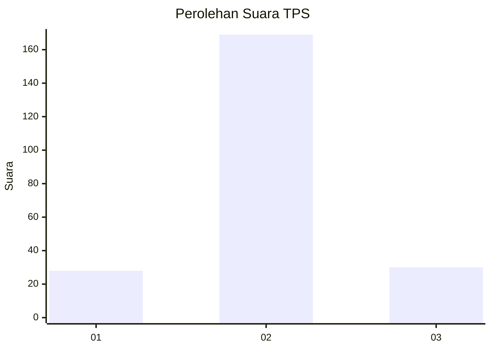
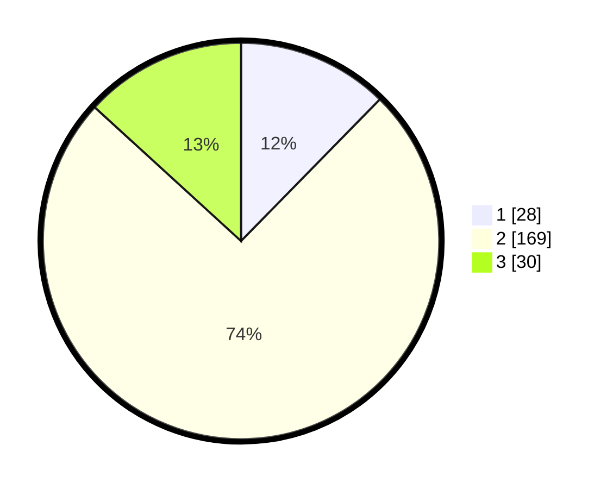

# Hasil

## Grafik

## Tabel

| No. | Nama Paslon    | Suara | Suara (raw) | Persentase |
|:--- |:-------------- | -----:| -----------:| ----------:|
| 1   | ANIES MUHAIMIN | 28    | [28][p-1]   | 12,33      |
| 2   | PRABOWO GIBRAN | 169   | [169][p-2]  | 74,45      |
| 3   | GANJAR MAHFUD  | 30    | [30][p-3]   | 13,22      |

[p-1]: https://github.com/gigit-pemilu/pemilu-2024/blob/main/pilpres/hitung-suara/sub/35-jawa-timur/sub/15-sidoarjo/sub/13-taman/sub/2010-kramatjegu/sub/005-tps/sub/paslon-1.txt
[p-2]: https://github.com/gigit-pemilu/pemilu-2024/blob/main/pilpres/hitung-suara/sub/35-jawa-timur/sub/15-sidoarjo/sub/13-taman/sub/2010-kramatjegu/sub/005-tps/sub/paslon-2.txt
[p-3]: https://github.com/gigit-pemilu/pemilu-2024/blob/main/pilpres/hitung-suara/sub/35-jawa-timur/sub/15-sidoarjo/sub/13-taman/sub/2010-kramatjegu/sub/005-tps/sub/paslon-3.txt

## Foto C Plano

https://sirekap-obj-formc.kpu.go.id/23d6/pemilu/ppwp/35/15/13/20/10/3515132010005-20240216-205827--74acb6b5-4c6d-45c8-88aa-1e9d93f2be35.jpg

https://sirekap-obj-formc.kpu.go.id/23d6/pemilu/ppwp/35/15/13/20/10/3515132010005-20240216-213425--937bcfb9-9d66-4dc3-afb7-ccfa53096213.jpg

https://sirekap-obj-formc.kpu.go.id/23d6/pemilu/ppwp/35/15/13/20/10/3515132010005-20240216-220144--0db9f6bf-ee7f-4151-bb68-749907d93347.jpg

## Metadata

| Key        | Value               |
| ---------- | ------------------- |
| Time Stamp | 2024-02-17 16:52:47 |

