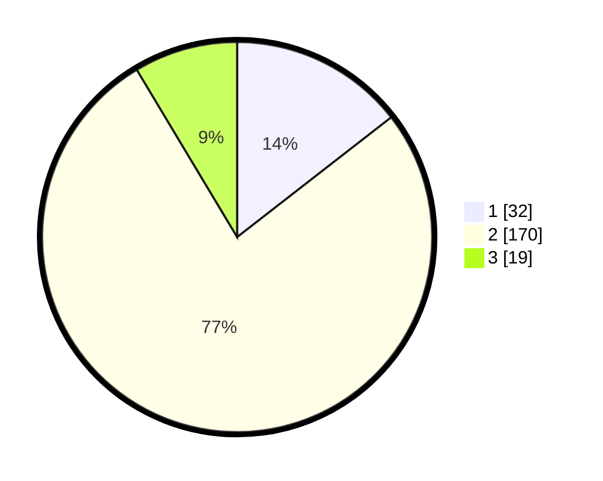

# Hasil

## Grafik

## Tabel

| No. | Nama Paslon    | Suara | Suara (raw) | Persentase |
|:--- |:-------------- | -----:| -----------:| ----------:|
| 1   | ANIES MUHAIMIN | 32    | [32][p-1]   | 14,48      |
| 2   | PRABOWO GIBRAN | 170   | [170][p-2]  | 76,92      |
| 3   | GANJAR MAHFUD  | 19    | [19][p-3]   | 8,60       |

[p-1]: https://github.com/gigit-pemilu/pemilu-2024/blob/main/pilpres/hitung-suara/sub/35-jawa-timur/sub/15-sidoarjo/sub/13-taman/sub/2012-pertapanmaduretno/sub/001-tps/sub/paslon-1.txt
[p-2]: https://github.com/gigit-pemilu/pemilu-2024/blob/main/pilpres/hitung-suara/sub/35-jawa-timur/sub/15-sidoarjo/sub/13-taman/sub/2012-pertapanmaduretno/sub/001-tps/sub/paslon-2.txt
[p-3]: https://github.com/gigit-pemilu/pemilu-2024/blob/main/pilpres/hitung-suara/sub/35-jawa-timur/sub/15-sidoarjo/sub/13-taman/sub/2012-pertapanmaduretno/sub/001-tps/sub/paslon-3.txt

## Foto C Plano

https://sirekap-obj-formc.kpu.go.id/a929/pemilu/ppwp/35/15/13/20/12/3515132012001-20240215-003320--e6c18528-29c2-4be7-9999-b4b842b601f3.jpg

https://sirekap-obj-formc.kpu.go.id/a929/pemilu/ppwp/35/15/13/20/12/3515132012001-20240215-003625--3bf17864-a458-4235-9aeb-0741754e6863.jpg

https://sirekap-obj-formc.kpu.go.id/a929/pemilu/ppwp/35/15/13/20/12/3515132012001-20240217-055747--98b3f940-edd9-4180-a0d0-94b19233bf83.jpg

## Metadata

| Key        | Value               |
| ---------- | ------------------- |
| Time Stamp | 2024-02-25 11:00:00 |

