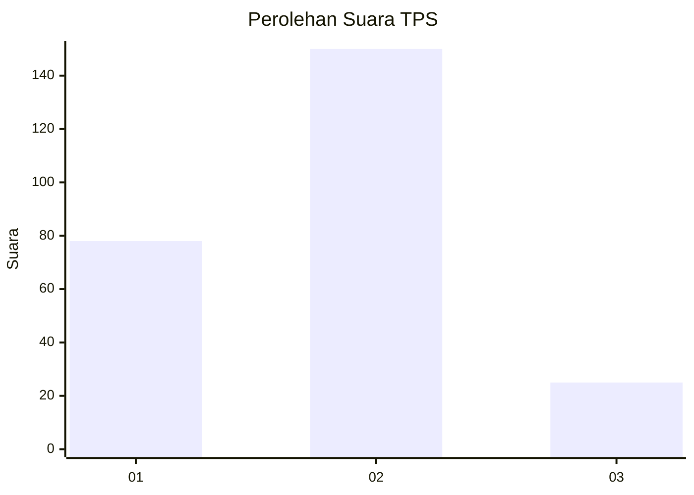
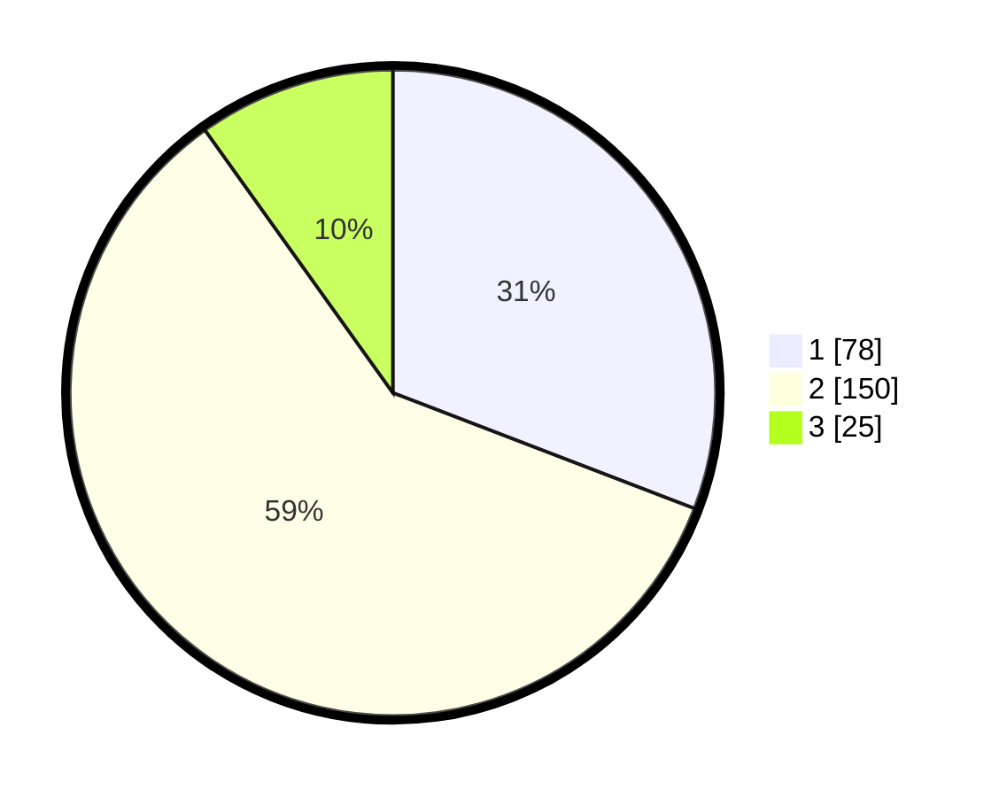

# Hasil

## Grafik

## Tabel

| No. | Nama Paslon    | Suara | Suara (raw) | Persentase |
|:--- |:-------------- | -----:| -----------:| ----------:|
| 1   | ANIES MUHAIMIN | 78    | [78][p-1]   | 30,83      |
| 2   | PRABOWO GIBRAN | 150   | [150][p-2]  | 59,29      |
| 3   | GANJAR MAHFUD  | 25    | [25][p-3]   | 9,88       |

[p-1]: https://github.com/gigit-pemilu/pemilu-2024-35-jawa-timur/blob/main/pilpres/hitung-suara/sub/35-jawa-timur/sub/15-sidoarjo/sub/13-taman/sub/2013-tawangsari/sub/019-tps/sub/paslon-1.txt
[p-2]: https://github.com/gigit-pemilu/pemilu-2024-35-jawa-timur/blob/main/pilpres/hitung-suara/sub/35-jawa-timur/sub/15-sidoarjo/sub/13-taman/sub/2013-tawangsari/sub/019-tps/sub/paslon-2.txt
[p-3]: https://github.com/gigit-pemilu/pemilu-2024-35-jawa-timur/blob/main/pilpres/hitung-suara/sub/35-jawa-timur/sub/15-sidoarjo/sub/13-taman/sub/2013-tawangsari/sub/019-tps/sub/paslon-3.txt

## Foto C Plano

https://sirekap-obj-formc.kpu.go.id/9dd3/pemilu/ppwp/35/15/13/20/13/3515132013019-20240214-234431--a9089f62-39d1-4a62-806a-5cbe044de050.jpg

https://sirekap-obj-formc.kpu.go.id/9dd3/pemilu/ppwp/35/15/13/20/13/3515132013019-20240214-234907--75b757ed-1a59-4e65-bb28-3634ea99e132.jpg

https://sirekap-obj-formc.kpu.go.id/9dd3/pemilu/ppwp/35/15/13/20/13/3515132013019-20240214-235223--d8ca95bc-f18b-4850-af75-6d9fd38eeb25.jpg

## Metadata

| Key        | Value               |
| ---------- | ------------------- |
| Time Stamp | 2024-02-25 12:00:00 |

