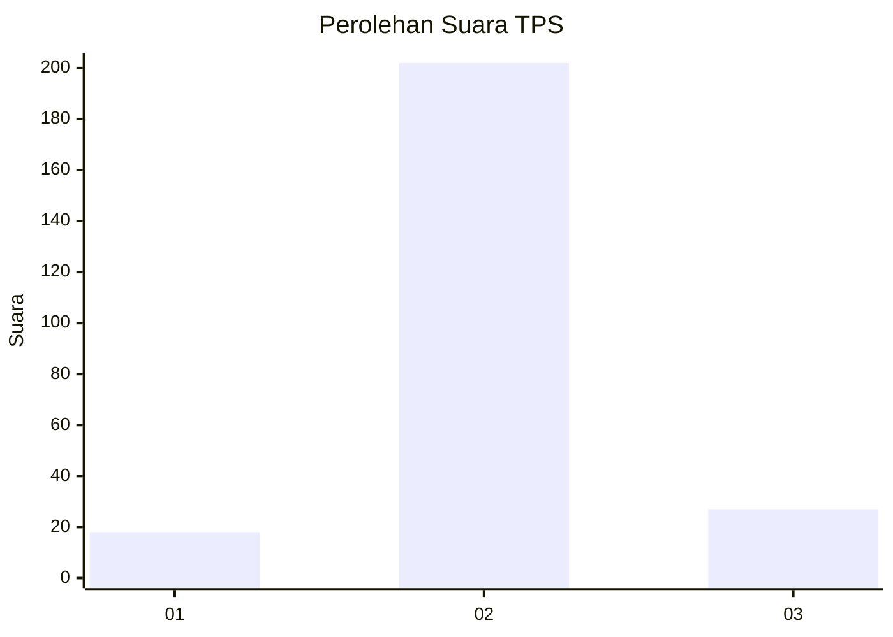
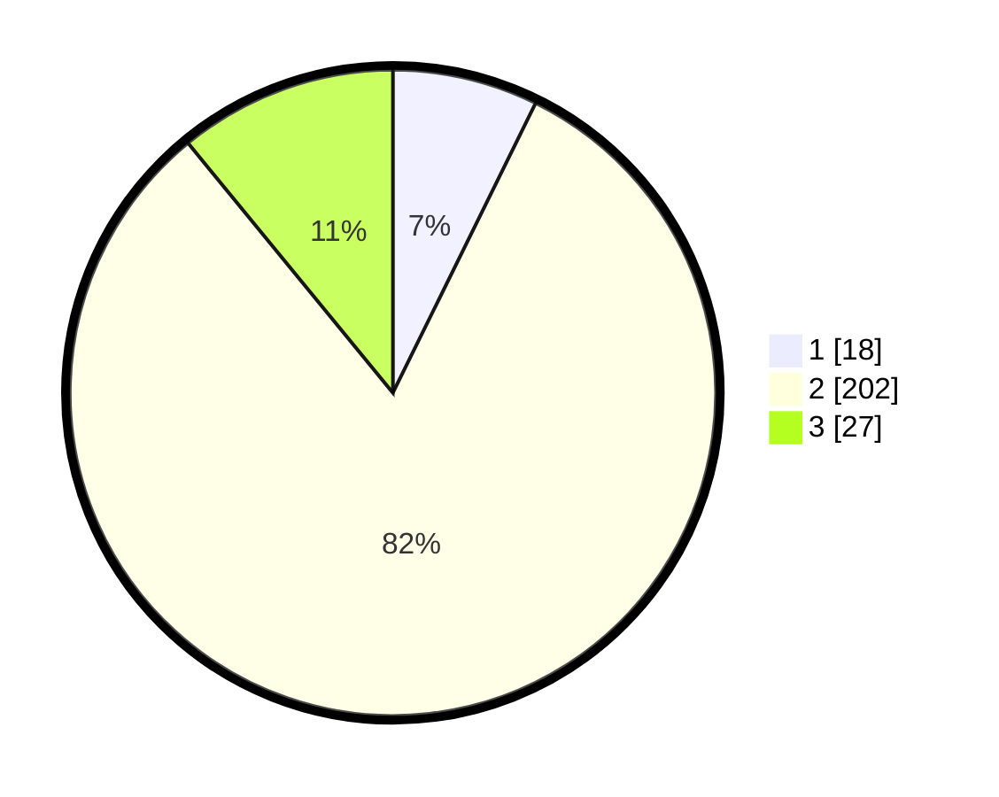

# Hasil

## Grafik

## Tabel

| No. | Nama Paslon    | Suara | Suara (raw) | Persentase |
|:--- |:-------------- | -----:| -----------:| ----------:|
| 1   | ANIES MUHAIMIN | 18    | [18][p-1]   | 7,29       |
| 2   | PRABOWO GIBRAN | 202   | [202][p-2]  | 81,78      |
| 3   | GANJAR MAHFUD  | 27    | [27][p-3]   | 10,93      |

[p-1]: https://github.com/gigit-pemilu/pemilu-2024-35-jawa-timur/blob/main/pilpres/hitung-suara/sub/35-jawa-timur/sub/15-sidoarjo/sub/14-sukodono/sub/2002-kebonagung/sub/014-tps/sub/paslon-1.txt
[p-2]: https://github.com/gigit-pemilu/pemilu-2024-35-jawa-timur/blob/main/pilpres/hitung-suara/sub/35-jawa-timur/sub/15-sidoarjo/sub/14-sukodono/sub/2002-kebonagung/sub/014-tps/sub/paslon-2.txt
[p-3]: https://github.com/gigit-pemilu/pemilu-2024-35-jawa-timur/blob/main/pilpres/hitung-suara/sub/35-jawa-timur/sub/15-sidoarjo/sub/14-sukodono/sub/2002-kebonagung/sub/014-tps/sub/paslon-3.txt

## Foto C Plano

https://sirekap-obj-formc.kpu.go.id/68be/pemilu/ppwp/35/15/14/20/02/3515142002014-20240214-233300--c923bfd0-c4be-44d8-8f21-832bbe5535ee.jpg

https://sirekap-obj-formc.kpu.go.id/68be/pemilu/ppwp/35/15/14/20/02/3515142002014-20240214-233418--5032997f-825b-43ce-8d3a-3cf629be097f.jpg

https://sirekap-obj-formc.kpu.go.id/68be/pemilu/ppwp/35/15/14/20/02/3515142002014-20240214-233525--6f557b35-875d-4444-9986-43a9a788bec5.jpg

## Metadata

| Key        | Value               |
| ---------- | ------------------- |
| Time Stamp | 2024-03-01 22:00:00 |

