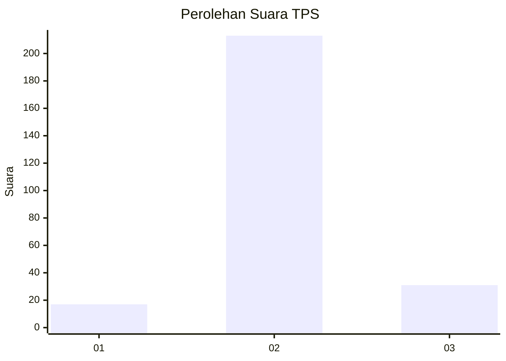
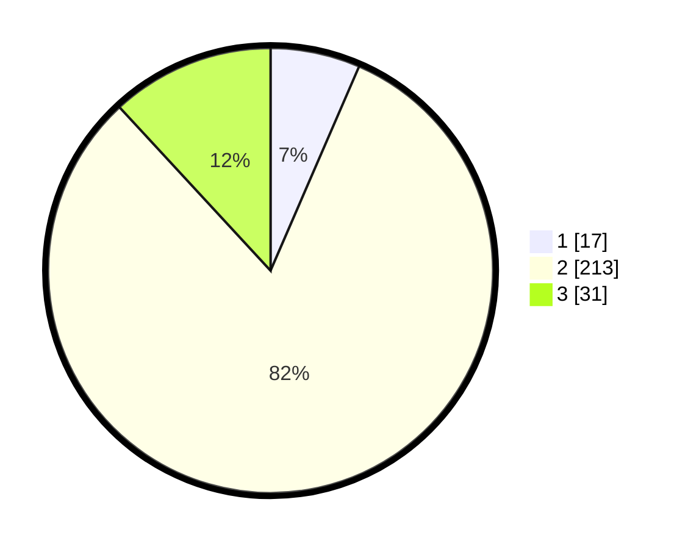

# Hasil

## Grafik

## Tabel

| No. | Nama Paslon    | Suara | Suara (raw) | Persentase |
|:--- |:-------------- | -----:| -----------:| ----------:|
| 1   | ANIES MUHAIMIN | 17    | [17][p-1]   | 6,51       |
| 2   | PRABOWO GIBRAN | 213   | [213][p-2]  | 81,61      |
| 3   | GANJAR MAHFUD  | 31    | [31][p-3]   | 11,88      |

[p-1]: https://github.com/gigit-pemilu/pemilu-2024-35-jawa-timur/blob/main/pilpres/hitung-suara/sub/35-jawa-timur/sub/15-sidoarjo/sub/14-sukodono/sub/2004-jumputrejo/sub/015-tps/sub/paslon-1.txt
[p-2]: https://github.com/gigit-pemilu/pemilu-2024-35-jawa-timur/blob/main/pilpres/hitung-suara/sub/35-jawa-timur/sub/15-sidoarjo/sub/14-sukodono/sub/2004-jumputrejo/sub/015-tps/sub/paslon-2.txt
[p-3]: https://github.com/gigit-pemilu/pemilu-2024-35-jawa-timur/blob/main/pilpres/hitung-suara/sub/35-jawa-timur/sub/15-sidoarjo/sub/14-sukodono/sub/2004-jumputrejo/sub/015-tps/sub/paslon-3.txt

## Foto C Plano

https://sirekap-obj-formc.kpu.go.id/b4ed/pemilu/ppwp/35/15/14/20/04/3515142004015-20240215-023945--2d77ecff-8c0e-4e67-afaa-030a07e9eca7.jpg

https://sirekap-obj-formc.kpu.go.id/b4ed/pemilu/ppwp/35/15/14/20/04/3515142004015-20240215-024033--511e0658-8e93-48b5-bcef-25512cf10c64.jpg

https://sirekap-obj-formc.kpu.go.id/b4ed/pemilu/ppwp/35/15/14/20/04/3515142004015-20240215-024201--fee4bde2-418b-4fb4-9c72-c796a7ea0518.jpg

## Metadata

| Key        | Value               |
| ---------- | ------------------- |
| Time Stamp | 2024-02-26 12:00:00 |

