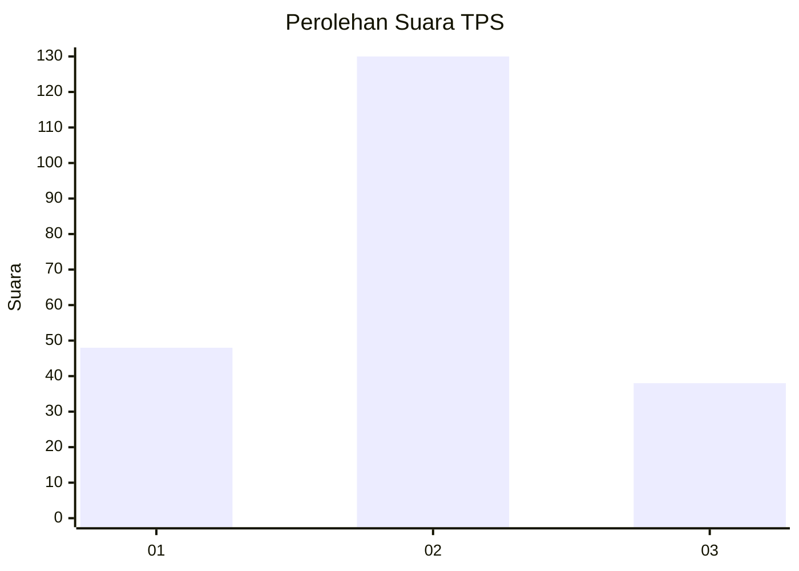

# Hasil

## Grafik

## Tabel

| No. | Nama Paslon    | Suara | Suara (raw) | Persentase |
|:--- |:-------------- | -----:| -----------:| ----------:|
| 1   | ANIES MUHAIMIN | 48    | [48][p-1]   | 22,22      |
| 2   | PRABOWO GIBRAN | 130   | [130][p-2]  | 60,19      |
| 3   | GANJAR MAHFUD  | 38    | [38][p-3]   | 17,59      |

[p-1]: https://github.com/gigit-pemilu/pemilu-2024/blob/main/pilpres/hitung-suara/sub/35-jawa-timur/sub/15-sidoarjo/sub/14-sukodono/sub/2005-suruh/sub/003-tps/sub/paslon-1.txt
[p-2]: https://github.com/gigit-pemilu/pemilu-2024/blob/main/pilpres/hitung-suara/sub/35-jawa-timur/sub/15-sidoarjo/sub/14-sukodono/sub/2005-suruh/sub/003-tps/sub/paslon-2.txt
[p-3]: https://github.com/gigit-pemilu/pemilu-2024/blob/main/pilpres/hitung-suara/sub/35-jawa-timur/sub/15-sidoarjo/sub/14-sukodono/sub/2005-suruh/sub/003-tps/sub/paslon-3.txt

## Foto C Plano

https://sirekap-obj-formc.kpu.go.id/71ea/pemilu/ppwp/35/15/14/20/05/3515142005003-20240214-231610--0e1df2b5-eb83-4653-889b-e662b8d103f8.jpg

https://sirekap-obj-formc.kpu.go.id/71ea/pemilu/ppwp/35/15/14/20/05/3515142005003-20240214-231945--4000fc35-a8cf-4a70-99c1-d93bc89d0696.jpg

https://sirekap-obj-formc.kpu.go.id/71ea/pemilu/ppwp/35/15/14/20/05/3515142005003-20240214-231844--6ba5bc2d-0ede-475e-9949-0db340b52977.jpg

## Metadata

| Key        | Value               |
| ---------- | ------------------- |
| Time Stamp | 2024-02-21 12:00:00 |

