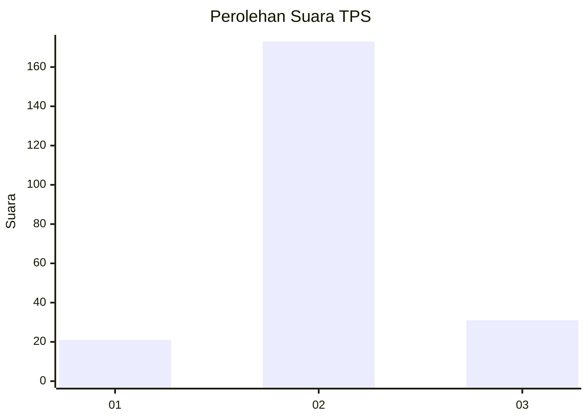
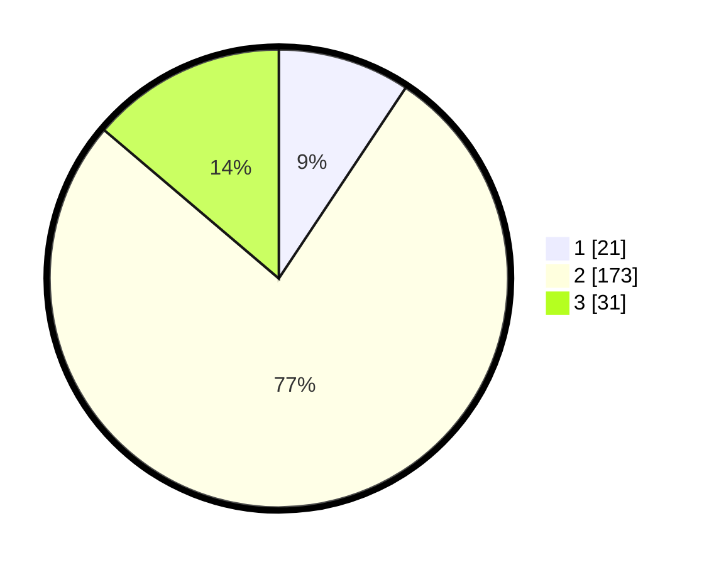

# Hasil

## Grafik

## Tabel

| No. | Nama Paslon    | Suara | Suara (raw) | Persentase |
|:--- |:-------------- | -----:| -----------:| ----------:|
| 1   | ANIES MUHAIMIN | 21    | [21][p-1]   | 9,33       |
| 2   | PRABOWO GIBRAN | 173   | [173][p-2]  | 76,89      |
| 3   | GANJAR MAHFUD  | 31    | [31][p-3]   | 13,78      |

[p-1]: https://github.com/gigit-pemilu/pemilu-2024/blob/main/pilpres/hitung-suara/sub/35-jawa-timur/sub/15-sidoarjo/sub/14-sukodono/sub/2009-jogosatru/sub/001-tps/sub/paslon-1.txt
[p-2]: https://github.com/gigit-pemilu/pemilu-2024/blob/main/pilpres/hitung-suara/sub/35-jawa-timur/sub/15-sidoarjo/sub/14-sukodono/sub/2009-jogosatru/sub/001-tps/sub/paslon-2.txt
[p-3]: https://github.com/gigit-pemilu/pemilu-2024/blob/main/pilpres/hitung-suara/sub/35-jawa-timur/sub/15-sidoarjo/sub/14-sukodono/sub/2009-jogosatru/sub/001-tps/sub/paslon-3.txt

## Foto C Plano

https://sirekap-obj-formc.kpu.go.id/5a7d/pemilu/ppwp/35/15/14/20/09/3515142009001-20240217-100133--3eb94542-9fcc-4007-8ac4-009abae1ef8e.jpg

https://sirekap-obj-formc.kpu.go.id/5a7d/pemilu/ppwp/35/15/14/20/09/3515142009001-20240217-100222--900aa110-54f7-460d-b285-0234257ecae0.jpg

https://sirekap-obj-formc.kpu.go.id/5a7d/pemilu/ppwp/35/15/14/20/09/3515142009001-20240216-214654--caa74875-3ea5-426b-9af7-9d3703a7a552.jpg

## Metadata

| Key        | Value               |
| ---------- | ------------------- |
| Time Stamp | 2024-02-25 15:00:00 |

