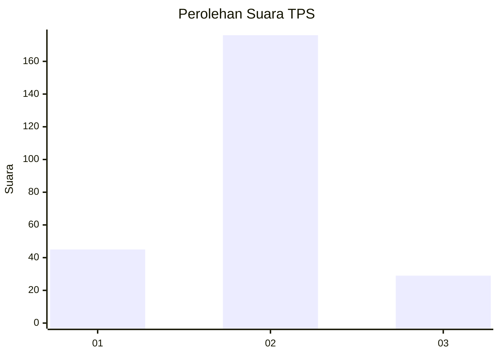
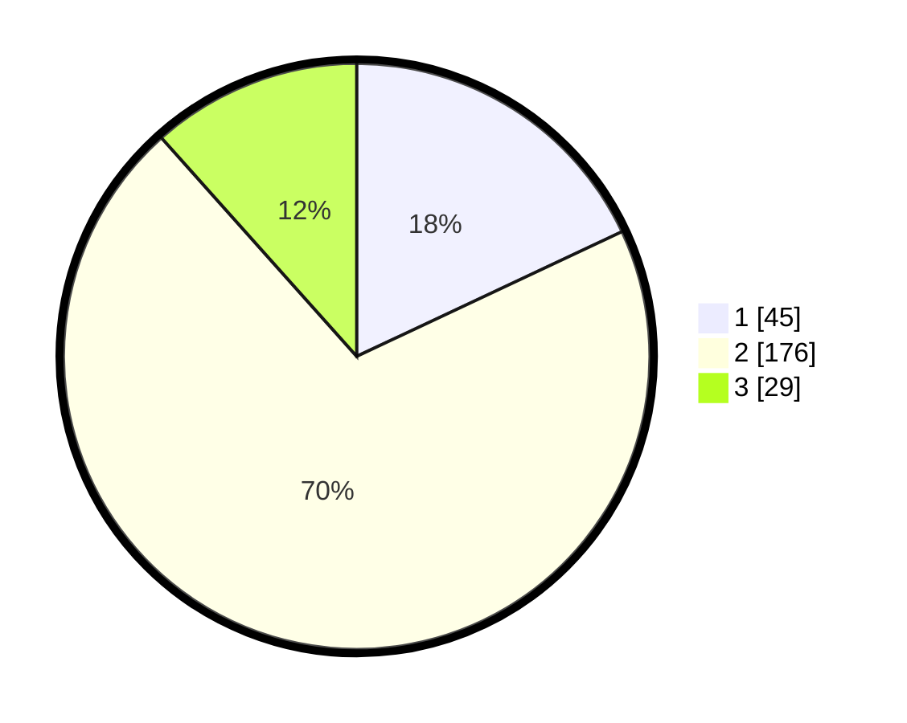

# Hasil

## Grafik

## Tabel

| No. | Nama Paslon    | Suara | Suara (raw) | Persentase |
|:--- |:-------------- | -----:| -----------:| ----------:|
| 1   | ANIES MUHAIMIN | 45    | [45][p-1]   | 18,00      |
| 2   | PRABOWO GIBRAN | 176   | [176][p-2]  | 70,40      |
| 3   | GANJAR MAHFUD  | 29    | [29][p-3]   | 11,60      |

[p-1]: https://github.com/gigit-pemilu/pemilu-2024/blob/main/pilpres/hitung-suara/sub/35-jawa-timur/sub/15-sidoarjo/sub/14-sukodono/sub/2009-jogosatru/sub/004-tps/sub/paslon-1.txt
[p-2]: https://github.com/gigit-pemilu/pemilu-2024/blob/main/pilpres/hitung-suara/sub/35-jawa-timur/sub/15-sidoarjo/sub/14-sukodono/sub/2009-jogosatru/sub/004-tps/sub/paslon-2.txt
[p-3]: https://github.com/gigit-pemilu/pemilu-2024/blob/main/pilpres/hitung-suara/sub/35-jawa-timur/sub/15-sidoarjo/sub/14-sukodono/sub/2009-jogosatru/sub/004-tps/sub/paslon-3.txt

## Foto C Plano

https://sirekap-obj-formc.kpu.go.id/7fc8/pemilu/ppwp/35/15/14/20/09/3515142009004-20240217-152339--b5bbf853-0161-4e98-8c30-28cdd85366fb.jpg

https://sirekap-obj-formc.kpu.go.id/7fc8/pemilu/ppwp/35/15/14/20/09/3515142009004-20240217-152411--d5e8ecec-04e4-4327-a3d9-c46b2aa4b415.jpg

https://sirekap-obj-formc.kpu.go.id/7fc8/pemilu/ppwp/35/15/14/20/09/3515142009004-20240217-152448--35133957-a37e-4a68-9c35-de66c624471d.jpg

## Metadata

| Key        | Value               |
| ---------- | ------------------- |
| Time Stamp | 2024-02-24 22:31:28 |

