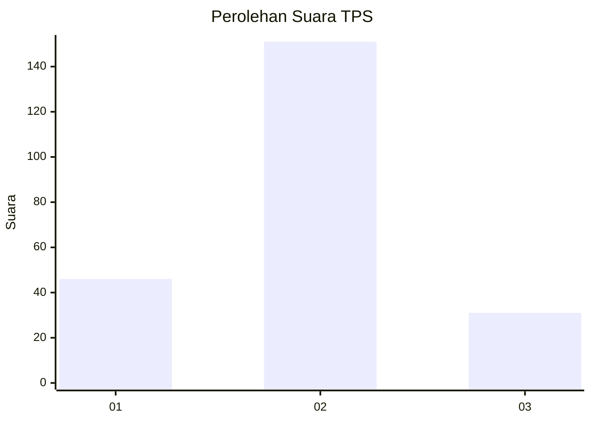
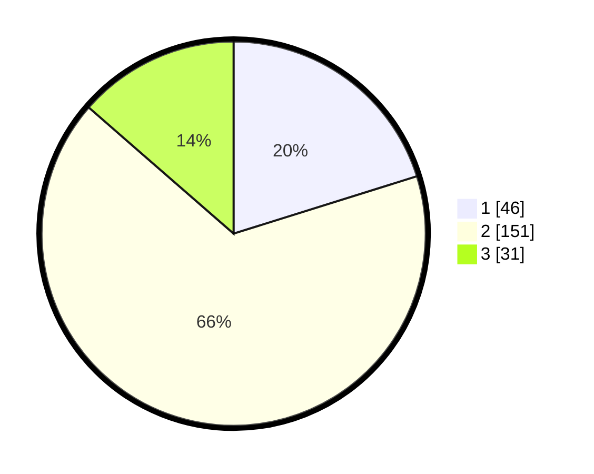

# Hasil

## Grafik

## Tabel

| No. | Nama Paslon    | Suara | Suara (raw) | Persentase |
|:--- |:-------------- | -----:| -----------:| ----------:|
| 1   | ANIES MUHAIMIN | 46    | [46][p-1]   | 20,18      |
| 2   | PRABOWO GIBRAN | 151   | [151][p-2]  | 66,23      |
| 3   | GANJAR MAHFUD  | 31    | [31][p-3]   | 13,60      |

[p-1]: https://github.com/gigit-pemilu/pemilu-2024/blob/main/pilpres/hitung-suara/sub/35-jawa-timur/sub/15-sidoarjo/sub/14-sukodono/sub/2009-jogosatru/sub/005-tps/sub/paslon-1.txt
[p-2]: https://github.com/gigit-pemilu/pemilu-2024/blob/main/pilpres/hitung-suara/sub/35-jawa-timur/sub/15-sidoarjo/sub/14-sukodono/sub/2009-jogosatru/sub/005-tps/sub/paslon-2.txt
[p-3]: https://github.com/gigit-pemilu/pemilu-2024/blob/main/pilpres/hitung-suara/sub/35-jawa-timur/sub/15-sidoarjo/sub/14-sukodono/sub/2009-jogosatru/sub/005-tps/sub/paslon-3.txt

## Foto C Plano

https://sirekap-obj-formc.kpu.go.id/a7c3/pemilu/ppwp/35/15/14/20/09/3515142009005-20240216-223754--a446e612-845e-4576-8229-bbe683fb54f3.jpg

https://sirekap-obj-formc.kpu.go.id/a7c3/pemilu/ppwp/35/15/14/20/09/3515142009005-20240216-223355--42e6608f-1d7b-408a-b3c8-4d960b39fb51.jpg

https://sirekap-obj-formc.kpu.go.id/a7c3/pemilu/ppwp/35/15/14/20/09/3515142009005-20240216-223454--d0c54d93-7e1a-44bd-9be7-f6ae0915e405.jpg

## Metadata

| Key        | Value               |
| ---------- | ------------------- |
| Time Stamp | 2024-02-16 23:00:00 |

