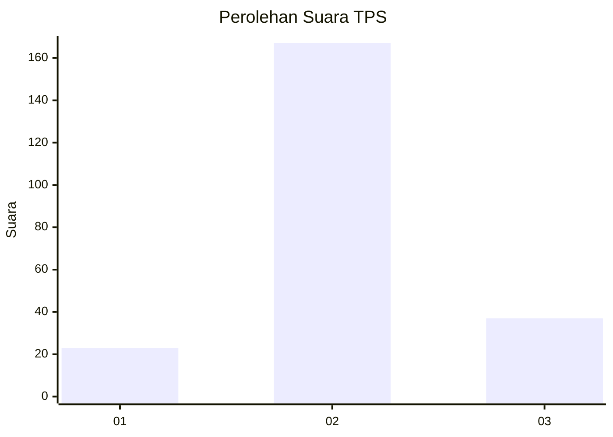
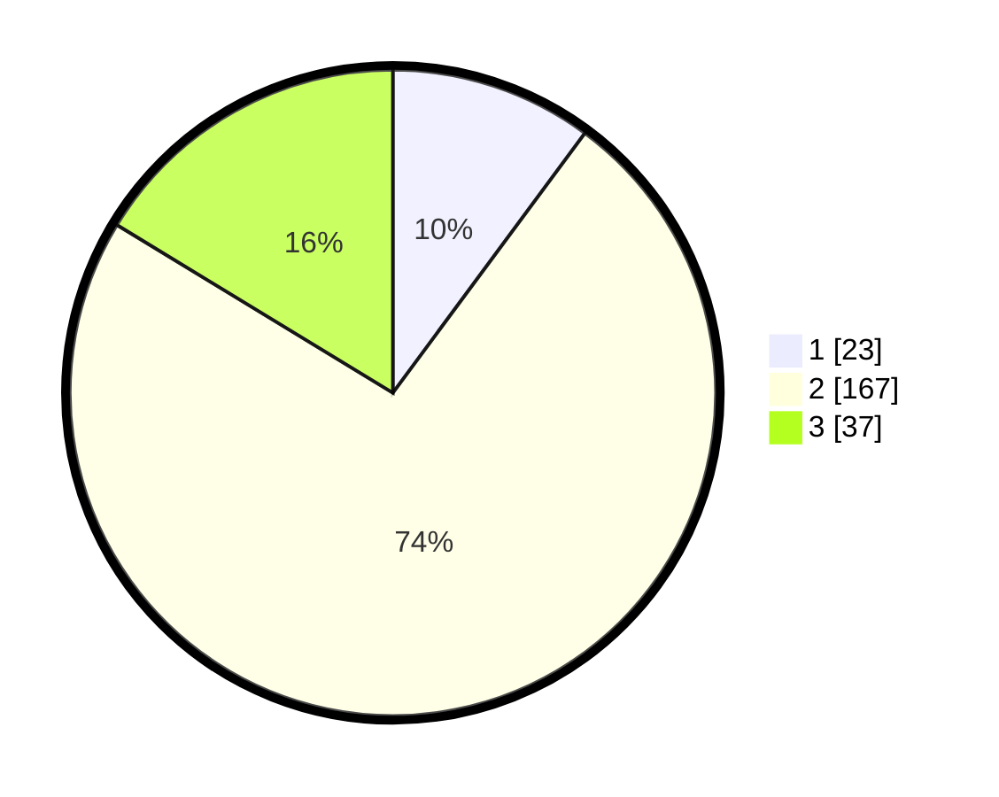

# Hasil

## Grafik

## Tabel

| No. | Nama Paslon    | Suara | Suara (raw) | Persentase |
|:--- |:-------------- | -----:| -----------:| ----------:|
| 1   | ANIES MUHAIMIN | 23    | [23][p-1]   | 10,13      |
| 2   | PRABOWO GIBRAN | 167   | [167][p-2]  | 73,57      |
| 3   | GANJAR MAHFUD  | 37    | [37][p-3]   | 16,30      |

[p-1]: https://github.com/gigit-pemilu/pemilu-2024/blob/main/pilpres/hitung-suara/sub/35-jawa-timur/sub/15-sidoarjo/sub/14-sukodono/sub/2010-ngaresrejo/sub/002-tps/sub/paslon-1.txt
[p-2]: https://github.com/gigit-pemilu/pemilu-2024/blob/main/pilpres/hitung-suara/sub/35-jawa-timur/sub/15-sidoarjo/sub/14-sukodono/sub/2010-ngaresrejo/sub/002-tps/sub/paslon-2.txt
[p-3]: https://github.com/gigit-pemilu/pemilu-2024/blob/main/pilpres/hitung-suara/sub/35-jawa-timur/sub/15-sidoarjo/sub/14-sukodono/sub/2010-ngaresrejo/sub/002-tps/sub/paslon-3.txt

## Foto C Plano

https://sirekap-obj-formc.kpu.go.id/21eb/pemilu/ppwp/35/15/14/20/10/3515142010002-20240215-190750--abab6bc2-4ff2-4d0b-a855-6cfab1721b8d.jpg

https://sirekap-obj-formc.kpu.go.id/21eb/pemilu/ppwp/35/15/14/20/10/3515142010002-20240215-191137--7839dc42-f8be-4aa9-935e-f413a4dd27fc.jpg

https://sirekap-obj-formc.kpu.go.id/21eb/pemilu/ppwp/35/15/14/20/10/3515142010002-20240217-101154--7dc9612c-4a65-4f6d-bf46-12ff23ed02f4.jpg

## Metadata

| Key        | Value               |
| ---------- | ------------------- |
| Time Stamp | 2024-02-25 12:00:00 |

