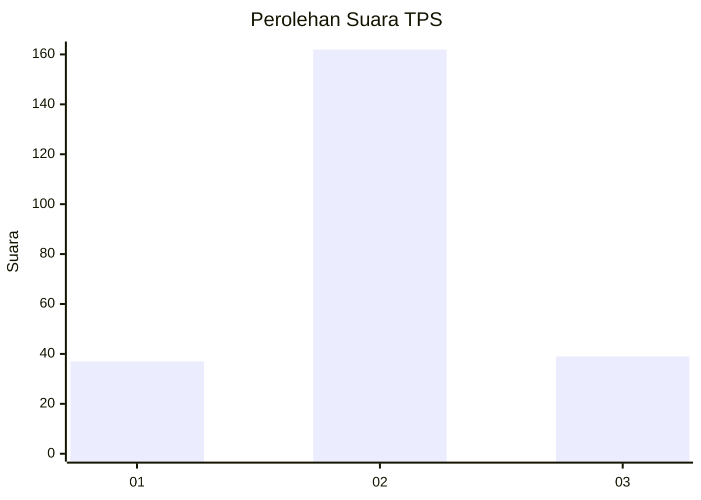
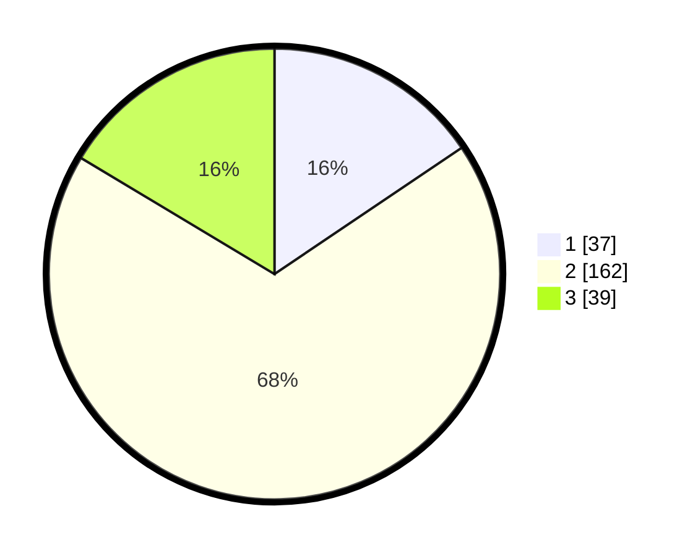

# Hasil

## Grafik

## Tabel

| No. | Nama Paslon    | Suara | Suara (raw) | Persentase |
|:--- |:-------------- | -----:| -----------:| ----------:|
| 1   | ANIES MUHAIMIN | 37    | [37][p-1]   | 15,55      |
| 2   | PRABOWO GIBRAN | 162   | [162][p-2]  | 68,07      |
| 3   | GANJAR MAHFUD  | 39    | [39][p-3]   | 16,39      |

[p-1]: https://github.com/gigit-pemilu/pemilu-2024/blob/main/pilpres/hitung-suara/sub/35-jawa-timur/sub/15-sidoarjo/sub/14-sukodono/sub/2012-plumbungan/sub/001-tps/sub/paslon-1.txt
[p-2]: https://github.com/gigit-pemilu/pemilu-2024/blob/main/pilpres/hitung-suara/sub/35-jawa-timur/sub/15-sidoarjo/sub/14-sukodono/sub/2012-plumbungan/sub/001-tps/sub/paslon-2.txt
[p-3]: https://github.com/gigit-pemilu/pemilu-2024/blob/main/pilpres/hitung-suara/sub/35-jawa-timur/sub/15-sidoarjo/sub/14-sukodono/sub/2012-plumbungan/sub/001-tps/sub/paslon-3.txt

## Foto C Plano

https://sirekap-obj-formc.kpu.go.id/fc55/pemilu/ppwp/35/15/14/20/12/3515142012001-20240214-191037--b1bfcc20-188d-4601-84f4-377b3e5999ec.jpg

https://sirekap-obj-formc.kpu.go.id/fc55/pemilu/ppwp/35/15/14/20/12/3515142012001-20240214-190940--9a25071e-a70c-40f6-b156-9287d7a26069.jpg

https://sirekap-obj-formc.kpu.go.id/fc55/pemilu/ppwp/35/15/14/20/12/3515142012001-20240214-191159--17eea4f6-e760-487d-a664-c4a150093dc9.jpg

## Metadata

| Key        | Value               |
| ---------- | ------------------- |
| Time Stamp | 2024-02-16 11:00:29 |

## DATA PEMILIH TETAP

Jumlah pemilih dalam DPT: **272**.
 * L: **831**.
 * P: **646**.

## DATA PENGGUNA HAK PILIH

Jumlah pengguna hak pilih dalam DPT: **249**.
 * L: **48**.
 * P: **636**.

Jumlah pengguna hak pilih dalam DPTb: **888**.
 * L: **808**.
 * P: **808**.

Jumlah pengguna hak pilih dalam DPK: **8**.
 * L: **88**.
 * P: **880**.

Jumlah pengguna hak pilih: **249**.
 * L: **648**.
 * P: **438**.

## JUMLAH SUARA SAH DAN TIDAK SAH

JUMLAH SELURUH SUARA SAH: **238**.

JUMLAH SUARA TIDAK SAH: **11**.

JUMLAH SELURUH SUARA SAH DAN SUARA TIDAK SAH: **249**.

