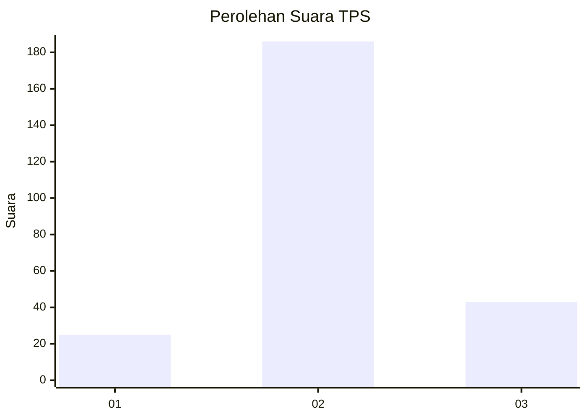
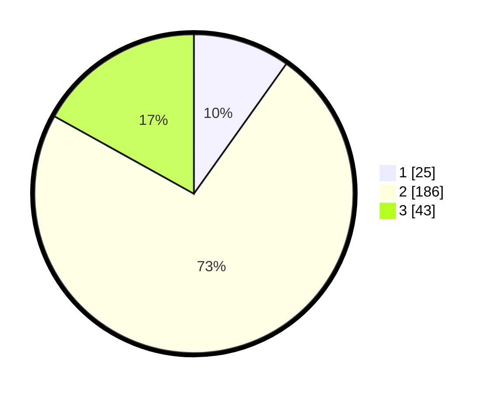

# Hasil

## Grafik

## Tabel

| No. | Nama Paslon    | Suara | Suara (raw) | Persentase |
|:--- |:-------------- | -----:| -----------:| ----------:|
| 1   | ANIES MUHAIMIN | 25    | [25][p-1]   | 9,84       |
| 2   | PRABOWO GIBRAN | 186   | [186][p-2]  | 73,23      |
| 3   | GANJAR MAHFUD  | 43    | [43][p-3]   | 16,93      |

[p-1]: https://github.com/gigit-pemilu/pemilu-2024-35-jawa-timur/blob/main/pilpres/hitung-suara/sub/35-jawa-timur/sub/15-sidoarjo/sub/14-sukodono/sub/2014-kloposepuluh/sub/015-tps/sub/paslon-1.txt
[p-2]: https://github.com/gigit-pemilu/pemilu-2024-35-jawa-timur/blob/main/pilpres/hitung-suara/sub/35-jawa-timur/sub/15-sidoarjo/sub/14-sukodono/sub/2014-kloposepuluh/sub/015-tps/sub/paslon-2.txt
[p-3]: https://github.com/gigit-pemilu/pemilu-2024-35-jawa-timur/blob/main/pilpres/hitung-suara/sub/35-jawa-timur/sub/15-sidoarjo/sub/14-sukodono/sub/2014-kloposepuluh/sub/015-tps/sub/paslon-3.txt

## Foto C Plano

https://sirekap-obj-formc.kpu.go.id/dd94/pemilu/ppwp/35/15/14/20/14/3515142014015-20240216-083015--20a99f37-c483-4a46-ac38-01abf95038a2.jpg

https://sirekap-obj-formc.kpu.go.id/dd94/pemilu/ppwp/35/15/14/20/14/3515142014015-20240215-214157--031a3b3c-94f8-45c7-a3bf-a913f592aad2.jpg

https://sirekap-obj-formc.kpu.go.id/dd94/pemilu/ppwp/35/15/14/20/14/3515142014015-20240216-082827--4bbd8fa9-e843-4d41-99cd-0a2b3ec64f33.jpg

## Metadata

| Key        | Value               |
| ---------- | ------------------- |
| Time Stamp | 2024-02-24 22:31:28 |

