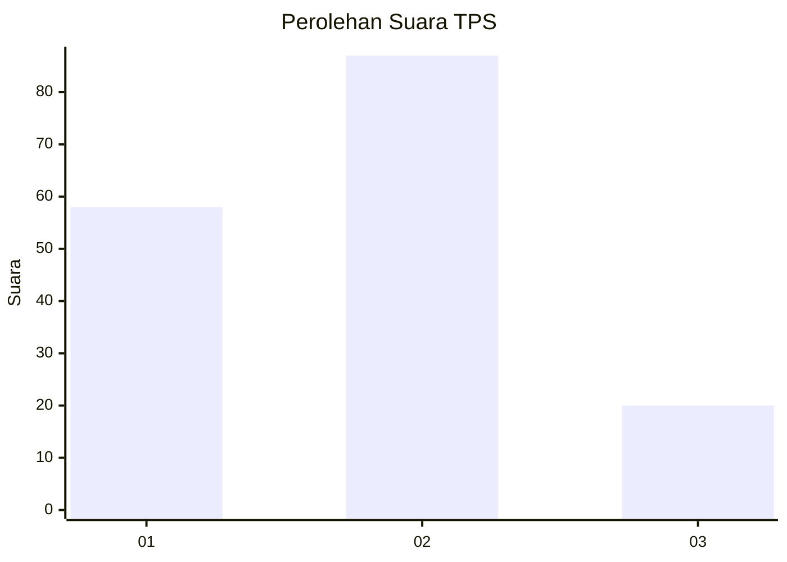
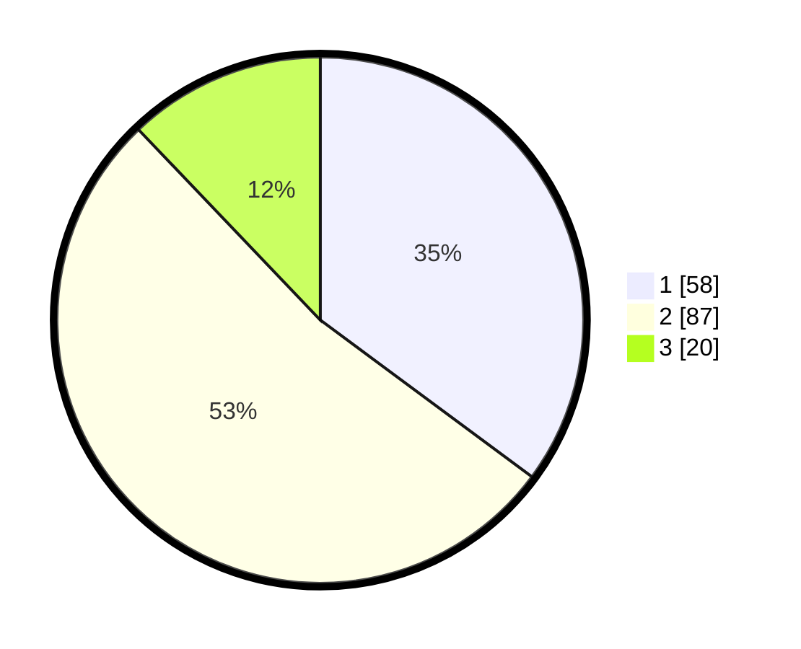

# Hasil

## Grafik

## Tabel

| No. | Nama Paslon    | Suara | Suara (raw) | Persentase |
|:--- |:-------------- | -----:| -----------:| ----------:|
| 1   | ANIES MUHAIMIN | 58    | [58][p-1]   | 35,15      |
| 2   | PRABOWO GIBRAN | 87    | [87][p-2]   | 52,73      |
| 3   | GANJAR MAHFUD  | 20    | [20][p-3]   | 12,12      |

[p-1]: https://github.com/gigit-pemilu/pemilu-2024-35-jawa-timur/blob/main/pilpres/hitung-suara/sub/35-jawa-timur/sub/15-sidoarjo/sub/14-sukodono/sub/2016-suko/sub/018-tps/sub/paslon-1.txt
[p-2]: https://github.com/gigit-pemilu/pemilu-2024-35-jawa-timur/blob/main/pilpres/hitung-suara/sub/35-jawa-timur/sub/15-sidoarjo/sub/14-sukodono/sub/2016-suko/sub/018-tps/sub/paslon-2.txt
[p-3]: https://github.com/gigit-pemilu/pemilu-2024-35-jawa-timur/blob/main/pilpres/hitung-suara/sub/35-jawa-timur/sub/15-sidoarjo/sub/14-sukodono/sub/2016-suko/sub/018-tps/sub/paslon-3.txt

## Foto C Plano

https://sirekap-obj-formc.kpu.go.id/775c/pemilu/ppwp/35/15/14/20/16/3515142016018-20240214-215529--7b12956f-d276-4ae3-9e4e-e3d543c0c3a6.jpg

https://sirekap-obj-formc.kpu.go.id/775c/pemilu/ppwp/35/15/14/20/16/3515142016018-20240214-215647--6acac45f-ea4d-45b8-94d2-1e46e01ee002.jpg

https://sirekap-obj-formc.kpu.go.id/775c/pemilu/ppwp/35/15/14/20/16/3515142016018-20240214-215735--0b4ffe78-3ac3-412b-8b9f-480bfc22c1ea.jpg

## Metadata

| Key        | Value               |
| ---------- | ------------------- |
| Time Stamp | 2024-02-25 16:00:00 |

