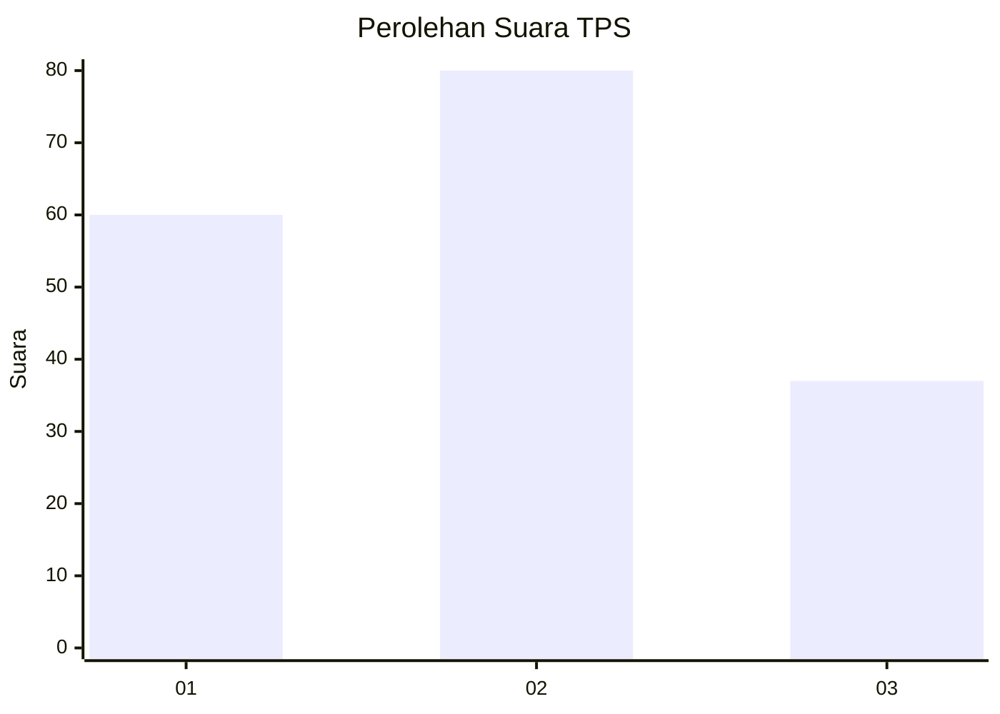
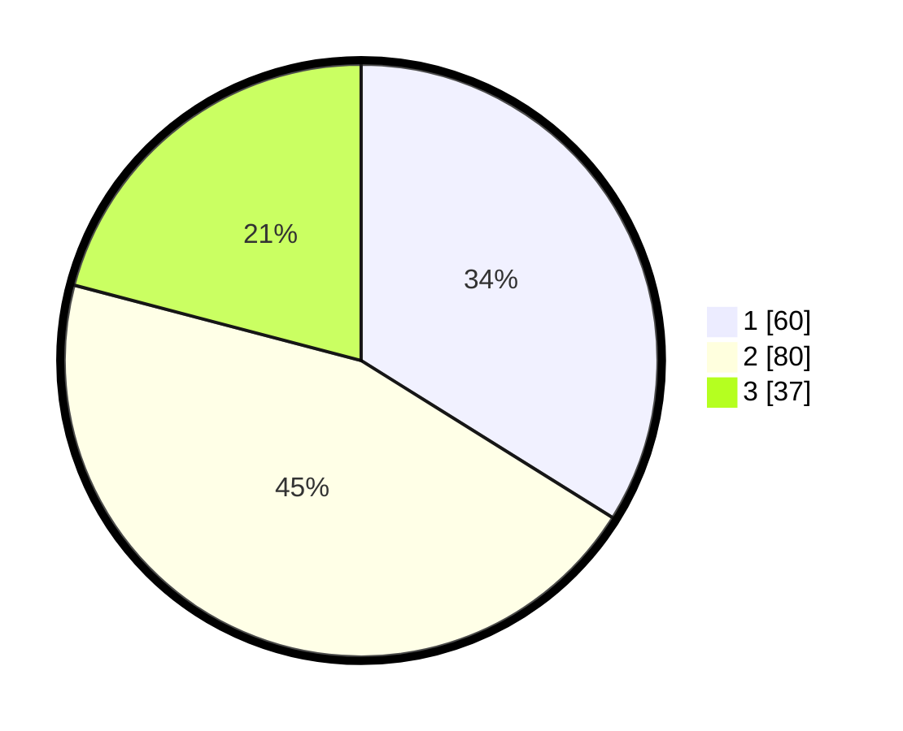

# Hasil

## Grafik

## Tabel

| No. | Nama Paslon    | Suara | Suara (raw) | Persentase |
|:--- |:-------------- | -----:| -----------:| ----------:|
| 1   | ANIES MUHAIMIN | 60    | [60][p-1]   | 33,90      |
| 2   | PRABOWO GIBRAN | 80    | [80][p-2]   | 45,20      |
| 3   | GANJAR MAHFUD  | 37    | [37][p-3]   | 20,90      |

[p-1]: https://github.com/gigit-pemilu/pemilu-2024-35-jawa-timur/blob/main/pilpres/hitung-suara/sub/35-jawa-timur/sub/15-sidoarjo/sub/14-sukodono/sub/2016-suko/sub/032-tps/sub/paslon-1.txt
[p-2]: https://github.com/gigit-pemilu/pemilu-2024-35-jawa-timur/blob/main/pilpres/hitung-suara/sub/35-jawa-timur/sub/15-sidoarjo/sub/14-sukodono/sub/2016-suko/sub/032-tps/sub/paslon-2.txt
[p-3]: https://github.com/gigit-pemilu/pemilu-2024-35-jawa-timur/blob/main/pilpres/hitung-suara/sub/35-jawa-timur/sub/15-sidoarjo/sub/14-sukodono/sub/2016-suko/sub/032-tps/sub/paslon-3.txt

## Foto C Plano

https://sirekap-obj-formc.kpu.go.id/0997/pemilu/ppwp/35/15/14/20/16/3515142016032-20240216-134901--a9e2390a-c1fc-4225-b165-869d59039da8.jpg

https://sirekap-obj-formc.kpu.go.id/0997/pemilu/ppwp/35/15/14/20/16/3515142016032-20240216-135004--89968184-1f81-4edc-a1c3-9eb16deb9ce9.jpg

https://sirekap-obj-formc.kpu.go.id/0997/pemilu/ppwp/35/15/14/20/16/3515142016032-20240216-135120--ad99659e-dd1b-4d7d-bb51-916ef054999c.jpg

## Metadata

| Key        | Value               |
| ---------- | ------------------- |
| Time Stamp | 2024-02-25 09:00:00 |

