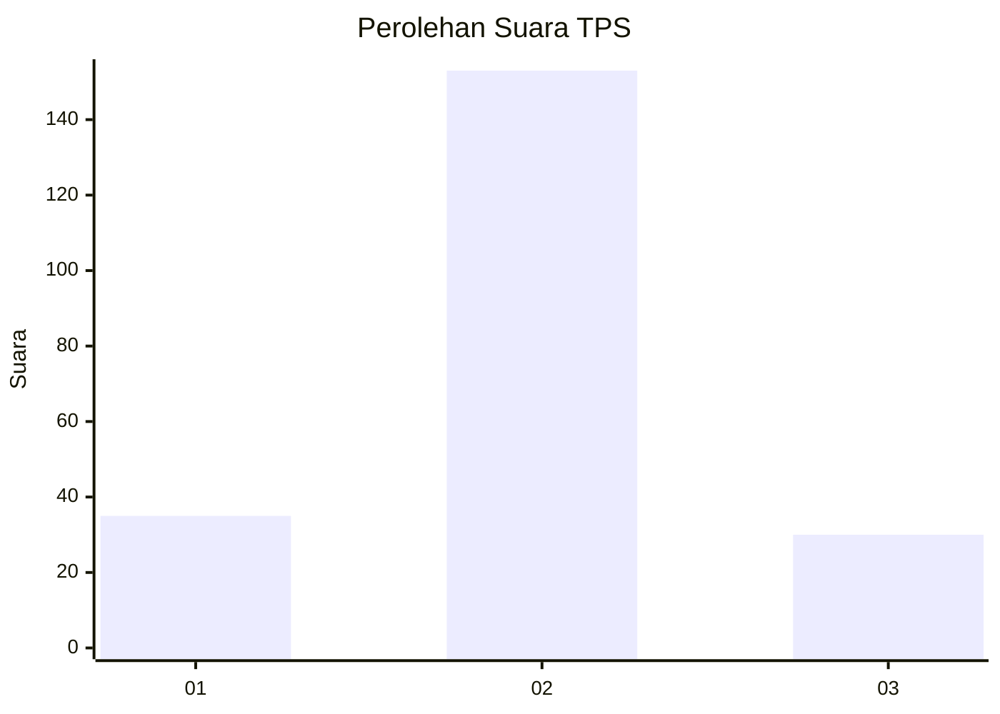
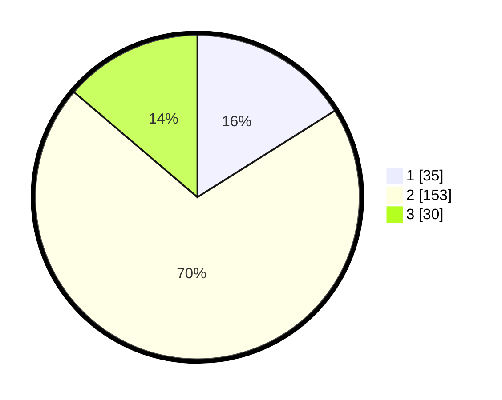

# Hasil

## Grafik

## Tabel

| No. | Nama Paslon    | Suara | Suara (raw) | Persentase |
|:--- |:-------------- | -----:| -----------:| ----------:|
| 1   | ANIES MUHAIMIN | 35    | [35][p-1]   | 16,06      |
| 2   | PRABOWO GIBRAN | 153   | [153][p-2]  | 70,18      |
| 3   | GANJAR MAHFUD  | 30    | [30][p-3]   | 13,76      |

[p-1]: https://github.com/gigit-pemilu/pemilu-2024-35-jawa-timur/blob/main/pilpres/hitung-suara/sub/35-jawa-timur/sub/15-sidoarjo/sub/15-buduran/sub/2001-entalsewu/sub/005-tps/sub/paslon-1.txt
[p-2]: https://github.com/gigit-pemilu/pemilu-2024-35-jawa-timur/blob/main/pilpres/hitung-suara/sub/35-jawa-timur/sub/15-sidoarjo/sub/15-buduran/sub/2001-entalsewu/sub/005-tps/sub/paslon-2.txt
[p-3]: https://github.com/gigit-pemilu/pemilu-2024-35-jawa-timur/blob/main/pilpres/hitung-suara/sub/35-jawa-timur/sub/15-sidoarjo/sub/15-buduran/sub/2001-entalsewu/sub/005-tps/sub/paslon-3.txt

## Foto C Plano

https://sirekap-obj-formc.kpu.go.id/6249/pemilu/ppwp/35/15/15/20/01/3515152001005-20240216-191732--68a81999-4149-47e3-bfc4-fd33e8e0f8a5.jpg

https://sirekap-obj-formc.kpu.go.id/6249/pemilu/ppwp/35/15/15/20/01/3515152001005-20240216-191126--68de8de7-aa8f-473d-8b0f-35ee488b307f.jpg

https://sirekap-obj-formc.kpu.go.id/6249/pemilu/ppwp/35/15/15/20/01/3515152001005-20240216-191614--e0863718-3d83-460d-bf81-989d5cd89822.jpg

## Metadata

| Key        | Value               |
| ---------- | ------------------- |
| Time Stamp | 2024-02-25 11:00:00 |

