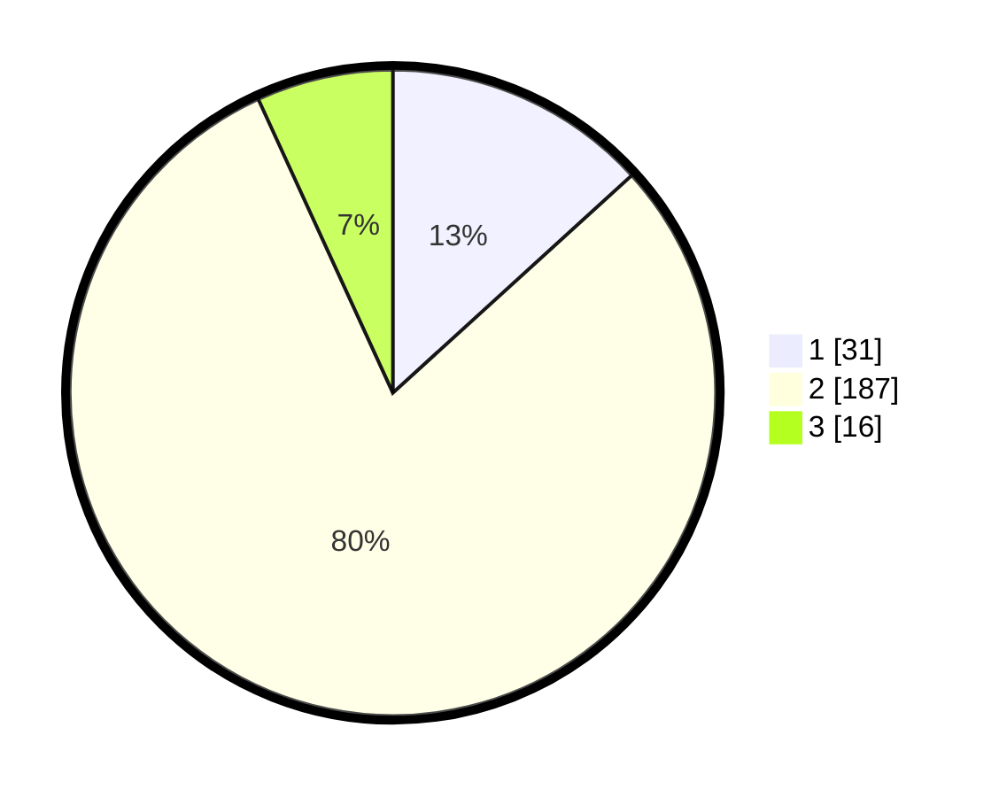

# Hasil

## Grafik

## Tabel

| No. | Nama Paslon    | Suara | Suara (raw) | Persentase |
|:--- |:-------------- | -----:| -----------:| ----------:|
| 1   | ANIES MUHAIMIN | 31    | [31][p-1]   | 13,25      |
| 2   | PRABOWO GIBRAN | 187   | [187][p-2]  | 79,91      |
| 3   | GANJAR MAHFUD  | 16    | [16][p-3]   | 6,84       |

[p-1]: https://github.com/gigit-pemilu/pemilu-2024/blob/main/pilpres/hitung-suara/sub/35-jawa-timur/sub/15-sidoarjo/sub/15-buduran/sub/2008-sawohan/sub/002-tps/sub/paslon-1.txt
[p-2]: https://github.com/gigit-pemilu/pemilu-2024/blob/main/pilpres/hitung-suara/sub/35-jawa-timur/sub/15-sidoarjo/sub/15-buduran/sub/2008-sawohan/sub/002-tps/sub/paslon-2.txt
[p-3]: https://github.com/gigit-pemilu/pemilu-2024/blob/main/pilpres/hitung-suara/sub/35-jawa-timur/sub/15-sidoarjo/sub/15-buduran/sub/2008-sawohan/sub/002-tps/sub/paslon-3.txt

## Foto C Plano

https://sirekap-obj-formc.kpu.go.id/4e89/pemilu/ppwp/35/15/15/20/08/3515152008002-20240215-091142--74b7f6ca-ddd9-4e17-aa4b-432ee003bac2.jpg

https://sirekap-obj-formc.kpu.go.id/4e89/pemilu/ppwp/35/15/15/20/08/3515152008002-20240215-091455--ef03e3e1-8249-4fcc-bd72-9b85a16bd948.jpg

https://sirekap-obj-formc.kpu.go.id/4e89/pemilu/ppwp/35/15/15/20/08/3515152008002-20240215-091701--bcc8b18c-e562-40d7-9ab0-cef6e6ffc690.jpg

## Metadata

| Key        | Value               |
| ---------- | ------------------- |
| Time Stamp | 2024-02-15 19:30:26 |

