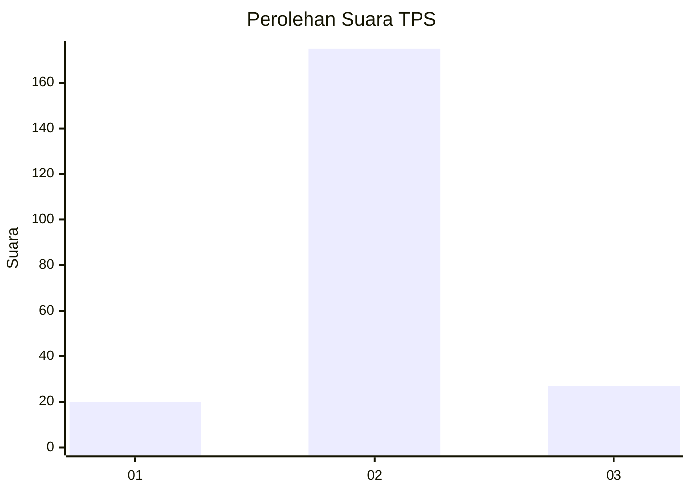
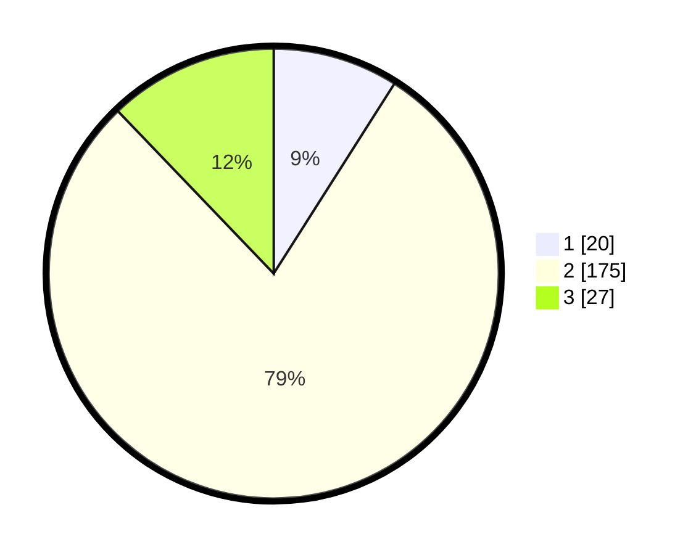

# Hasil

## Grafik

## Tabel

| No. | Nama Paslon    | Suara | Suara (raw) | Persentase |
|:--- |:-------------- | -----:| -----------:| ----------:|
| 1   | ANIES MUHAIMIN | 20    | [20][p-1]   | 9,01       |
| 2   | PRABOWO GIBRAN | 175   | [175][p-2]  | 78,83      |
| 3   | GANJAR MAHFUD  | 27    | [27][p-3]   | 12,16      |

[p-1]: https://github.com/gigit-pemilu/pemilu-2024-35-jawa-timur/blob/main/pilpres/hitung-suara/sub/35-jawa-timur/sub/15-sidoarjo/sub/15-buduran/sub/2009-damarsi/sub/005-tps/sub/paslon-1.txt
[p-2]: https://github.com/gigit-pemilu/pemilu-2024-35-jawa-timur/blob/main/pilpres/hitung-suara/sub/35-jawa-timur/sub/15-sidoarjo/sub/15-buduran/sub/2009-damarsi/sub/005-tps/sub/paslon-2.txt
[p-3]: https://github.com/gigit-pemilu/pemilu-2024-35-jawa-timur/blob/main/pilpres/hitung-suara/sub/35-jawa-timur/sub/15-sidoarjo/sub/15-buduran/sub/2009-damarsi/sub/005-tps/sub/paslon-3.txt

## Foto C Plano

https://sirekap-obj-formc.kpu.go.id/a4af/pemilu/ppwp/35/15/15/20/09/3515152009005-20240214-214929--057d9dc4-72fe-48b2-81e6-3fdc5fd45680.jpg

https://sirekap-obj-formc.kpu.go.id/a4af/pemilu/ppwp/35/15/15/20/09/3515152009005-20240214-215009--ce8bf928-c106-46f9-9748-f707ccf56d5e.jpg

https://sirekap-obj-formc.kpu.go.id/a4af/pemilu/ppwp/35/15/15/20/09/3515152009005-20240214-215154--4811a3cd-426c-499b-9648-82d6070102eb.jpg

## Metadata

| Key        | Value               |
| ---------- | ------------------- |
| Time Stamp | 2024-02-16 16:25:10 |

