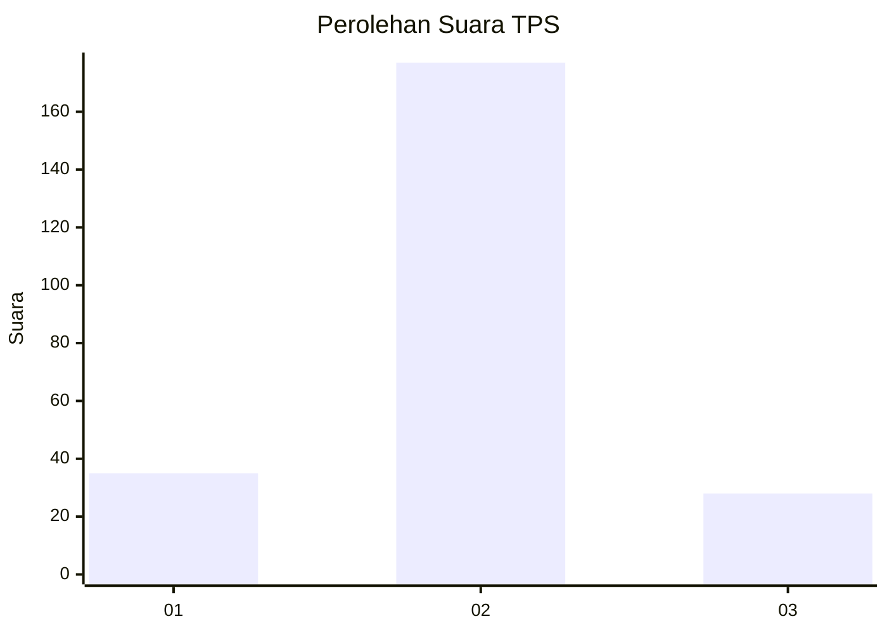
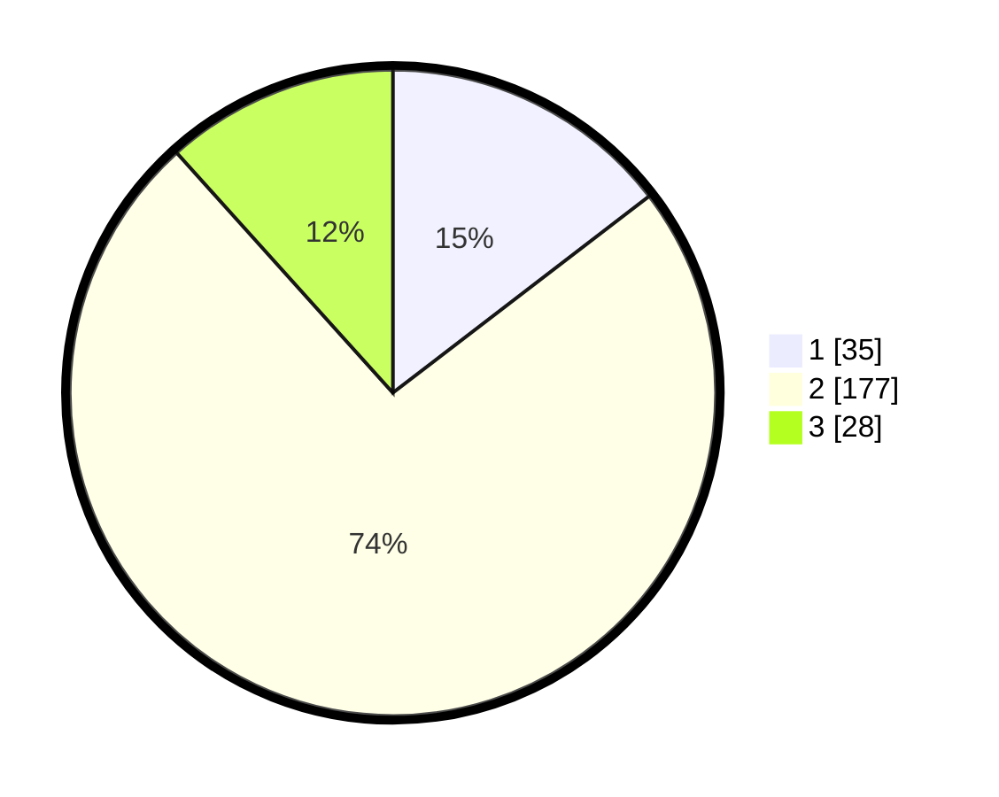

# Hasil

## Grafik

## Tabel

| No. | Nama Paslon    | Suara | Suara (raw) | Persentase |
|:--- |:-------------- | -----:| -----------:| ----------:|
| 1   | ANIES MUHAIMIN | 35    | [35][p-1]   | 14,58      |
| 2   | PRABOWO GIBRAN | 177   | [177][p-2]  | 73,75      |
| 3   | GANJAR MAHFUD  | 28    | [28][p-3]   | 11,67      |

[p-1]: https://github.com/gigit-pemilu/pemilu-2024/blob/main/pilpres/hitung-suara/sub/35-jawa-timur/sub/15-sidoarjo/sub/15-buduran/sub/2013-banjarkemantren/sub/003-tps/sub/paslon-1.txt
[p-2]: https://github.com/gigit-pemilu/pemilu-2024/blob/main/pilpres/hitung-suara/sub/35-jawa-timur/sub/15-sidoarjo/sub/15-buduran/sub/2013-banjarkemantren/sub/003-tps/sub/paslon-2.txt
[p-3]: https://github.com/gigit-pemilu/pemilu-2024/blob/main/pilpres/hitung-suara/sub/35-jawa-timur/sub/15-sidoarjo/sub/15-buduran/sub/2013-banjarkemantren/sub/003-tps/sub/paslon-3.txt

## Foto C Plano

https://sirekap-obj-formc.kpu.go.id/a11f/pemilu/ppwp/35/15/15/20/13/3515152013003-20240214-215007--0fc84a6d-0610-46f6-b1ff-86d1b2bbddde.jpg

https://sirekap-obj-formc.kpu.go.id/a11f/pemilu/ppwp/35/15/15/20/13/3515152013003-20240214-215232--c8c954f0-807f-45a2-a11c-aadcb754a110.jpg

https://sirekap-obj-formc.kpu.go.id/a11f/pemilu/ppwp/35/15/15/20/13/3515152013003-20240214-215445--2d6b7f9c-f61f-4404-997c-ac3283247d88.jpg

## Metadata

| Key        | Value               |
| ---------- | ------------------- |
| Time Stamp | 2024-02-16 16:25:10 |

