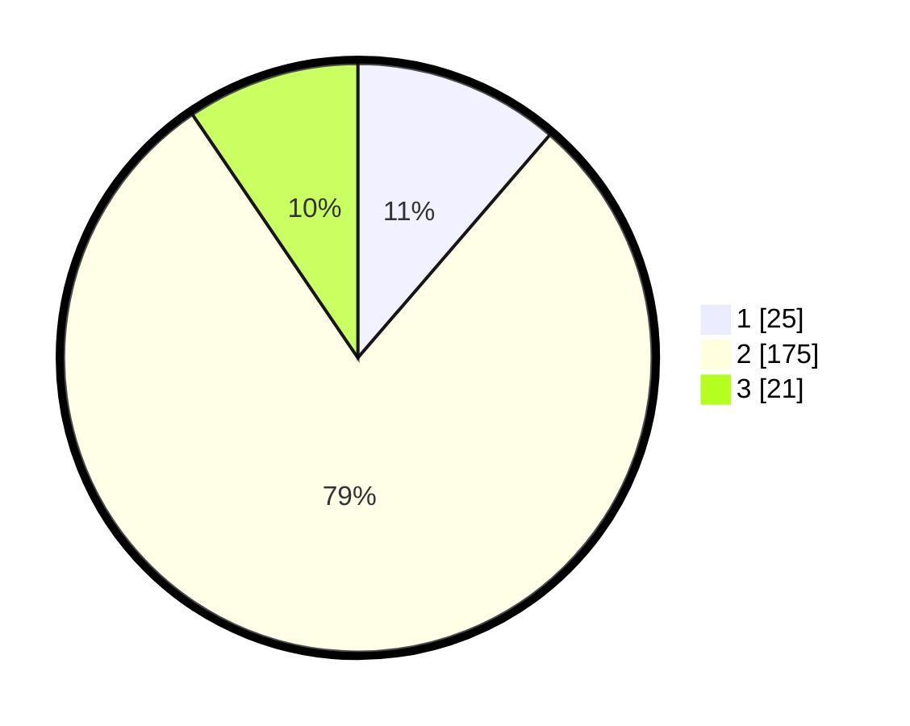

# Hasil

## Grafik

## Tabel

| No. | Nama Paslon    | Suara | Suara (raw) | Persentase |
|:--- |:-------------- | -----:| -----------:| ----------:|
| 1   | ANIES MUHAIMIN | 25    | [25][p-1]   | 11,31      |
| 2   | PRABOWO GIBRAN | 175   | [175][p-2]  | 79,19      |
| 3   | GANJAR MAHFUD  | 21    | [21][p-3]   | 9,50       |

[p-1]: https://github.com/gigit-pemilu/pemilu-2024-35-jawa-timur/blob/main/pilpres/hitung-suara/sub/35-jawa-timur/sub/15-sidoarjo/sub/15-buduran/sub/2013-banjarkemantren/sub/005-tps/sub/paslon-1.txt
[p-2]: https://github.com/gigit-pemilu/pemilu-2024-35-jawa-timur/blob/main/pilpres/hitung-suara/sub/35-jawa-timur/sub/15-sidoarjo/sub/15-buduran/sub/2013-banjarkemantren/sub/005-tps/sub/paslon-2.txt
[p-3]: https://github.com/gigit-pemilu/pemilu-2024-35-jawa-timur/blob/main/pilpres/hitung-suara/sub/35-jawa-timur/sub/15-sidoarjo/sub/15-buduran/sub/2013-banjarkemantren/sub/005-tps/sub/paslon-3.txt

## Foto C Plano

https://sirekap-obj-formc.kpu.go.id/4bd9/pemilu/ppwp/35/15/15/20/13/3515152013005-20240215-015759--91f69544-29c3-4e57-9211-6ee571974d3f.jpg

https://sirekap-obj-formc.kpu.go.id/4bd9/pemilu/ppwp/35/15/15/20/13/3515152013005-20240215-020303--55e25340-cb2a-416f-adaa-9ebc401fd4fa.jpg

https://sirekap-obj-formc.kpu.go.id/4bd9/pemilu/ppwp/35/15/15/20/13/3515152013005-20240215-020742--22d816c8-4aad-4d04-9bda-88c08a6008bb.jpg

## Metadata

| Key        | Value               |
| ---------- | ------------------- |
| Time Stamp | 2024-02-25 12:00:00 |

