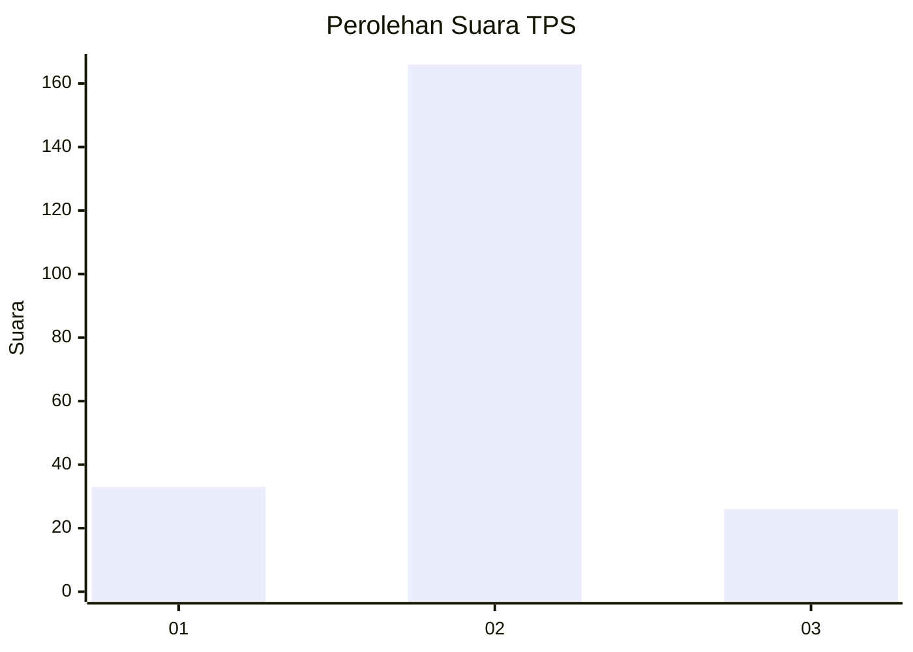
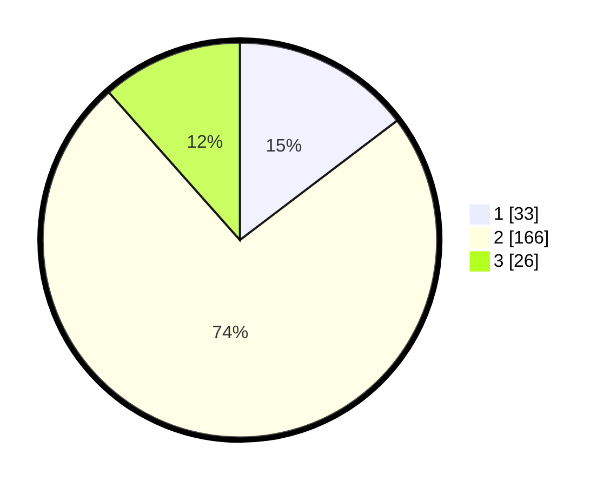

# Hasil

## Grafik

## Tabel

| No. | Nama Paslon    | Suara | Suara (raw) | Persentase |
|:--- |:-------------- | -----:| -----------:| ----------:|
| 1   | ANIES MUHAIMIN | 33    | [33][p-1]   | 14,67      |
| 2   | PRABOWO GIBRAN | 166   | [166][p-2]  | 73,78      |
| 3   | GANJAR MAHFUD  | 26    | [26][p-3]   | 11,56      |

[p-1]: https://github.com/gigit-pemilu/pemilu-2024/blob/main/pilpres/hitung-suara/sub/35-jawa-timur/sub/15-sidoarjo/sub/15-buduran/sub/2013-banjarkemantren/sub/006-tps/sub/paslon-1.txt
[p-2]: https://github.com/gigit-pemilu/pemilu-2024/blob/main/pilpres/hitung-suara/sub/35-jawa-timur/sub/15-sidoarjo/sub/15-buduran/sub/2013-banjarkemantren/sub/006-tps/sub/paslon-2.txt
[p-3]: https://github.com/gigit-pemilu/pemilu-2024/blob/main/pilpres/hitung-suara/sub/35-jawa-timur/sub/15-sidoarjo/sub/15-buduran/sub/2013-banjarkemantren/sub/006-tps/sub/paslon-3.txt

## Foto C Plano

https://sirekap-obj-formc.kpu.go.id/9ad1/pemilu/ppwp/35/15/15/20/13/3515152013006-20240214-235820--9afd93ba-0384-4ded-9ca4-91fcbec6dca5.jpg

https://sirekap-obj-formc.kpu.go.id/9ad1/pemilu/ppwp/35/15/15/20/13/3515152013006-20240214-235941--56ca97a1-6646-445b-9159-a9cf8c9e4522.jpg

https://sirekap-obj-formc.kpu.go.id/9ad1/pemilu/ppwp/35/15/15/20/13/3515152013006-20240215-000356--71bc00a0-f4b8-4464-8303-ae0c610a0268.jpg

## Metadata

| Key        | Value               |
| ---------- | ------------------- |
| Time Stamp | 2024-02-24 22:31:28 |

