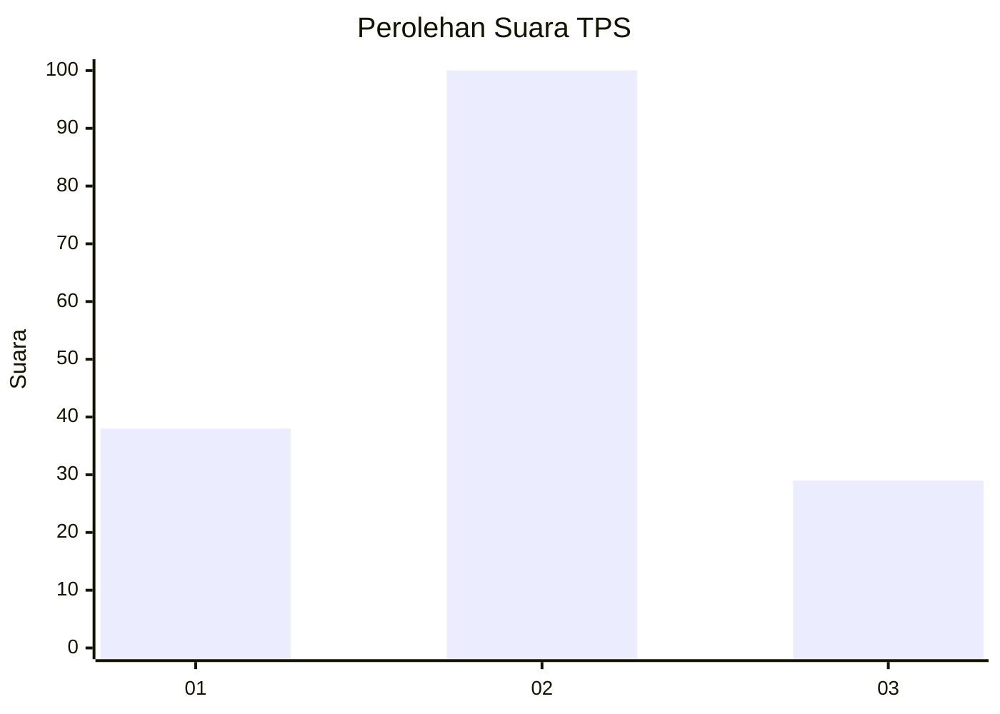

# Hasil

## Grafik

## Tabel

| No. | Nama Paslon    | Suara | Suara (raw) | Persentase |
|:--- |:-------------- | -----:| -----------:| ----------:|
| 1   | ANIES MUHAIMIN | 38    | [38][p-1]   | 22,75      |
| 2   | PRABOWO GIBRAN | 100   | [100][p-2]  | 59,88      |
| 3   | GANJAR MAHFUD  | 29    | [29][p-3]   | 17,37      |

[p-1]: https://github.com/gigit-pemilu/pemilu-2024-35-jawa-timur/blob/main/pilpres/hitung-suara/sub/35-jawa-timur/sub/15-sidoarjo/sub/15-buduran/sub/2015-sidokepung/sub/034-tps/sub/paslon-1.txt
[p-2]: https://github.com/gigit-pemilu/pemilu-2024-35-jawa-timur/blob/main/pilpres/hitung-suara/sub/35-jawa-timur/sub/15-sidoarjo/sub/15-buduran/sub/2015-sidokepung/sub/034-tps/sub/paslon-2.txt
[p-3]: https://github.com/gigit-pemilu/pemilu-2024-35-jawa-timur/blob/main/pilpres/hitung-suara/sub/35-jawa-timur/sub/15-sidoarjo/sub/15-buduran/sub/2015-sidokepung/sub/034-tps/sub/paslon-3.txt

## Foto C Plano

https://sirekap-obj-formc.kpu.go.id/f9b8/pemilu/ppwp/35/15/15/20/15/3515152015034-20240216-163515--6e2340e0-5cd2-434a-8bb4-38bac6f518ed.jpg

https://sirekap-obj-formc.kpu.go.id/f9b8/pemilu/ppwp/35/15/15/20/15/3515152015034-20240216-164125--26267fc8-bfe0-4a89-bf8d-786cfad024c3.jpg

https://sirekap-obj-formc.kpu.go.id/f9b8/pemilu/ppwp/35/15/15/20/15/3515152015034-20240215-014748--a3b4faba-7eef-4bf8-851d-c569d24d53fa.jpg

## Metadata

| Key        | Value               |
| ---------- | ------------------- |
| Time Stamp | 2024-02-25 15:00:00 |

