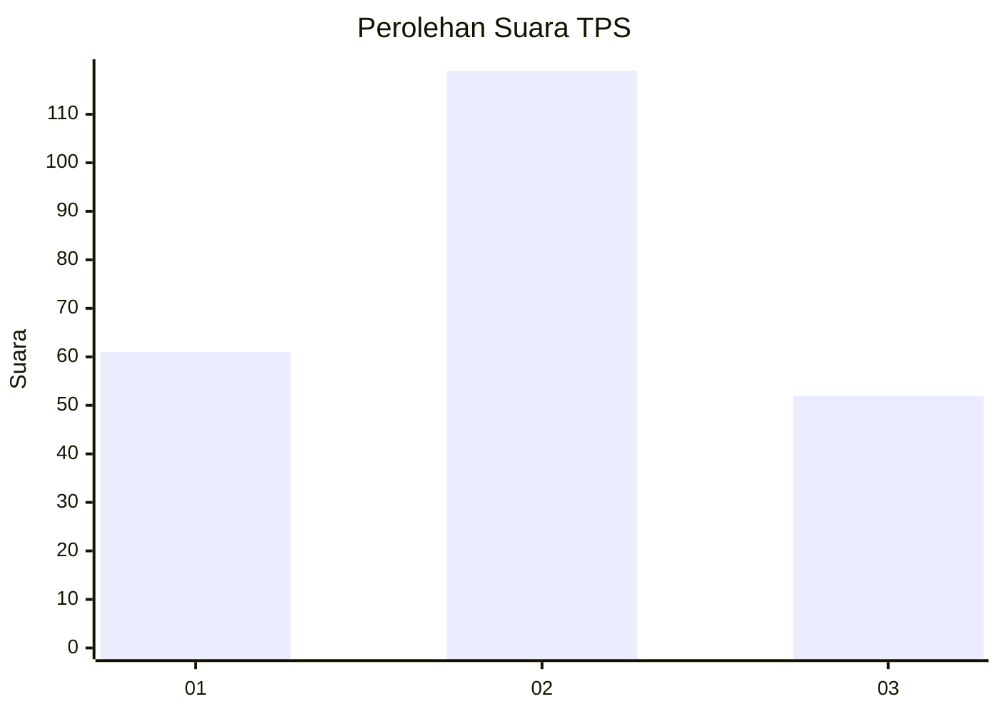
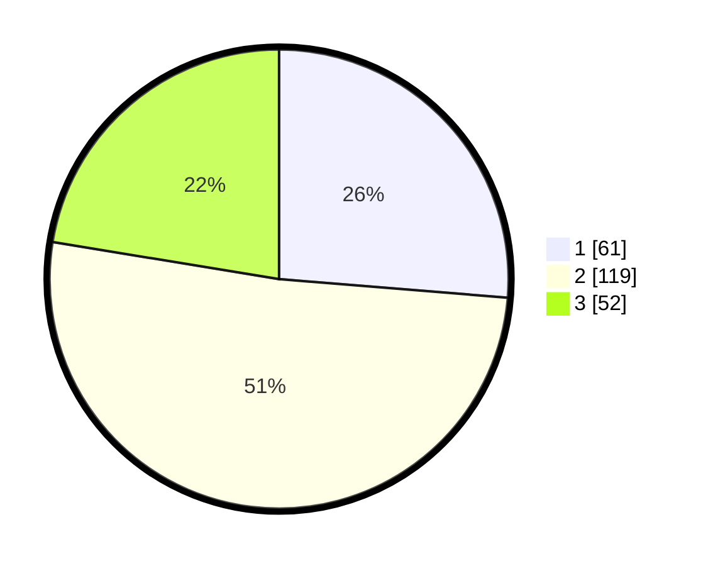

# Hasil

## Grafik

## Tabel

| No. | Nama Paslon    | Suara | Suara (raw) | Persentase |
|:--- |:-------------- | -----:| -----------:| ----------:|
| 1   | ANIES MUHAIMIN | 61    | [61][p-1]   | 26,29      |
| 2   | PRABOWO GIBRAN | 119   | [119][p-2]  | 51,29      |
| 3   | GANJAR MAHFUD  | 52    | [52][p-3]   | 22,41      |

[p-1]: https://github.com/gigit-pemilu/pemilu-2024-35-jawa-timur/blob/main/pilpres/hitung-suara/sub/35-jawa-timur/sub/15-sidoarjo/sub/15-buduran/sub/2015-sidokepung/sub/035-tps/sub/paslon-1.txt
[p-2]: https://github.com/gigit-pemilu/pemilu-2024-35-jawa-timur/blob/main/pilpres/hitung-suara/sub/35-jawa-timur/sub/15-sidoarjo/sub/15-buduran/sub/2015-sidokepung/sub/035-tps/sub/paslon-2.txt
[p-3]: https://github.com/gigit-pemilu/pemilu-2024-35-jawa-timur/blob/main/pilpres/hitung-suara/sub/35-jawa-timur/sub/15-sidoarjo/sub/15-buduran/sub/2015-sidokepung/sub/035-tps/sub/paslon-3.txt

## Foto C Plano

https://sirekap-obj-formc.kpu.go.id/7bdb/pemilu/ppwp/35/15/15/20/15/3515152015035-20240215-103118--e04bbbb0-58f3-49c8-bf56-a8325057c8c8.jpg

https://sirekap-obj-formc.kpu.go.id/7bdb/pemilu/ppwp/35/15/15/20/15/3515152015035-20240215-103156--9e275581-8507-40b3-84a8-7f27f2b83661.jpg

https://sirekap-obj-formc.kpu.go.id/7bdb/pemilu/ppwp/35/15/15/20/15/3515152015035-20240215-103227--25bfd38c-5a6a-4083-8312-2cd4d176ef30.jpg

## Metadata

| Key        | Value               |
| ---------- | ------------------- |
| Time Stamp | 2024-02-16 16:25:10 |

