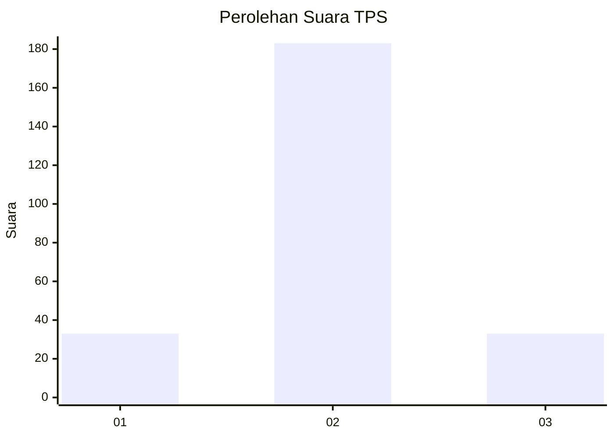
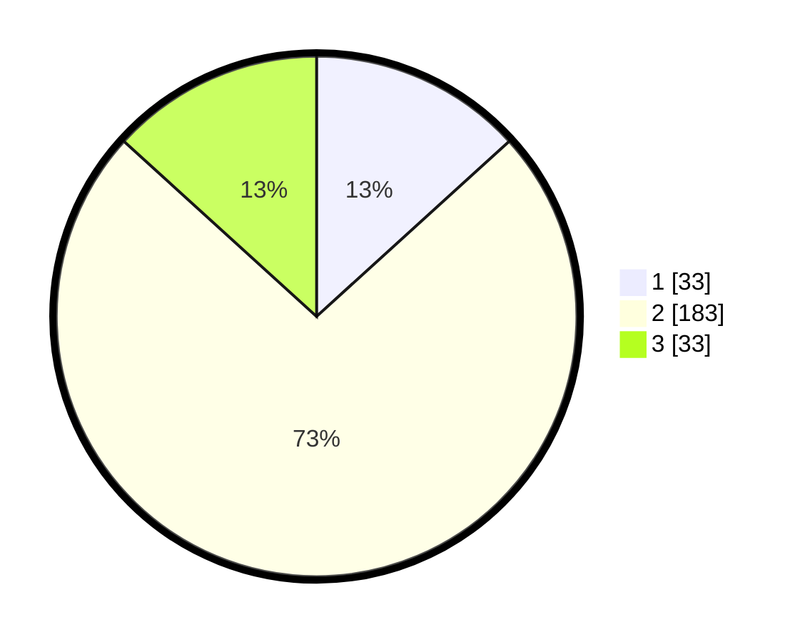

# Hasil

## Grafik

## Tabel

| No. | Nama Paslon    | Suara | Suara (raw) | Persentase |
|:--- |:-------------- | -----:| -----------:| ----------:|
| 1   | ANIES MUHAIMIN | 33    | [33][p-1]   | 13,25      |
| 2   | PRABOWO GIBRAN | 183   | [183][p-2]  | 73,49      |
| 3   | GANJAR MAHFUD  | 33    | [33][p-3]   | 13,25      |

[p-1]: https://github.com/gigit-pemilu/pemilu-2024-35-jawa-timur/blob/main/pilpres/hitung-suara/sub/35-jawa-timur/sub/15-sidoarjo/sub/16-gedangan/sub/2002-karangbong/sub/003-tps/sub/paslon-1.txt
[p-2]: https://github.com/gigit-pemilu/pemilu-2024-35-jawa-timur/blob/main/pilpres/hitung-suara/sub/35-jawa-timur/sub/15-sidoarjo/sub/16-gedangan/sub/2002-karangbong/sub/003-tps/sub/paslon-2.txt
[p-3]: https://github.com/gigit-pemilu/pemilu-2024-35-jawa-timur/blob/main/pilpres/hitung-suara/sub/35-jawa-timur/sub/15-sidoarjo/sub/16-gedangan/sub/2002-karangbong/sub/003-tps/sub/paslon-3.txt

## Foto C Plano

https://sirekap-obj-formc.kpu.go.id/7ff9/pemilu/ppwp/35/15/16/20/02/3515162002003-20240214-214153--2a3aff85-13fc-4855-9629-33bef4430400.jpg

https://sirekap-obj-formc.kpu.go.id/7ff9/pemilu/ppwp/35/15/16/20/02/3515162002003-20240215-011453--ded126a4-4071-4ffb-bd7b-5c11363ae893.jpg

https://sirekap-obj-formc.kpu.go.id/7ff9/pemilu/ppwp/35/15/16/20/02/3515162002003-20240215-011625--9595274f-413b-4a02-a5b4-81d036dc477f.jpg

## Metadata

| Key        | Value               |
| ---------- | ------------------- |
| Time Stamp | 2024-02-16 12:51:22 |

