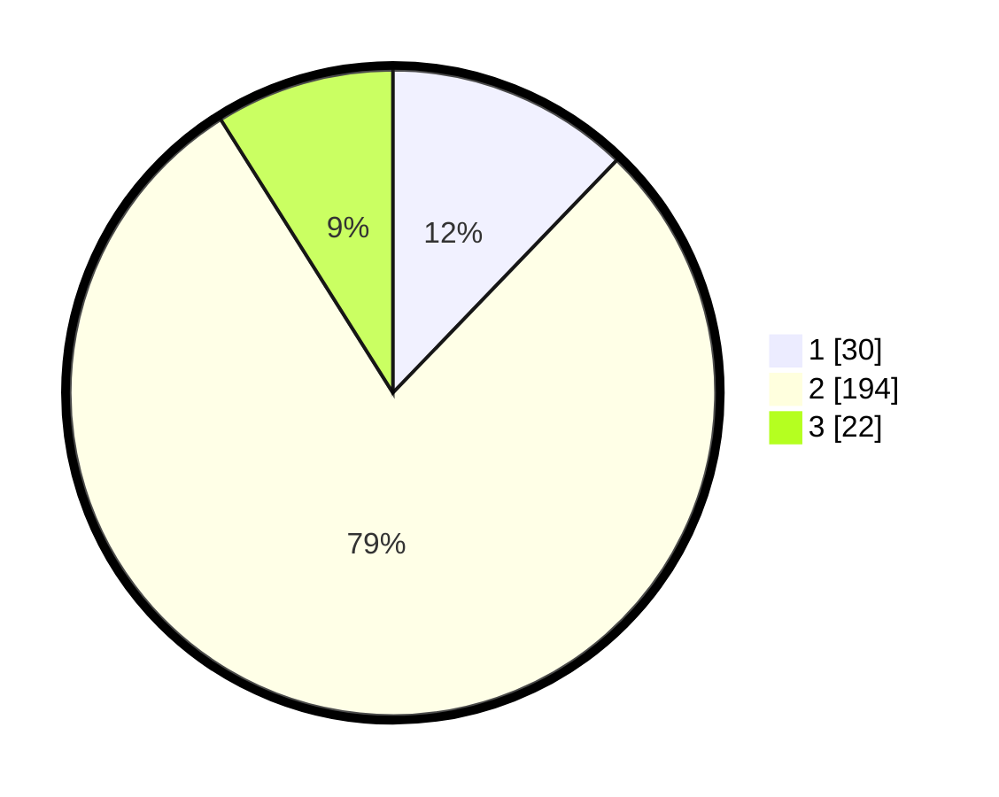

# Hasil

## Grafik

## Tabel

| No. | Nama Paslon    | Suara | Suara (raw) | Persentase |
|:--- |:-------------- | -----:| -----------:| ----------:|
| 1   | ANIES MUHAIMIN | 30    | [30][p-1]   | 12,20      |
| 2   | PRABOWO GIBRAN | 194   | [194][p-2]  | 78,86      |
| 3   | GANJAR MAHFUD  | 22    | [22][p-3]   | 8,94       |

[p-1]: https://github.com/gigit-pemilu/pemilu-2024/blob/main/pilpres/hitung-suara/sub/35-jawa-timur/sub/15-sidoarjo/sub/16-gedangan/sub/2004-kragan/sub/002-tps/sub/paslon-1.txt
[p-2]: https://github.com/gigit-pemilu/pemilu-2024/blob/main/pilpres/hitung-suara/sub/35-jawa-timur/sub/15-sidoarjo/sub/16-gedangan/sub/2004-kragan/sub/002-tps/sub/paslon-2.txt
[p-3]: https://github.com/gigit-pemilu/pemilu-2024/blob/main/pilpres/hitung-suara/sub/35-jawa-timur/sub/15-sidoarjo/sub/16-gedangan/sub/2004-kragan/sub/002-tps/sub/paslon-3.txt

## Foto C Plano

https://sirekap-obj-formc.kpu.go.id/01da/pemilu/ppwp/35/15/16/20/04/3515162004002-20240216-061838--ee178545-4a1a-4989-9d25-632193abafff.jpg

https://sirekap-obj-formc.kpu.go.id/01da/pemilu/ppwp/35/15/16/20/04/3515162004002-20240216-061842--448f8b94-f592-4df8-b7fd-34b58b94b285.jpg

https://sirekap-obj-formc.kpu.go.id/01da/pemilu/ppwp/35/15/16/20/04/3515162004002-20240216-061847--a3a39760-9919-4b1d-87d6-6b7a868985e8.jpg

## Metadata

| Key        | Value               |
| ---------- | ------------------- |
| Time Stamp | 2024-02-25 01:00:00 |

