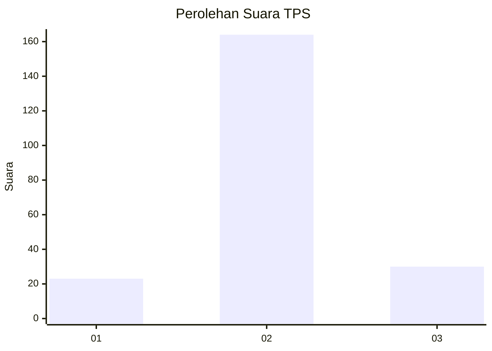
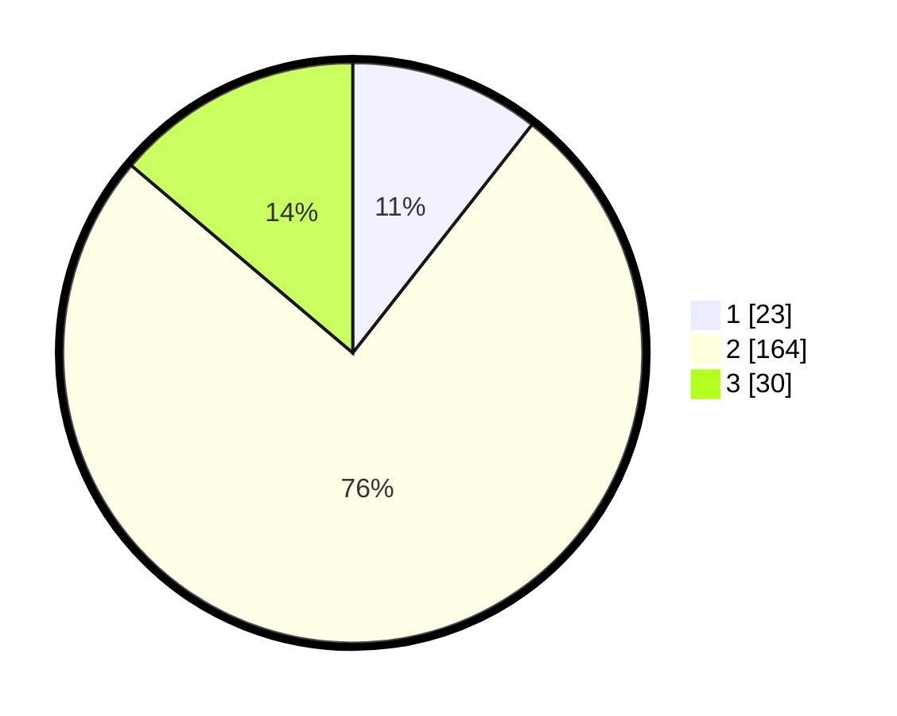

# Hasil

## Grafik

## Tabel

| No. | Nama Paslon    | Suara | Suara (raw) | Persentase |
|:--- |:-------------- | -----:| -----------:| ----------:|
| 1   | ANIES MUHAIMIN | 23    | [23][p-1]   | 10,60      |
| 2   | PRABOWO GIBRAN | 164   | [164][p-2]  | 75,58      |
| 3   | GANJAR MAHFUD  | 30    | [30][p-3]   | 13,82      |

[p-1]: https://github.com/gigit-pemilu/pemilu-2024/blob/main/pilpres/hitung-suara/sub/35-jawa-timur/sub/15-sidoarjo/sub/16-gedangan/sub/2008-ketajen/sub/006-tps/sub/paslon-1.txt
[p-2]: https://github.com/gigit-pemilu/pemilu-2024/blob/main/pilpres/hitung-suara/sub/35-jawa-timur/sub/15-sidoarjo/sub/16-gedangan/sub/2008-ketajen/sub/006-tps/sub/paslon-2.txt
[p-3]: https://github.com/gigit-pemilu/pemilu-2024/blob/main/pilpres/hitung-suara/sub/35-jawa-timur/sub/15-sidoarjo/sub/16-gedangan/sub/2008-ketajen/sub/006-tps/sub/paslon-3.txt

## Foto C Plano

https://sirekap-obj-formc.kpu.go.id/dbfe/pemilu/ppwp/35/15/16/20/08/3515162008006-20240214-191037--e0d35235-2d9d-44f1-a33b-5b8f87e5b4d9.jpg

https://sirekap-obj-formc.kpu.go.id/dbfe/pemilu/ppwp/35/15/16/20/08/3515162008006-20240214-191825--d8b82b58-6795-412a-ba15-e65c1ae96691.jpg

https://sirekap-obj-formc.kpu.go.id/dbfe/pemilu/ppwp/35/15/16/20/08/3515162008006-20240214-191137--76b1e41e-7e8c-4a4d-a337-6a6bf95fd6a8.jpg

## Metadata

| Key        | Value               |
| ---------- | ------------------- |
| Time Stamp | 2024-02-24 22:31:28 |

