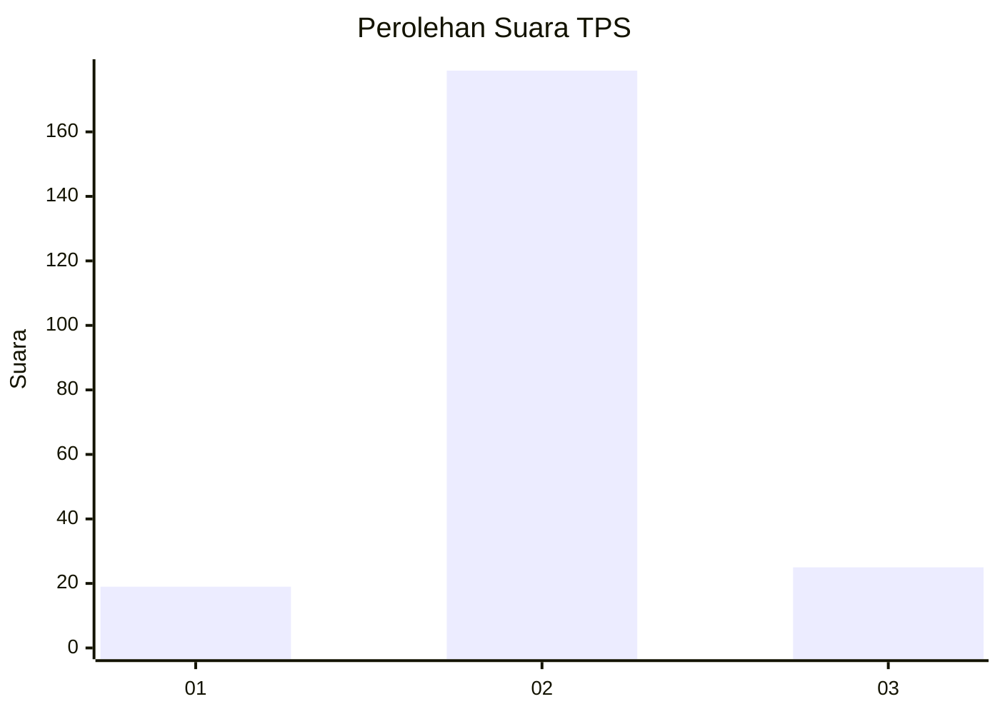
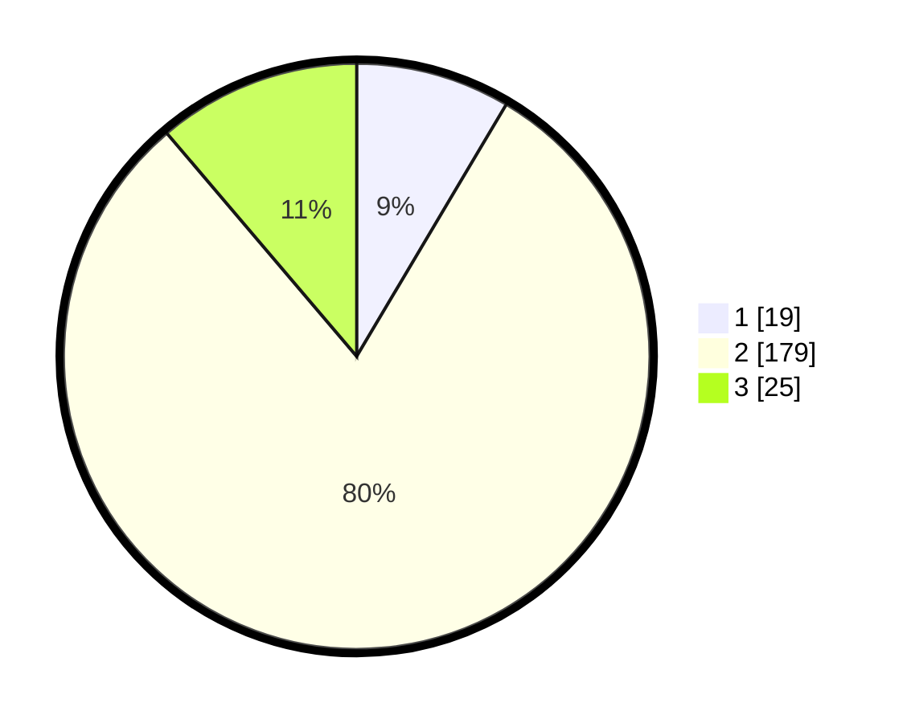

# Hasil

## Grafik

## Tabel

| No. | Nama Paslon    | Suara | Suara (raw) | Persentase |
|:--- |:-------------- | -----:| -----------:| ----------:|
| 1   | ANIES MUHAIMIN | 19    | [19][p-1]   | 8,52       |
| 2   | PRABOWO GIBRAN | 179   | [179][p-2]  | 80,27      |
| 3   | GANJAR MAHFUD  | 25    | [25][p-3]   | 11,21      |

[p-1]: https://github.com/gigit-pemilu/pemilu-2024/blob/main/pilpres/hitung-suara/sub/35-jawa-timur/sub/15-sidoarjo/sub/16-gedangan/sub/2009-gedangan/sub/005-tps/sub/paslon-1.txt
[p-2]: https://github.com/gigit-pemilu/pemilu-2024/blob/main/pilpres/hitung-suara/sub/35-jawa-timur/sub/15-sidoarjo/sub/16-gedangan/sub/2009-gedangan/sub/005-tps/sub/paslon-2.txt
[p-3]: https://github.com/gigit-pemilu/pemilu-2024/blob/main/pilpres/hitung-suara/sub/35-jawa-timur/sub/15-sidoarjo/sub/16-gedangan/sub/2009-gedangan/sub/005-tps/sub/paslon-3.txt

## Foto C Plano

https://sirekap-obj-formc.kpu.go.id/0d3f/pemilu/ppwp/35/15/16/20/09/3515162009005-20240214-233707--fdc88d1d-4190-409a-b1f7-9414104a0e4c.jpg

https://sirekap-obj-formc.kpu.go.id/0d3f/pemilu/ppwp/35/15/16/20/09/3515162009005-20240214-234917--3736bd0b-66cd-4a73-b6ad-ee7de536c489.jpg

https://sirekap-obj-formc.kpu.go.id/0d3f/pemilu/ppwp/35/15/16/20/09/3515162009005-20240214-235408--464e5304-b024-455d-ae6d-b75c1d6d7920.jpg

## Metadata

| Key        | Value               |
| ---------- | ------------------- |
| Time Stamp | 2024-02-16 12:51:22 |

