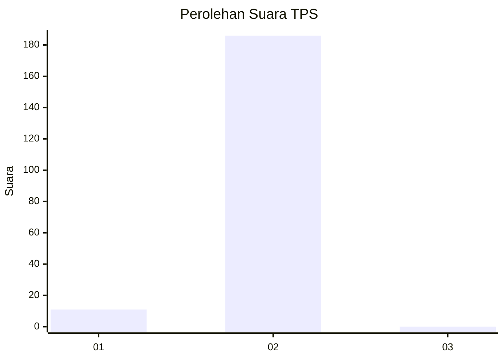
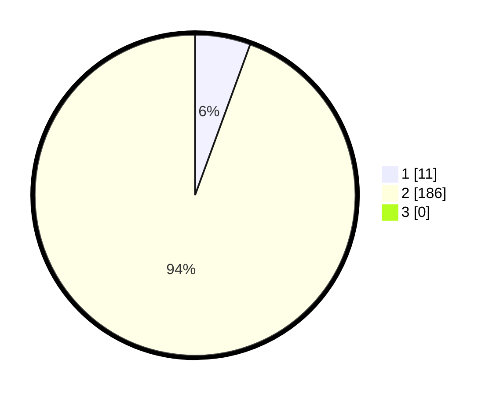

# Hasil

## Grafik

## Tabel

| No. | Nama Paslon    | Suara | Suara (raw) | Persentase |
|:--- |:-------------- | -----:| -----------:| ----------:|
| 1   | ANIES MUHAIMIN | 11    | [11][p-1]   | 5,58       |
| 2   | PRABOWO GIBRAN | 186   | [186][p-2]  | 94,42      |
| 3   | GANJAR MAHFUD  | 0     | [0][p-3]    | 0,00       |

[p-1]: https://github.com/gigit-pemilu/pemilu-2024/blob/main/pilpres/hitung-suara/sub/35-jawa-timur/sub/15-sidoarjo/sub/16-gedangan/sub/2010-sruni/sub/004-tps/sub/paslon-1.txt
[p-2]: https://github.com/gigit-pemilu/pemilu-2024/blob/main/pilpres/hitung-suara/sub/35-jawa-timur/sub/15-sidoarjo/sub/16-gedangan/sub/2010-sruni/sub/004-tps/sub/paslon-2.txt
[p-3]: https://github.com/gigit-pemilu/pemilu-2024/blob/main/pilpres/hitung-suara/sub/35-jawa-timur/sub/15-sidoarjo/sub/16-gedangan/sub/2010-sruni/sub/004-tps/sub/paslon-3.txt

## Foto C Plano

https://sirekap-obj-formc.kpu.go.id/3bc0/pemilu/ppwp/35/15/16/20/10/3515162010004-20240214-230300--24c71e04-2558-4901-80f9-d53cc5e20d1f.jpg

https://sirekap-obj-formc.kpu.go.id/3bc0/pemilu/ppwp/35/15/16/20/10/3515162010004-20240214-230500--8291f2b0-33cd-4c8c-8628-8639bff9f590.jpg

https://sirekap-obj-formc.kpu.go.id/3bc0/pemilu/ppwp/35/15/16/20/10/3515162010004-20240214-230746--532ee748-4ffd-4c5b-8a42-06e2a43f074d.jpg

## Metadata

| Key        | Value               |
| ---------- | ------------------- |
| Time Stamp | 2024-02-25 22:00:00 |

