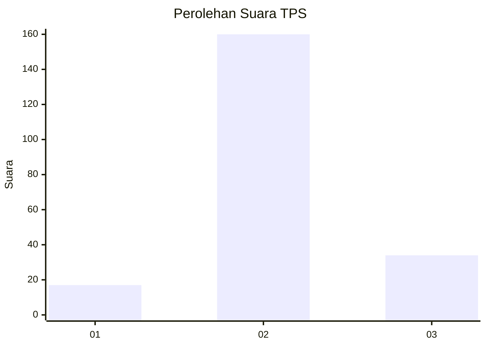
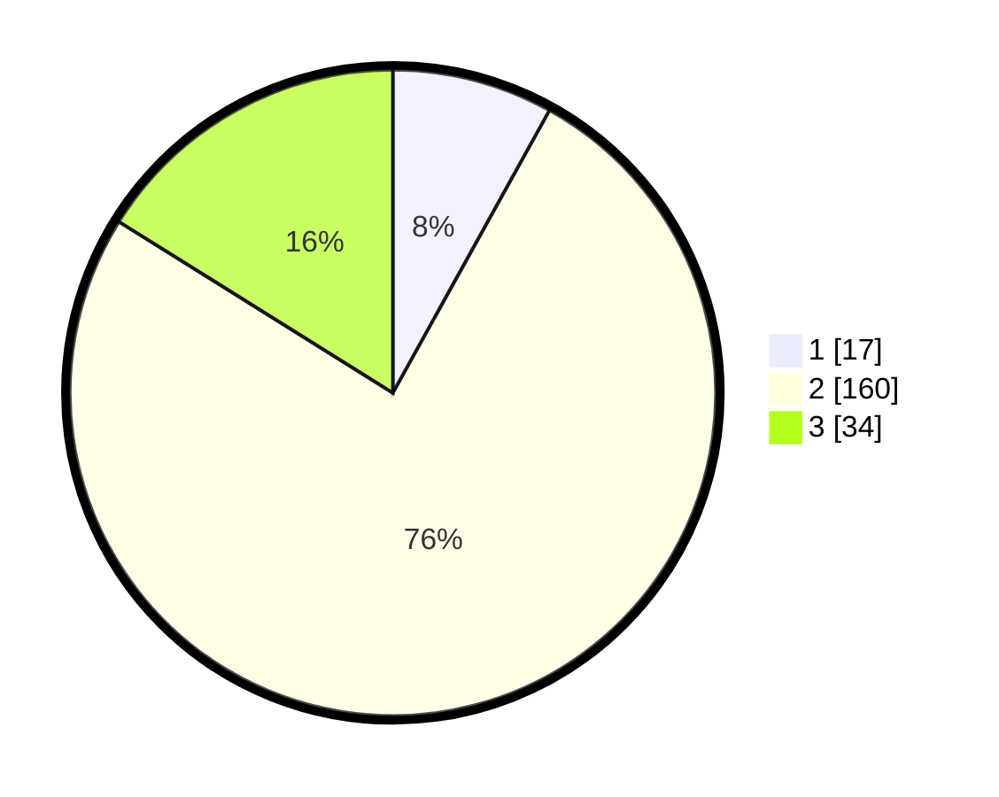

# Hasil

## Grafik

## Tabel

| No. | Nama Paslon    | Suara | Suara (raw) | Persentase |
|:--- |:-------------- | -----:| -----------:| ----------:|
| 1   | ANIES MUHAIMIN | 17    | [17][p-1]   | 8,06       |
| 2   | PRABOWO GIBRAN | 160   | [160][p-2]  | 75,83      |
| 3   | GANJAR MAHFUD  | 34    | [34][p-3]   | 16,11      |

[p-1]: https://github.com/gigit-pemilu/pemilu-2024/blob/main/pilpres/hitung-suara/sub/35-jawa-timur/sub/15-sidoarjo/sub/16-gedangan/sub/2011-keboansikep/sub/001-tps/sub/paslon-1.txt
[p-2]: https://github.com/gigit-pemilu/pemilu-2024/blob/main/pilpres/hitung-suara/sub/35-jawa-timur/sub/15-sidoarjo/sub/16-gedangan/sub/2011-keboansikep/sub/001-tps/sub/paslon-2.txt
[p-3]: https://github.com/gigit-pemilu/pemilu-2024/blob/main/pilpres/hitung-suara/sub/35-jawa-timur/sub/15-sidoarjo/sub/16-gedangan/sub/2011-keboansikep/sub/001-tps/sub/paslon-3.txt

## Foto C Plano

https://sirekap-obj-formc.kpu.go.id/ccc2/pemilu/ppwp/35/15/16/20/11/3515162011001-20240214-224853--d5171e9a-6a36-4525-b577-49807bb41486.jpg

https://sirekap-obj-formc.kpu.go.id/ccc2/pemilu/ppwp/35/15/16/20/11/3515162011001-20240214-224259--50c59839-57e3-4663-9ee9-a9f76d0b54f0.jpg

https://sirekap-obj-formc.kpu.go.id/ccc2/pemilu/ppwp/35/15/16/20/11/3515162011001-20240214-224531--8623ba44-262f-4b7f-8e0e-c9ae5ee5e222.jpg

## Metadata

| Key        | Value               |
| ---------- | ------------------- |
| Time Stamp | 2024-02-24 22:31:28 |

