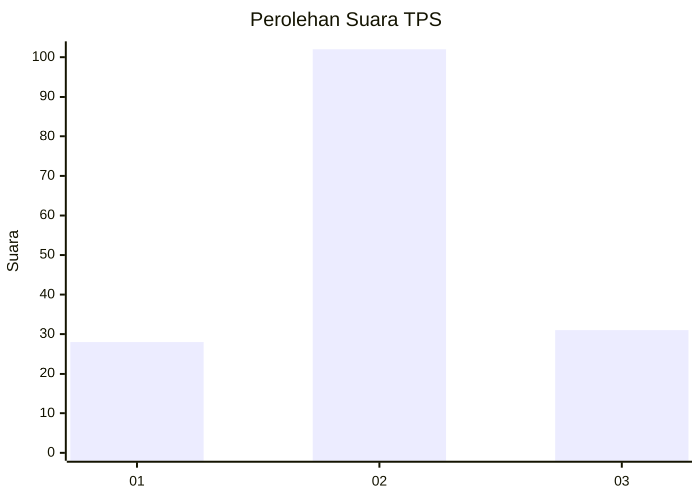
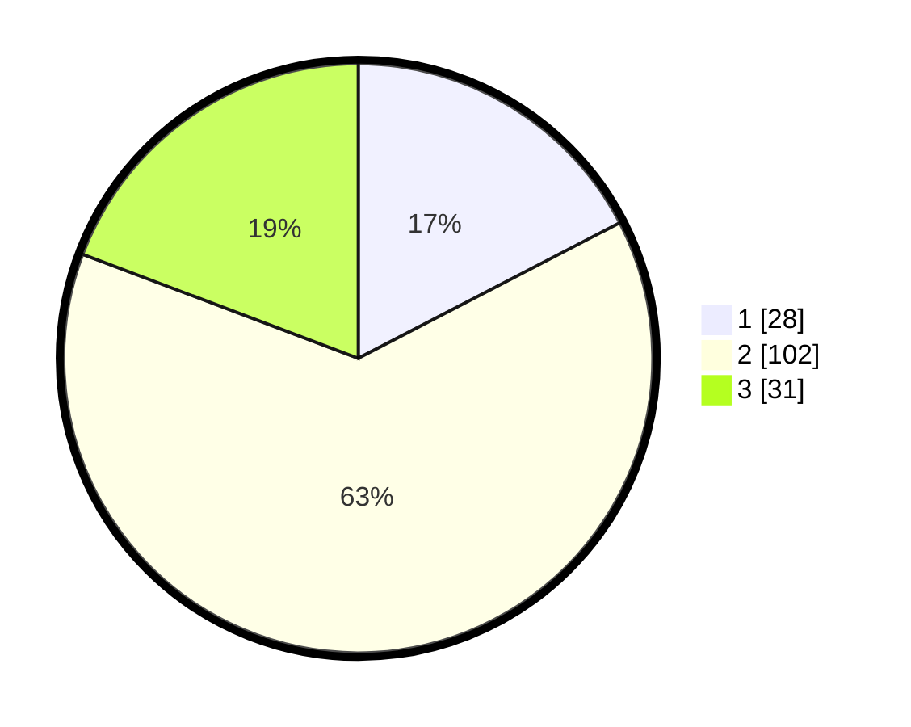

# Hasil

## Grafik

## Tabel

| No. | Nama Paslon    | Suara | Suara (raw) | Persentase |
|:--- |:-------------- | -----:| -----------:| ----------:|
| 1   | ANIES MUHAIMIN | 28    | [28][p-1]   | 17,39      |
| 2   | PRABOWO GIBRAN | 102   | [102][p-2]  | 63,35      |
| 3   | GANJAR MAHFUD  | 31    | [31][p-3]   | 19,25      |

[p-1]: https://github.com/gigit-pemilu/pemilu-2024/blob/main/pilpres/hitung-suara/sub/35-jawa-timur/sub/15-sidoarjo/sub/16-gedangan/sub/2011-keboansikep/sub/003-tps/sub/paslon-1.txt
[p-2]: https://github.com/gigit-pemilu/pemilu-2024/blob/main/pilpres/hitung-suara/sub/35-jawa-timur/sub/15-sidoarjo/sub/16-gedangan/sub/2011-keboansikep/sub/003-tps/sub/paslon-2.txt
[p-3]: https://github.com/gigit-pemilu/pemilu-2024/blob/main/pilpres/hitung-suara/sub/35-jawa-timur/sub/15-sidoarjo/sub/16-gedangan/sub/2011-keboansikep/sub/003-tps/sub/paslon-3.txt

## Foto C Plano

https://sirekap-obj-formc.kpu.go.id/1af9/pemilu/ppwp/35/15/16/20/11/3515162011003-20240214-192043--cc193de4-36ae-4ed1-a79f-41752e3e56fe.jpg

https://sirekap-obj-formc.kpu.go.id/1af9/pemilu/ppwp/35/15/16/20/11/3515162011003-20240214-192418--a710eba6-df23-4d9e-a1a0-3876a97cb73f.jpg

https://sirekap-obj-formc.kpu.go.id/1af9/pemilu/ppwp/35/15/16/20/11/3515162011003-20240214-192619--3be723a5-a299-4f9a-8a40-9471e7310633.jpg

## Metadata

| Key        | Value               |
| ---------- | ------------------- |
| Time Stamp | 2024-02-25 17:00:00 |

