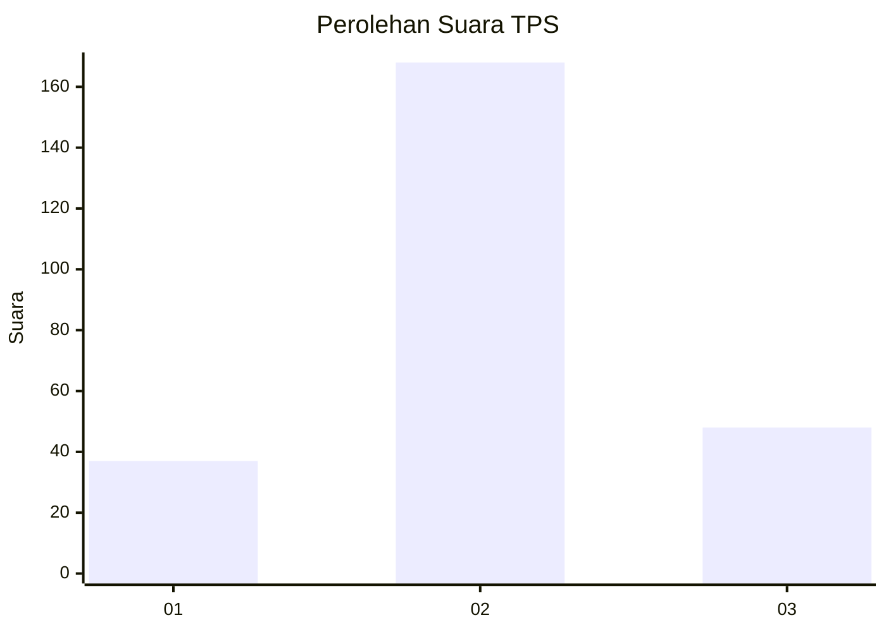
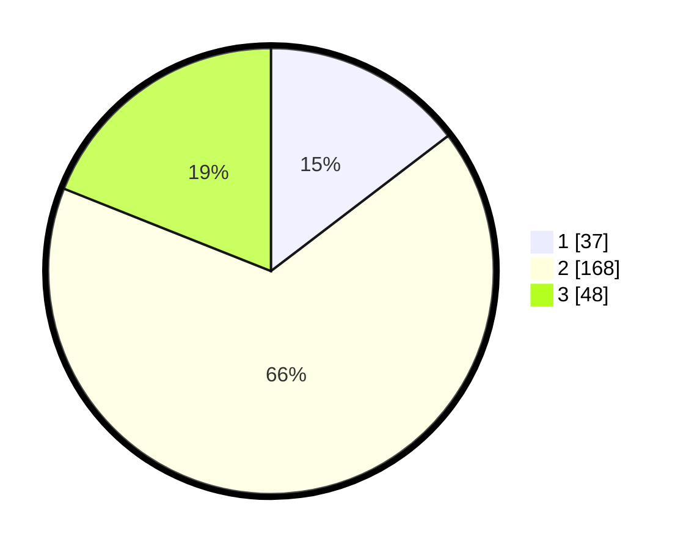

# Hasil

## Grafik

## Tabel

| No. | Nama Paslon    | Suara | Suara (raw) | Persentase |
|:--- |:-------------- | -----:| -----------:| ----------:|
| 1   | ANIES MUHAIMIN | 37    | [37][p-1]   | 14,62      |
| 2   | PRABOWO GIBRAN | 168   | [168][p-2]  | 66,40      |
| 3   | GANJAR MAHFUD  | 48    | [48][p-3]   | 18,97      |

[p-1]: https://github.com/gigit-pemilu/pemilu-2024/blob/main/pilpres/hitung-suara/sub/35-jawa-timur/sub/15-sidoarjo/sub/16-gedangan/sub/2011-keboansikep/sub/021-tps/sub/paslon-1.txt
[p-2]: https://github.com/gigit-pemilu/pemilu-2024/blob/main/pilpres/hitung-suara/sub/35-jawa-timur/sub/15-sidoarjo/sub/16-gedangan/sub/2011-keboansikep/sub/021-tps/sub/paslon-2.txt
[p-3]: https://github.com/gigit-pemilu/pemilu-2024/blob/main/pilpres/hitung-suara/sub/35-jawa-timur/sub/15-sidoarjo/sub/16-gedangan/sub/2011-keboansikep/sub/021-tps/sub/paslon-3.txt

## Foto C Plano

https://sirekap-obj-formc.kpu.go.id/c925/pemilu/ppwp/35/15/16/20/11/3515162011021-20240214-224328--a8175943-cc58-463d-ace5-8ae7a2f5a0a6.jpg

https://sirekap-obj-formc.kpu.go.id/c925/pemilu/ppwp/35/15/16/20/11/3515162011021-20240214-224441--46041afa-bf7c-40aa-aaa4-b16ea7a1d1f6.jpg

https://sirekap-obj-formc.kpu.go.id/c925/pemilu/ppwp/35/15/16/20/11/3515162011021-20240214-224536--6fb66731-44bd-47d1-a357-d7c8eece36d1.jpg

## Metadata

| Key        | Value               |
| ---------- | ------------------- |
| Time Stamp | 2024-02-24 22:31:28 |

