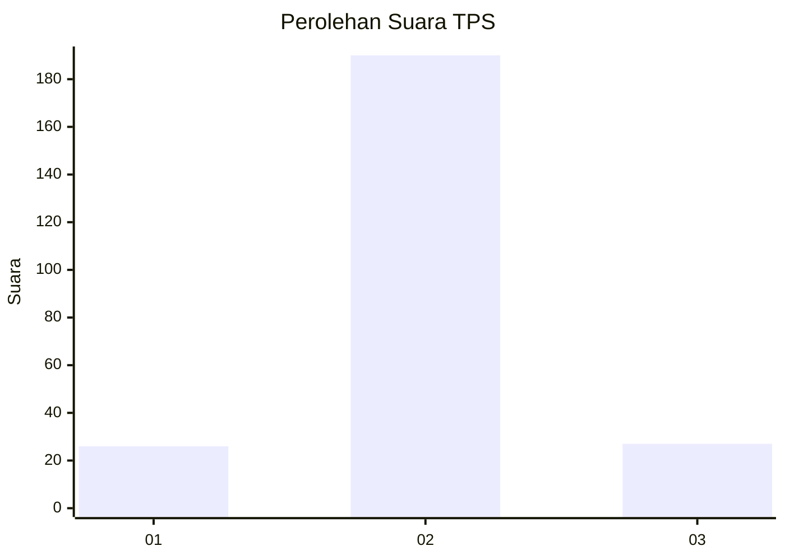
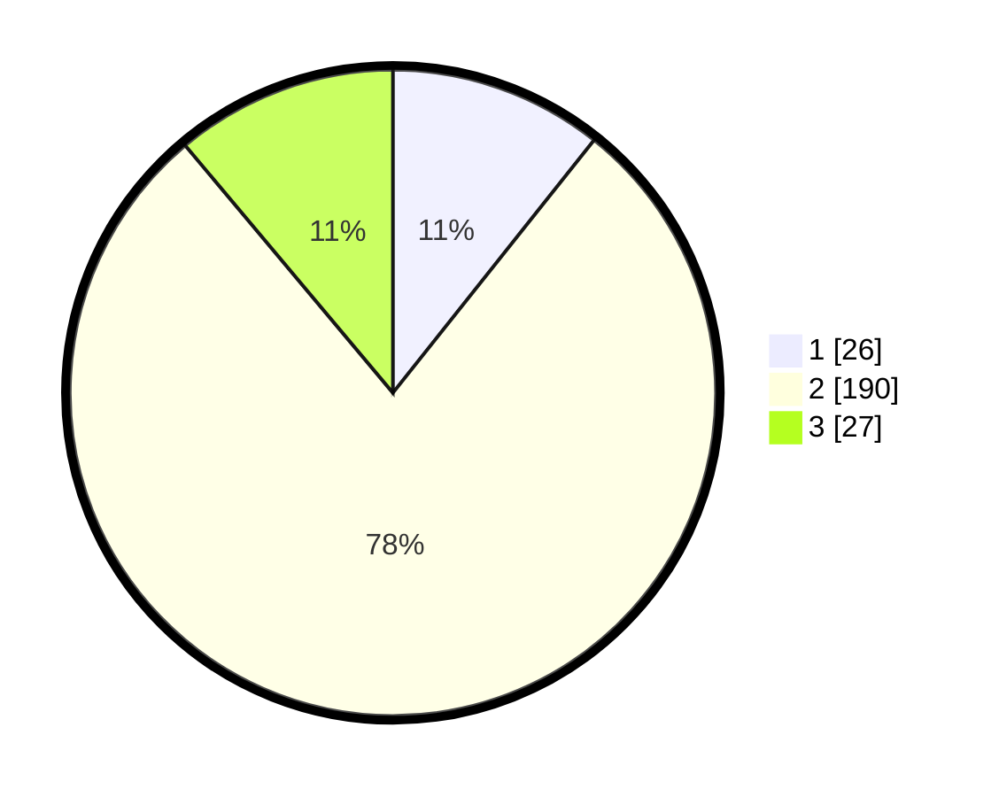

# Hasil

## Grafik

## Tabel

| No. | Nama Paslon    | Suara | Suara (raw) | Persentase |
|:--- |:-------------- | -----:| -----------:| ----------:|
| 1   | ANIES MUHAIMIN | 26    | [26][p-1]   | 10,70      |
| 2   | PRABOWO GIBRAN | 190   | [190][p-2]  | 78,19      |
| 3   | GANJAR MAHFUD  | 27    | [27][p-3]   | 11,11      |

[p-1]: https://github.com/gigit-pemilu/pemilu-2024/blob/main/pilpres/hitung-suara/sub/35-jawa-timur/sub/15-sidoarjo/sub/16-gedangan/sub/2012-keboananom/sub/003-tps/sub/paslon-1.txt
[p-2]: https://github.com/gigit-pemilu/pemilu-2024/blob/main/pilpres/hitung-suara/sub/35-jawa-timur/sub/15-sidoarjo/sub/16-gedangan/sub/2012-keboananom/sub/003-tps/sub/paslon-2.txt
[p-3]: https://github.com/gigit-pemilu/pemilu-2024/blob/main/pilpres/hitung-suara/sub/35-jawa-timur/sub/15-sidoarjo/sub/16-gedangan/sub/2012-keboananom/sub/003-tps/sub/paslon-3.txt

## Foto C Plano

https://sirekap-obj-formc.kpu.go.id/ed1c/pemilu/ppwp/35/15/16/20/12/3515162012003-20240215-003057--fd0170f8-fa6f-4e51-8bf7-429c79e0b1c0.jpg

https://sirekap-obj-formc.kpu.go.id/ed1c/pemilu/ppwp/35/15/16/20/12/3515162012003-20240214-225028--ce774188-3ee6-47d4-9aa7-036fe2739236.jpg

https://sirekap-obj-formc.kpu.go.id/ed1c/pemilu/ppwp/35/15/16/20/12/3515162012003-20240214-225057--0cb6e498-af81-4a84-897c-e5fb47cf4db4.jpg

## Metadata

| Key        | Value               |
| ---------- | ------------------- |
| Time Stamp | 2024-02-25 14:00:00 |

