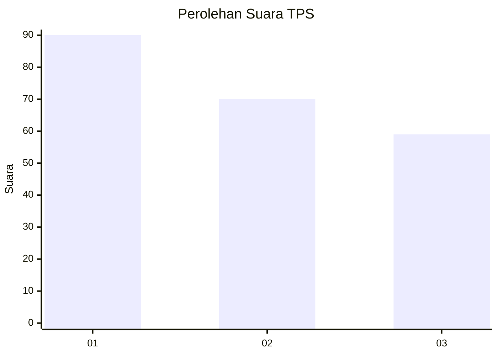
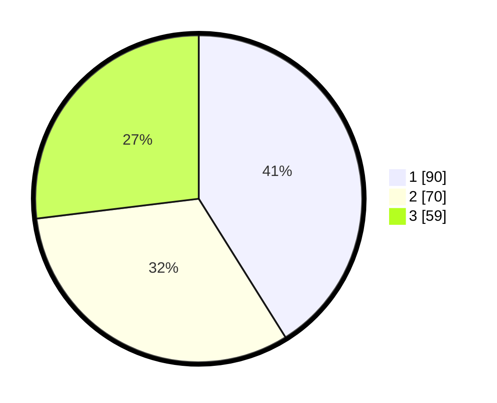

# Hasil

## Grafik

## Tabel

| No. | Nama Paslon    | Suara | Suara (raw) | Persentase |
|:--- |:-------------- | -----:| -----------:| ----------:|
| 1   | ANIES MUHAIMIN | 90    | [90][p-1]   | 41,10      |
| 2   | PRABOWO GIBRAN | 70    | [70][p-2]   | 31,96      |
| 3   | GANJAR MAHFUD  | 59    | [59][p-3]   | 26,94      |

[p-1]: https://github.com/gigit-pemilu/pemilu-2024-35-jawa-timur/blob/main/pilpres/hitung-suara/sub/35-jawa-timur/sub/15-sidoarjo/sub/16-gedangan/sub/2015-semambung/sub/019-tps/sub/paslon-1.txt
[p-2]: https://github.com/gigit-pemilu/pemilu-2024-35-jawa-timur/blob/main/pilpres/hitung-suara/sub/35-jawa-timur/sub/15-sidoarjo/sub/16-gedangan/sub/2015-semambung/sub/019-tps/sub/paslon-2.txt
[p-3]: https://github.com/gigit-pemilu/pemilu-2024-35-jawa-timur/blob/main/pilpres/hitung-suara/sub/35-jawa-timur/sub/15-sidoarjo/sub/16-gedangan/sub/2015-semambung/sub/019-tps/sub/paslon-3.txt

## Foto C Plano

https://sirekap-obj-formc.kpu.go.id/35ff/pemilu/ppwp/35/15/16/20/15/3515162015019-20240214-224549--05563518-7ee3-48d0-9962-00ae2c0b8b90.jpg

https://sirekap-obj-formc.kpu.go.id/35ff/pemilu/ppwp/35/15/16/20/15/3515162015019-20240214-200557--7ee3ec41-ed43-4bc2-b09e-f21b3a574e96.jpg

https://sirekap-obj-formc.kpu.go.id/35ff/pemilu/ppwp/35/15/16/20/15/3515162015019-20240214-224728--1c63b858-3772-43fc-990f-5a52a12271cc.jpg

## Metadata

| Key        | Value               |
| ---------- | ------------------- |
| Time Stamp | 2024-02-15 15:30:25 |

