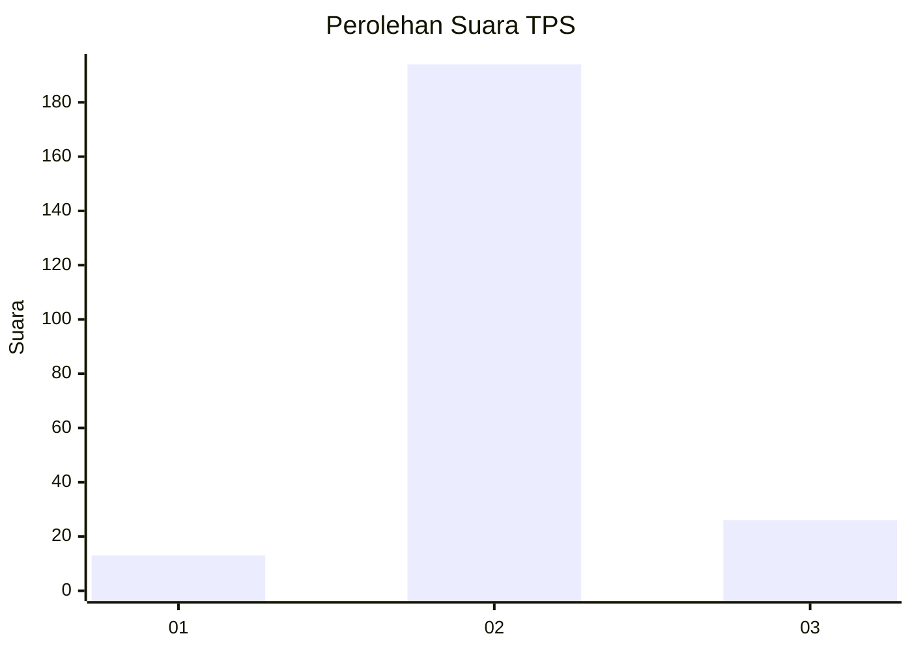
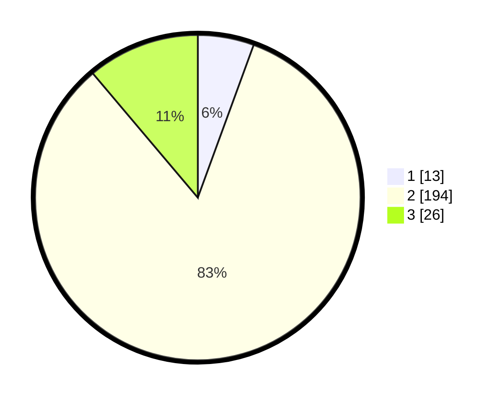

# Hasil

## Grafik

## Tabel

| No. | Nama Paslon    | Suara | Suara (raw) | Persentase |
|:--- |:-------------- | -----:| -----------:| ----------:|
| 1   | ANIES MUHAIMIN | 13    | [13][p-1]   | 5,58       |
| 2   | PRABOWO GIBRAN | 194   | [194][p-2]  | 83,26      |
| 3   | GANJAR MAHFUD  | 26    | [26][p-3]   | 11,16      |

[p-1]: https://github.com/gigit-pemilu/pemilu-2024/blob/main/pilpres/hitung-suara/sub/35-jawa-timur/sub/15-sidoarjo/sub/17-sedati/sub/2006-gisikcemandi/sub/003-tps/sub/paslon-1.txt
[p-2]: https://github.com/gigit-pemilu/pemilu-2024/blob/main/pilpres/hitung-suara/sub/35-jawa-timur/sub/15-sidoarjo/sub/17-sedati/sub/2006-gisikcemandi/sub/003-tps/sub/paslon-2.txt
[p-3]: https://github.com/gigit-pemilu/pemilu-2024/blob/main/pilpres/hitung-suara/sub/35-jawa-timur/sub/15-sidoarjo/sub/17-sedati/sub/2006-gisikcemandi/sub/003-tps/sub/paslon-3.txt

## Foto C Plano

https://sirekap-obj-formc.kpu.go.id/7942/pemilu/ppwp/35/15/17/20/06/3515172006003-20240215-011317--f82d9482-a918-4b1e-a7fb-c4d783e8ce54.jpg

https://sirekap-obj-formc.kpu.go.id/7942/pemilu/ppwp/35/15/17/20/06/3515172006003-20240215-011727--65a2c392-b1c5-432f-8246-16f108667c3f.jpg

https://sirekap-obj-formc.kpu.go.id/7942/pemilu/ppwp/35/15/17/20/06/3515172006003-20240215-011845--e4fb9d50-48b8-4732-861a-8c80cb367ac9.jpg

## Metadata

| Key        | Value               |
| ---------- | ------------------- |
| Time Stamp | 2024-02-15 16:00:26 |

