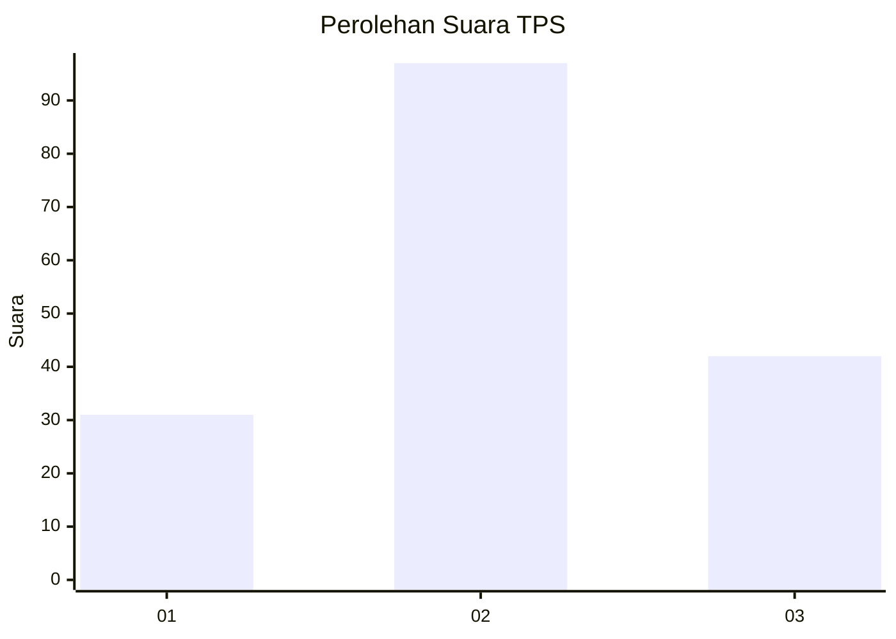
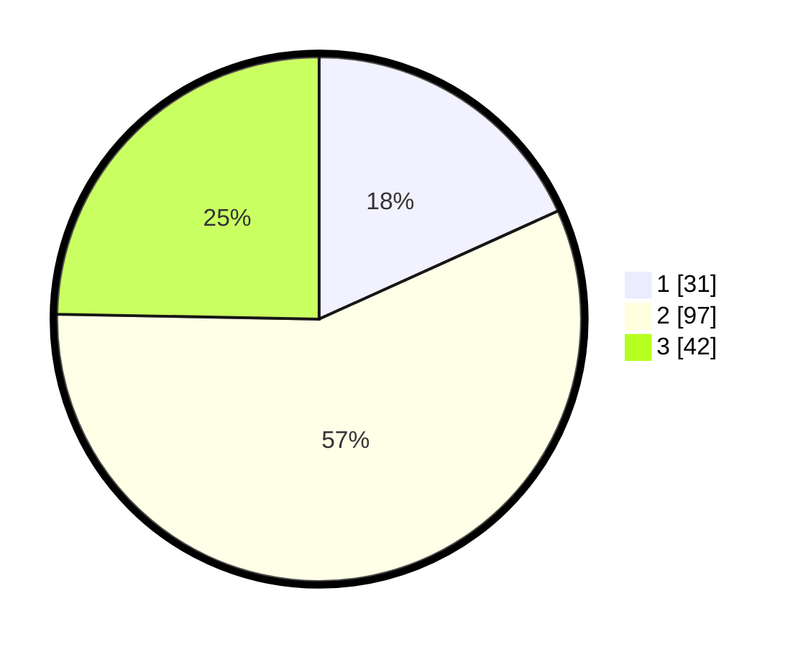

# Hasil

## Grafik

## Tabel

| No. | Nama Paslon    | Suara | Suara (raw) | Persentase |
|:--- |:-------------- | -----:| -----------:| ----------:|
| 1   | ANIES MUHAIMIN | 31    | [31][p-1]   | 18,24      |
| 2   | PRABOWO GIBRAN | 97    | [97][p-2]   | 57,06      |
| 3   | GANJAR MAHFUD  | 42    | [42][p-3]   | 24,71      |

[p-1]: https://github.com/gigit-pemilu/pemilu-2024/blob/main/pilpres/hitung-suara/sub/35-jawa-timur/sub/15-sidoarjo/sub/17-sedati/sub/2008-pulungan/sub/008-tps/sub/paslon-1.txt
[p-2]: https://github.com/gigit-pemilu/pemilu-2024/blob/main/pilpres/hitung-suara/sub/35-jawa-timur/sub/15-sidoarjo/sub/17-sedati/sub/2008-pulungan/sub/008-tps/sub/paslon-2.txt
[p-3]: https://github.com/gigit-pemilu/pemilu-2024/blob/main/pilpres/hitung-suara/sub/35-jawa-timur/sub/15-sidoarjo/sub/17-sedati/sub/2008-pulungan/sub/008-tps/sub/paslon-3.txt

## Foto C Plano

https://sirekap-obj-formc.kpu.go.id/03ce/pemilu/ppwp/35/15/17/20/08/3515172008008-20240214-184651--3e163195-d13c-4c53-9b78-55075869ec7e.jpg

https://sirekap-obj-formc.kpu.go.id/03ce/pemilu/ppwp/35/15/17/20/08/3515172008008-20240214-215807--708a0df4-248c-4ea7-ad88-8fcd074dd976.jpg

https://sirekap-obj-formc.kpu.go.id/03ce/pemilu/ppwp/35/15/17/20/08/3515172008008-20240217-211320--04b9e462-7ed6-427e-8d19-e3f3ac330745.jpg

## Metadata

| Key        | Value               |
| ---------- | ------------------- |
| Time Stamp | 2024-02-19 06:16:00 |

