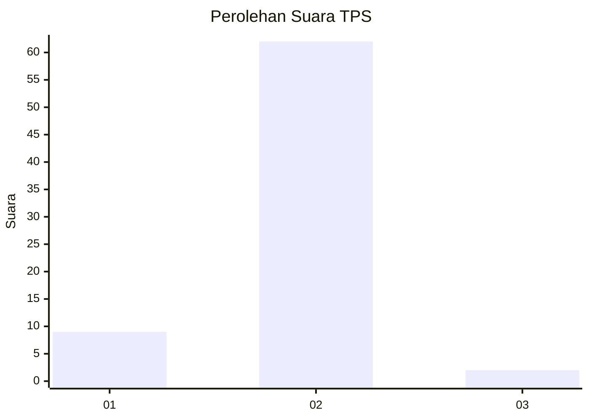
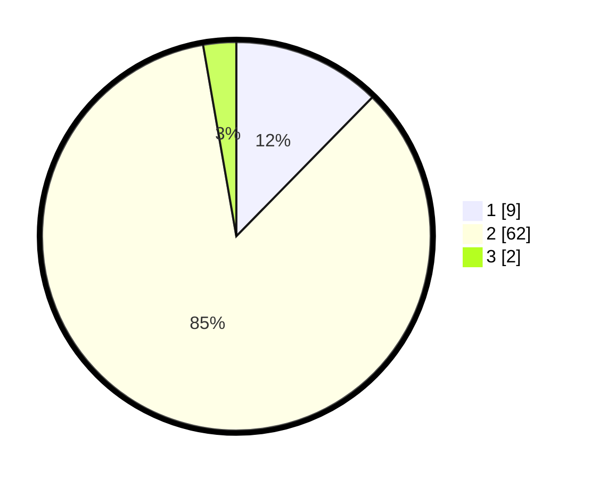

# Hasil

## Grafik

## Tabel

| No. | Nama Paslon    | Suara | Suara (raw) | Persentase |
|:--- |:-------------- | -----:| -----------:| ----------:|
| 1   | ANIES MUHAIMIN | 9     | [9][p-1]    | 12,33      |
| 2   | PRABOWO GIBRAN | 62    | [62][p-2]   | 84,93      |
| 3   | GANJAR MAHFUD  | 2     | [2][p-3]    | 2,74       |

[p-1]: https://github.com/gigit-pemilu/pemilu-2024-35-jawa-timur/blob/main/pilpres/hitung-suara/sub/35-jawa-timur/sub/15-sidoarjo/sub/17-sedati/sub/2009-betro/sub/018-tps/sub/paslon-1.txt
[p-2]: https://github.com/gigit-pemilu/pemilu-2024-35-jawa-timur/blob/main/pilpres/hitung-suara/sub/35-jawa-timur/sub/15-sidoarjo/sub/17-sedati/sub/2009-betro/sub/018-tps/sub/paslon-2.txt
[p-3]: https://github.com/gigit-pemilu/pemilu-2024-35-jawa-timur/blob/main/pilpres/hitung-suara/sub/35-jawa-timur/sub/15-sidoarjo/sub/17-sedati/sub/2009-betro/sub/018-tps/sub/paslon-3.txt

## Foto C Plano

https://sirekap-obj-formc.kpu.go.id/7a77/pemilu/ppwp/35/15/17/20/09/3515172009018-20240216-192446--8e835683-08cd-418f-aa9e-a6bc837526f6.jpg

https://sirekap-obj-formc.kpu.go.id/7a77/pemilu/ppwp/35/15/17/20/09/3515172009018-20240216-190957--30e8d58a-f257-4cf8-aa52-3ddb09e22303.jpg

https://sirekap-obj-formc.kpu.go.id/7a77/pemilu/ppwp/35/15/17/20/09/3515172009018-20240216-191227--c2e566b7-3ad4-4fc5-9473-243d9f50ab72.jpg

## Metadata

| Key        | Value               |
| ---------- | ------------------- |
| Time Stamp | 2024-02-25 11:00:00 |

