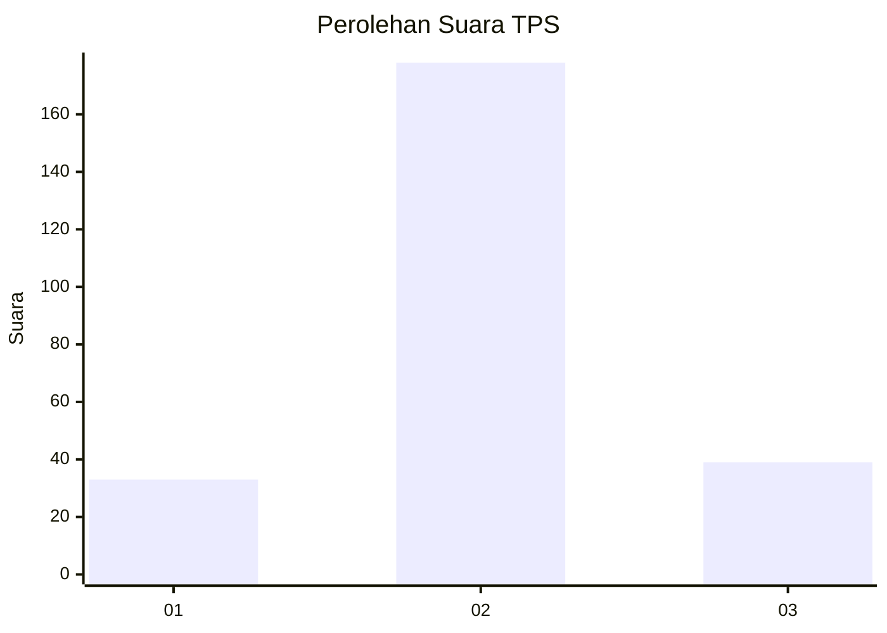

# Hasil

## Grafik

## Tabel

| No. | Nama Paslon    | Suara | Suara (raw) | Persentase |
|:--- |:-------------- | -----:| -----------:| ----------:|
| 1   | ANIES MUHAIMIN | 33    | [33][p-1]   | 13,20      |
| 2   | PRABOWO GIBRAN | 178   | [178][p-2]  | 71,20      |
| 3   | GANJAR MAHFUD  | 39    | [39][p-3]   | 15,60      |

[p-1]: https://github.com/gigit-pemilu/pemilu-2024/blob/main/pilpres/hitung-suara/sub/35-jawa-timur/sub/15-sidoarjo/sub/17-sedati/sub/2010-sedatiagung/sub/001-tps/sub/paslon-1.txt
[p-2]: https://github.com/gigit-pemilu/pemilu-2024/blob/main/pilpres/hitung-suara/sub/35-jawa-timur/sub/15-sidoarjo/sub/17-sedati/sub/2010-sedatiagung/sub/001-tps/sub/paslon-2.txt
[p-3]: https://github.com/gigit-pemilu/pemilu-2024/blob/main/pilpres/hitung-suara/sub/35-jawa-timur/sub/15-sidoarjo/sub/17-sedati/sub/2010-sedatiagung/sub/001-tps/sub/paslon-3.txt

## Foto C Plano

https://sirekap-obj-formc.kpu.go.id/7146/pemilu/ppwp/35/15/17/20/10/3515172010001-20240215-093155--e800f3dd-9722-4924-9c20-4e8d327dcf94.jpg

https://sirekap-obj-formc.kpu.go.id/7146/pemilu/ppwp/35/15/17/20/10/3515172010001-20240215-093202--e0ead56f-7ba3-41ed-b1c2-eb0b539b28c0.jpg

https://sirekap-obj-formc.kpu.go.id/7146/pemilu/ppwp/35/15/17/20/10/3515172010001-20240215-093208--4cfdb532-2067-4b4e-93f8-da4f98e76899.jpg

## Metadata

| Key        | Value               |
| ---------- | ------------------- |
| Time Stamp | 2024-02-24 22:31:28 |

