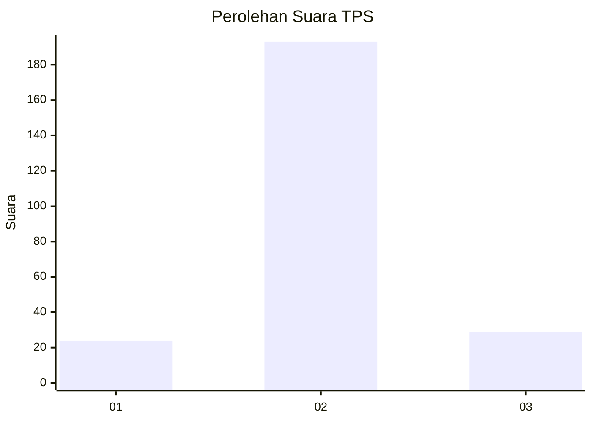
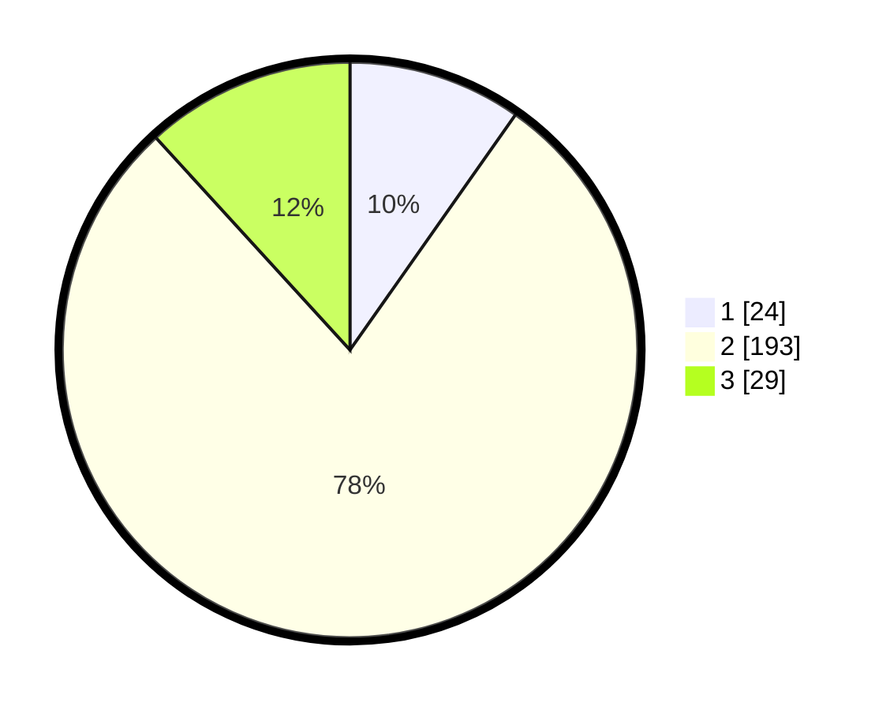

# Hasil

## Grafik

## Tabel

| No. | Nama Paslon    | Suara | Suara (raw) | Persentase |
|:--- |:-------------- | -----:| -----------:| ----------:|
| 1   | ANIES MUHAIMIN | 24    | [24][p-1]   | 9,76       |
| 2   | PRABOWO GIBRAN | 193   | [193][p-2]  | 78,46      |
| 3   | GANJAR MAHFUD  | 29    | [29][p-3]   | 11,79      |

[p-1]: https://github.com/gigit-pemilu/pemilu-2024/blob/main/pilpres/hitung-suara/sub/35-jawa-timur/sub/15-sidoarjo/sub/17-sedati/sub/2016-banjarkemuning/sub/001-tps/sub/paslon-1.txt
[p-2]: https://github.com/gigit-pemilu/pemilu-2024/blob/main/pilpres/hitung-suara/sub/35-jawa-timur/sub/15-sidoarjo/sub/17-sedati/sub/2016-banjarkemuning/sub/001-tps/sub/paslon-2.txt
[p-3]: https://github.com/gigit-pemilu/pemilu-2024/blob/main/pilpres/hitung-suara/sub/35-jawa-timur/sub/15-sidoarjo/sub/17-sedati/sub/2016-banjarkemuning/sub/001-tps/sub/paslon-3.txt

## Foto C Plano

https://sirekap-obj-formc.kpu.go.id/4539/pemilu/ppwp/35/15/17/20/16/3515172016001-20240214-195510--db5d77b7-8255-4e2f-8284-1a5f11788cf3.jpg

https://sirekap-obj-formc.kpu.go.id/4539/pemilu/ppwp/35/15/17/20/16/3515172016001-20240214-213526--cf246434-c656-44b4-95e0-c54b432699e0.jpg

https://sirekap-obj-formc.kpu.go.id/4539/pemilu/ppwp/35/15/17/20/16/3515172016001-20240215-013212--f5dfb377-ccf4-4c4e-9db0-b20a0ca9094d.jpg

## Metadata

| Key        | Value               |
| ---------- | ------------------- |
| Time Stamp | 2024-02-25 11:00:00 |

