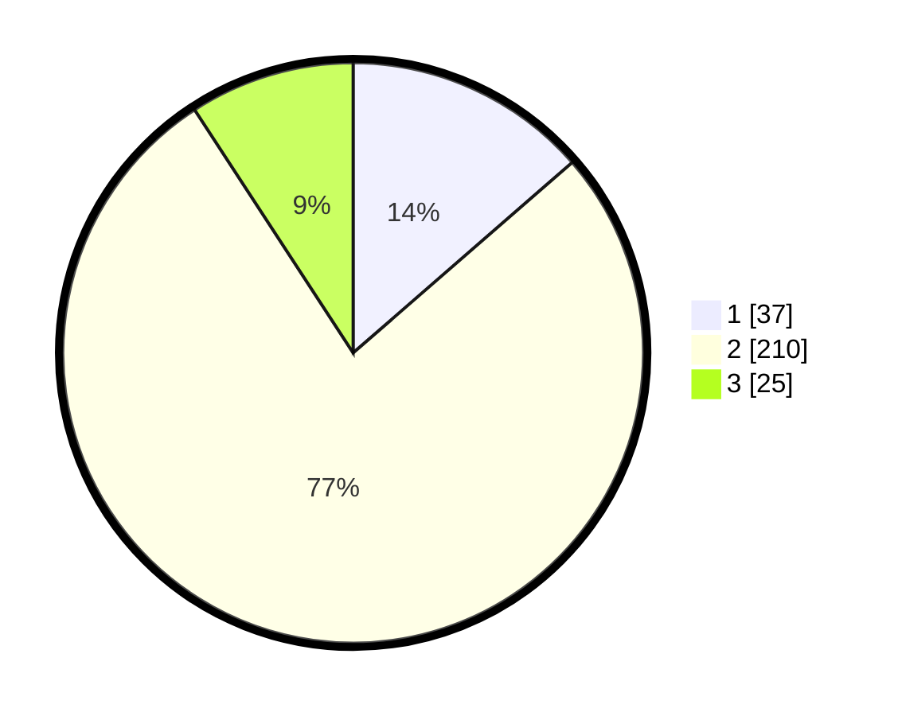

# Hasil

## Grafik

## Tabel

| No. | Nama Paslon    | Suara | Suara (raw) | Persentase |
|:--- |:-------------- | -----:| -----------:| ----------:|
| 1   | ANIES MUHAIMIN | 37    | [37][p-1]   | 13,60      |
| 2   | PRABOWO GIBRAN | 210   | [210][p-2]  | 77,21      |
| 3   | GANJAR MAHFUD  | 25    | [25][p-3]   | 9,19       |

[p-1]: https://github.com/gigit-pemilu/pemilu-2024-35-jawa-timur/blob/main/pilpres/hitung-suara/sub/35-jawa-timur/sub/15-sidoarjo/sub/17-sedati/sub/2016-banjarkemuning/sub/005-tps/sub/paslon-1.txt
[p-2]: https://github.com/gigit-pemilu/pemilu-2024-35-jawa-timur/blob/main/pilpres/hitung-suara/sub/35-jawa-timur/sub/15-sidoarjo/sub/17-sedati/sub/2016-banjarkemuning/sub/005-tps/sub/paslon-2.txt
[p-3]: https://github.com/gigit-pemilu/pemilu-2024-35-jawa-timur/blob/main/pilpres/hitung-suara/sub/35-jawa-timur/sub/15-sidoarjo/sub/17-sedati/sub/2016-banjarkemuning/sub/005-tps/sub/paslon-3.txt

## Foto C Plano

https://sirekap-obj-formc.kpu.go.id/25f3/pemilu/ppwp/35/15/17/20/16/3515172016005-20240214-194856--b6ec37e1-6efe-4c18-8029-6a204bfe79b0.jpg

https://sirekap-obj-formc.kpu.go.id/25f3/pemilu/ppwp/35/15/17/20/16/3515172016005-20240214-195026--0aee810d-4f3c-4bfd-bb15-1706fa1a415e.jpg

https://sirekap-obj-formc.kpu.go.id/25f3/pemilu/ppwp/35/15/17/20/16/3515172016005-20240214-212205--36a43619-01f7-460c-8186-10979feed3d4.jpg

## Metadata

| Key        | Value               |
| ---------- | ------------------- |
| Time Stamp | 2024-02-16 12:51:22 |

## DATA PEMILIH TETAP

Jumlah pemilih dalam DPT: **269**.
 * L: **115**.
 * P: **154**.

## DATA PENGGUNA HAK PILIH

Jumlah pengguna hak pilih dalam DPT: **248**.
 * L: **106**.
 * P: **142**.

Jumlah pengguna hak pilih dalam DPTb: **27**.
 * L: **14**.
 * P: **13**.

Jumlah pengguna hak pilih dalam DPK: **0**.
 * L: **0**.
 * P: **0**.

Jumlah pengguna hak pilih: **275**.
 * L: **120**.
 * P: **155**.

## JUMLAH SUARA SAH DAN TIDAK SAH

JUMLAH SELURUH SUARA SAH: **272**.

JUMLAH SUARA TIDAK SAH: **3**.

JUMLAH SELURUH SUARA SAH DAN SUARA TIDAK SAH: **275**.

