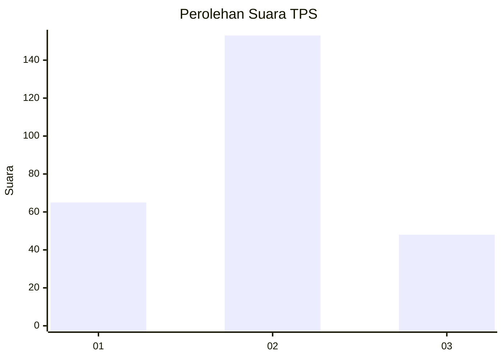
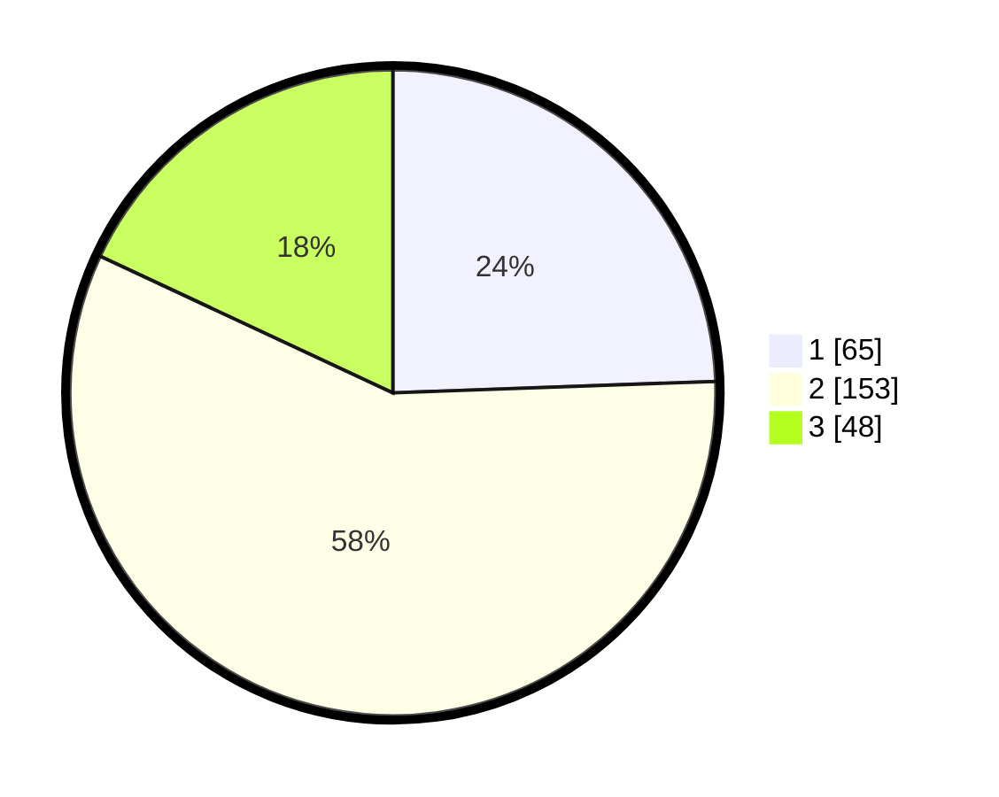

# Hasil

## Grafik

## Tabel

| No. | Nama Paslon    | Suara | Suara (raw) | Persentase |
|:--- |:-------------- | -----:| -----------:| ----------:|
| 1   | ANIES MUHAIMIN | 65    | [65][p-1]   | 24,44      |
| 2   | PRABOWO GIBRAN | 153   | [153][p-2]  | 57,52      |
| 3   | GANJAR MAHFUD  | 48    | [48][p-3]   | 18,05      |

[p-1]: https://github.com/gigit-pemilu/pemilu-2024/blob/main/pilpres/hitung-suara/sub/35-jawa-timur/sub/15-sidoarjo/sub/18-waru/sub/2001-pepelegi/sub/031-tps/sub/paslon-1.txt
[p-2]: https://github.com/gigit-pemilu/pemilu-2024/blob/main/pilpres/hitung-suara/sub/35-jawa-timur/sub/15-sidoarjo/sub/18-waru/sub/2001-pepelegi/sub/031-tps/sub/paslon-2.txt
[p-3]: https://github.com/gigit-pemilu/pemilu-2024/blob/main/pilpres/hitung-suara/sub/35-jawa-timur/sub/15-sidoarjo/sub/18-waru/sub/2001-pepelegi/sub/031-tps/sub/paslon-3.txt

## Foto C Plano

https://sirekap-obj-formc.kpu.go.id/f5ac/pemilu/ppwp/35/15/18/20/01/3515182001031-20240216-074028--83e7ebc0-bfe9-4b0e-a77c-3c32c7902a97.jpg

https://sirekap-obj-formc.kpu.go.id/f5ac/pemilu/ppwp/35/15/18/20/01/3515182001031-20240216-205750--d4187589-0091-487b-a8ee-252df3f1da81.jpg

https://sirekap-obj-formc.kpu.go.id/f5ac/pemilu/ppwp/35/15/18/20/01/3515182001031-20240216-201219--28cdeece-a458-4558-b5b2-08757f2b8179.jpg

## Metadata

| Key        | Value               |
| ---------- | ------------------- |
| Time Stamp | 2024-02-19 06:16:00 |

