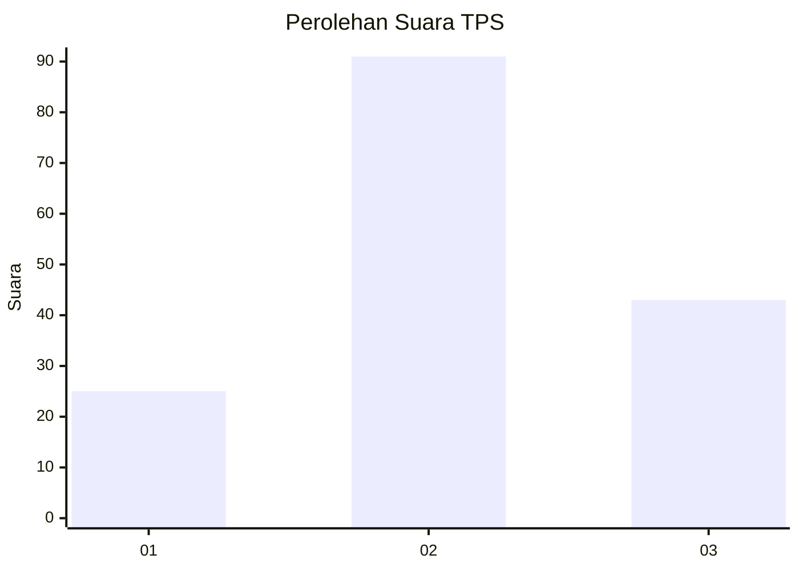
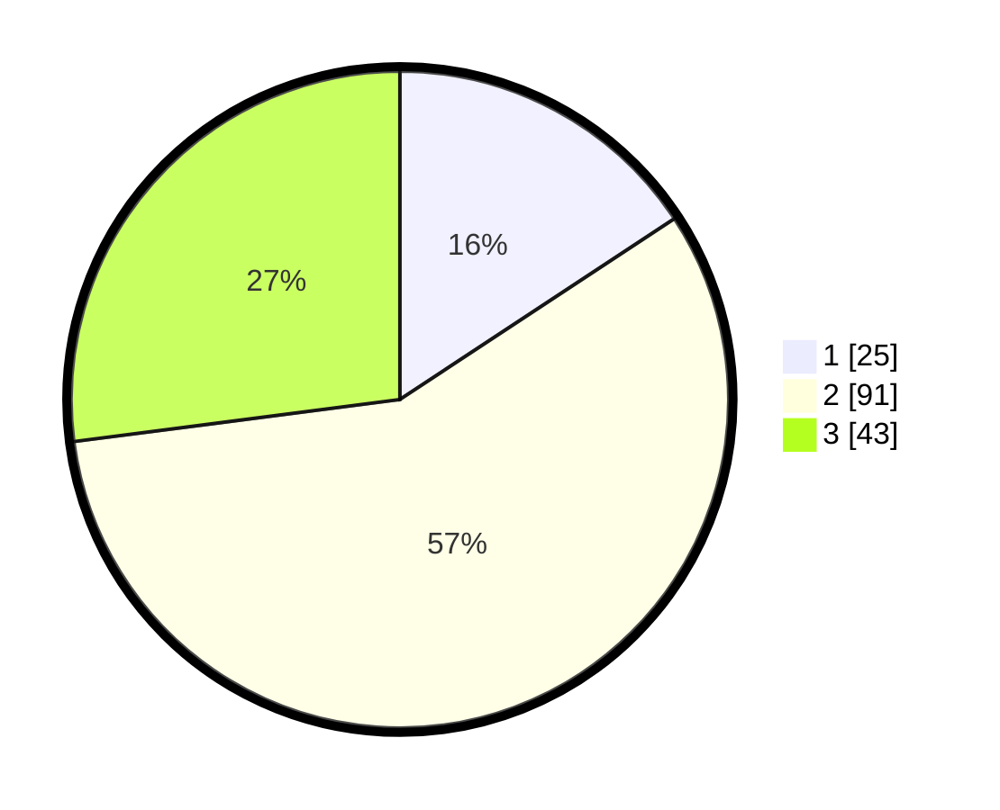

# Hasil

## Grafik

## Tabel

| No. | Nama Paslon    | Suara | Suara (raw) | Persentase |
|:--- |:-------------- | -----:| -----------:| ----------:|
| 1   | ANIES MUHAIMIN | 25    | [25][p-1]   | 15,72      |
| 2   | PRABOWO GIBRAN | 91    | [91][p-2]   | 57,23      |
| 3   | GANJAR MAHFUD  | 43    | [43][p-3]   | 27,04      |

[p-1]: https://github.com/gigit-pemilu/pemilu-2024-35-jawa-timur/blob/main/pilpres/hitung-suara/sub/35-jawa-timur/sub/15-sidoarjo/sub/18-waru/sub/2002-waru/sub/003-tps/sub/paslon-1.txt
[p-2]: https://github.com/gigit-pemilu/pemilu-2024-35-jawa-timur/blob/main/pilpres/hitung-suara/sub/35-jawa-timur/sub/15-sidoarjo/sub/18-waru/sub/2002-waru/sub/003-tps/sub/paslon-2.txt
[p-3]: https://github.com/gigit-pemilu/pemilu-2024-35-jawa-timur/blob/main/pilpres/hitung-suara/sub/35-jawa-timur/sub/15-sidoarjo/sub/18-waru/sub/2002-waru/sub/003-tps/sub/paslon-3.txt

## Foto C Plano

https://sirekap-obj-formc.kpu.go.id/fe93/pemilu/ppwp/35/15/18/20/02/3515182002003-20240214-205631--ccc2d7c8-126b-437d-ba86-1e2425658d58.jpg

https://sirekap-obj-formc.kpu.go.id/fe93/pemilu/ppwp/35/15/18/20/02/3515182002003-20240214-190158--b2eba434-a744-407b-9e03-bad9e4307a97.jpg

https://sirekap-obj-formc.kpu.go.id/fe93/pemilu/ppwp/35/15/18/20/02/3515182002003-20240214-190033--f3cd9622-f8c0-48e2-82c6-f398c9b88f63.jpg

## Metadata

| Key        | Value               |
| ---------- | ------------------- |
| Time Stamp | 2024-02-15 04:00:24 |

