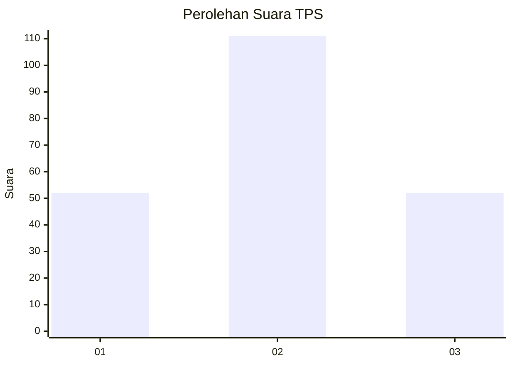
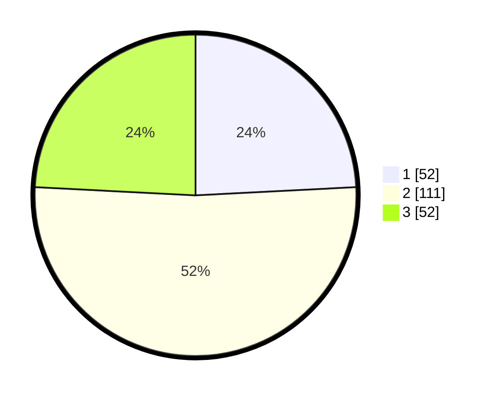

# Hasil

## Grafik

## Tabel

| No. | Nama Paslon    | Suara | Suara (raw) | Persentase |
|:--- |:-------------- | -----:| -----------:| ----------:|
| 1   | ANIES MUHAIMIN | 52    | [52][p-1]   | 24,19      |
| 2   | PRABOWO GIBRAN | 111   | [111][p-2]  | 51,63      |
| 3   | GANJAR MAHFUD  | 52    | [52][p-3]   | 24,19      |

[p-1]: https://github.com/gigit-pemilu/pemilu-2024/blob/main/pilpres/hitung-suara/sub/35-jawa-timur/sub/15-sidoarjo/sub/18-waru/sub/2002-waru/sub/013-tps/sub/paslon-1.txt
[p-2]: https://github.com/gigit-pemilu/pemilu-2024/blob/main/pilpres/hitung-suara/sub/35-jawa-timur/sub/15-sidoarjo/sub/18-waru/sub/2002-waru/sub/013-tps/sub/paslon-2.txt
[p-3]: https://github.com/gigit-pemilu/pemilu-2024/blob/main/pilpres/hitung-suara/sub/35-jawa-timur/sub/15-sidoarjo/sub/18-waru/sub/2002-waru/sub/013-tps/sub/paslon-3.txt

## Foto C Plano

https://sirekap-obj-formc.kpu.go.id/e924/pemilu/ppwp/35/15/18/20/02/3515182002013-20240217-141414--21e1d98f-3fe5-4d8d-ae26-e4f29e2a95e9.jpg

https://sirekap-obj-formc.kpu.go.id/e924/pemilu/ppwp/35/15/18/20/02/3515182002013-20240214-214815--57877a9e-4fe0-4d82-b6c7-d97a489e9634.jpg

https://sirekap-obj-formc.kpu.go.id/e924/pemilu/ppwp/35/15/18/20/02/3515182002013-20240214-214853--75e83b51-6b6d-4cd5-b36f-730563d58263.jpg

## Metadata

| Key        | Value               |
| ---------- | ------------------- |
| Time Stamp | 2024-02-25 11:00:00 |

