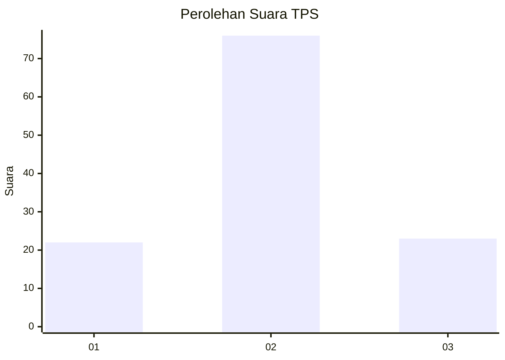
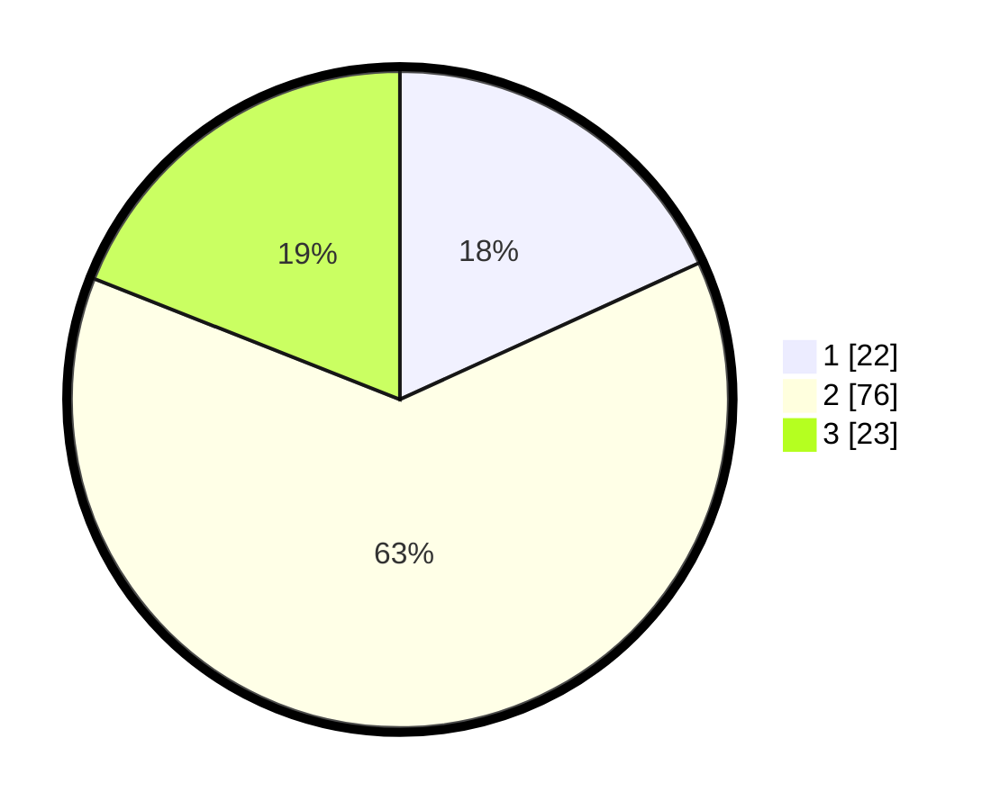

# Hasil

## Grafik

## Tabel

| No. | Nama Paslon    | Suara | Suara (raw) | Persentase |
|:--- |:-------------- | -----:| -----------:| ----------:|
| 1   | ANIES MUHAIMIN | 22    | [22][p-1]   | 18,18      |
| 2   | PRABOWO GIBRAN | 76    | [76][p-2]   | 62,81      |
| 3   | GANJAR MAHFUD  | 23    | [23][p-3]   | 19,01      |

[p-1]: https://github.com/gigit-pemilu/pemilu-2024-35-jawa-timur/blob/main/pilpres/hitung-suara/sub/35-jawa-timur/sub/15-sidoarjo/sub/18-waru/sub/2003-kureksari/sub/021-tps/sub/paslon-1.txt
[p-2]: https://github.com/gigit-pemilu/pemilu-2024-35-jawa-timur/blob/main/pilpres/hitung-suara/sub/35-jawa-timur/sub/15-sidoarjo/sub/18-waru/sub/2003-kureksari/sub/021-tps/sub/paslon-2.txt
[p-3]: https://github.com/gigit-pemilu/pemilu-2024-35-jawa-timur/blob/main/pilpres/hitung-suara/sub/35-jawa-timur/sub/15-sidoarjo/sub/18-waru/sub/2003-kureksari/sub/021-tps/sub/paslon-3.txt

## Foto C Plano

https://sirekap-obj-formc.kpu.go.id/8a91/pemilu/ppwp/35/15/18/20/03/3515182003021-20240216-213247--c3de6ab3-4084-491b-aaa3-dcb12fb4678f.jpg

https://sirekap-obj-formc.kpu.go.id/8a91/pemilu/ppwp/35/15/18/20/03/3515182003021-20240218-125244--8766ea70-12b3-492e-9d2e-513230724dd8.jpg

https://sirekap-obj-formc.kpu.go.id/8a91/pemilu/ppwp/35/15/18/20/03/3515182003021-20240217-193712--5afe0444-5fd6-423e-98df-157167a19592.jpg

## Metadata

| Key        | Value               |
| ---------- | ------------------- |
| Time Stamp | 2024-02-22 11:00:00 |

