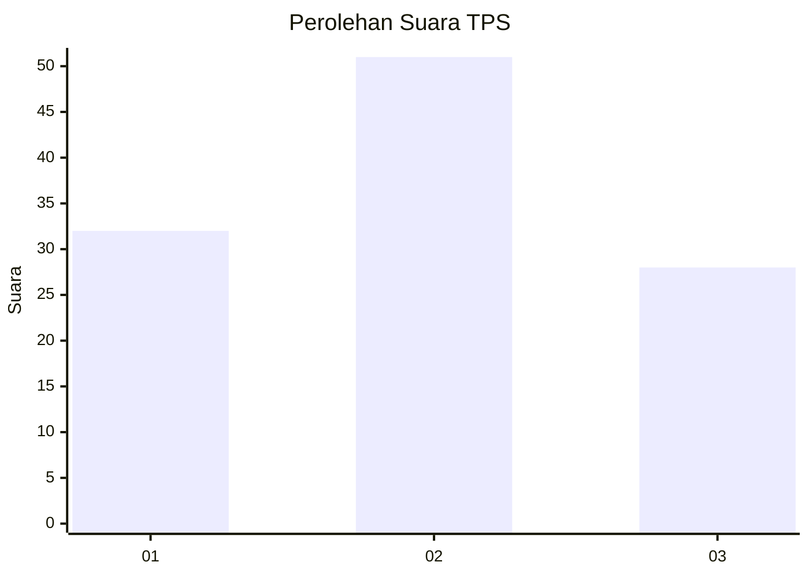
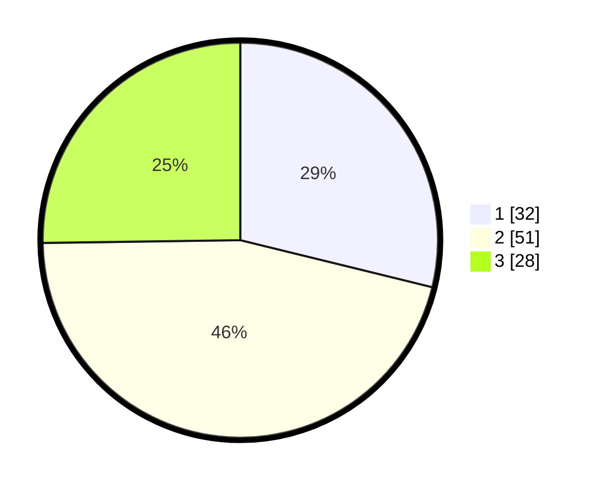

# Hasil

## Grafik

## Tabel

| No. | Nama Paslon    | Suara | Suara (raw) | Persentase |
|:--- |:-------------- | -----:| -----------:| ----------:|
| 1   | ANIES MUHAIMIN | 32    | [32][p-1]   | 28,83      |
| 2   | PRABOWO GIBRAN | 51    | [51][p-2]   | 45,95      |
| 3   | GANJAR MAHFUD  | 28    | [28][p-3]   | 25,23      |

[p-1]: https://github.com/gigit-pemilu/pemilu-2024/blob/main/pilpres/hitung-suara/sub/35-jawa-timur/sub/15-sidoarjo/sub/18-waru/sub/2003-kureksari/sub/029-tps/sub/paslon-1.txt
[p-2]: https://github.com/gigit-pemilu/pemilu-2024/blob/main/pilpres/hitung-suara/sub/35-jawa-timur/sub/15-sidoarjo/sub/18-waru/sub/2003-kureksari/sub/029-tps/sub/paslon-2.txt
[p-3]: https://github.com/gigit-pemilu/pemilu-2024/blob/main/pilpres/hitung-suara/sub/35-jawa-timur/sub/15-sidoarjo/sub/18-waru/sub/2003-kureksari/sub/029-tps/sub/paslon-3.txt

## Foto C Plano

https://sirekap-obj-formc.kpu.go.id/4999/pemilu/ppwp/35/15/18/20/03/3515182003029-20240215-123045--aaa6d9e4-df3d-4560-a542-33b28c9fef64.jpg

https://sirekap-obj-formc.kpu.go.id/4999/pemilu/ppwp/35/15/18/20/03/3515182003029-20240216-154138--dbb859f2-b61a-44e6-88ec-ca1b4903538e.jpg

https://sirekap-obj-formc.kpu.go.id/4999/pemilu/ppwp/35/15/18/20/03/3515182003029-20240217-071728--625dc9f4-4ea3-4237-80db-abb032a68716.jpg

## Metadata

| Key        | Value               |
| ---------- | ------------------- |
| Time Stamp | 2024-02-17 07:30:03 |

## DATA PEMILIH TETAP

Jumlah pemilih dalam DPT: **131**.
 * L: **67**.
 * P: **64**.

## DATA PENGGUNA HAK PILIH

Jumlah pengguna hak pilih dalam DPT: **97**.
 * L: **50**.
 * P: **47**.

Jumlah pengguna hak pilih dalam DPTb: **3**.
 * L: **1**.
 * P: **2**.

Jumlah pengguna hak pilih dalam DPK: **12**.
 * L: **2**.
 * P: **10**.

Jumlah pengguna hak pilih: **112**.
 * L: **53**.
 * P: **59**.

## JUMLAH SUARA SAH DAN TIDAK SAH

JUMLAH SELURUH SUARA SAH: **111**.

JUMLAH SUARA TIDAK SAH: **1**.

JUMLAH SELURUH SUARA SAH DAN SUARA TIDAK SAH: **112**.

