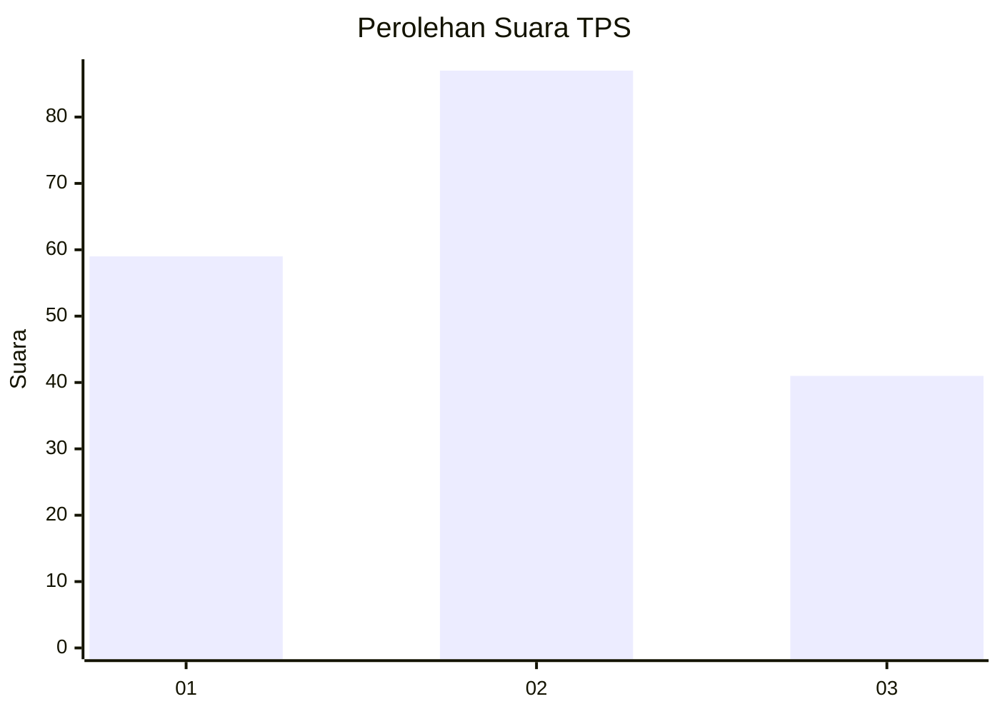
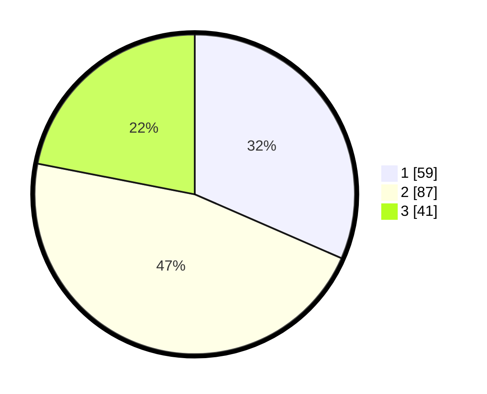

# Hasil

## Grafik

## Tabel

| No. | Nama Paslon    | Suara | Suara (raw) | Persentase |
|:--- |:-------------- | -----:| -----------:| ----------:|
| 1   | ANIES MUHAIMIN | 59    | [59][p-1]   | 31,55      |
| 2   | PRABOWO GIBRAN | 87    | [87][p-2]   | 46,52      |
| 3   | GANJAR MAHFUD  | 41    | [41][p-3]   | 21,93      |

[p-1]: https://github.com/gigit-pemilu/pemilu-2024/blob/main/pilpres/hitung-suara/sub/35-jawa-timur/sub/15-sidoarjo/sub/18-waru/sub/2003-kureksari/sub/041-tps/sub/paslon-1.txt
[p-2]: https://github.com/gigit-pemilu/pemilu-2024/blob/main/pilpres/hitung-suara/sub/35-jawa-timur/sub/15-sidoarjo/sub/18-waru/sub/2003-kureksari/sub/041-tps/sub/paslon-2.txt
[p-3]: https://github.com/gigit-pemilu/pemilu-2024/blob/main/pilpres/hitung-suara/sub/35-jawa-timur/sub/15-sidoarjo/sub/18-waru/sub/2003-kureksari/sub/041-tps/sub/paslon-3.txt

## Foto C Plano

https://sirekap-obj-formc.kpu.go.id/e2b7/pemilu/ppwp/35/15/18/20/03/3515182003041-20240217-230348--3f0cb080-aecc-4c74-8218-e6c4fe4869ac.jpg

https://sirekap-obj-formc.kpu.go.id/e2b7/pemilu/ppwp/35/15/18/20/03/3515182003041-20240217-230509--dfe22b99-612a-40aa-89e0-d3fe440b4a08.jpg

https://sirekap-obj-formc.kpu.go.id/e2b7/pemilu/ppwp/35/15/18/20/03/3515182003041-20240217-230629--324557be-0a71-4cc5-9e20-4d63f8307609.jpg

## Metadata

| Key        | Value               |
| ---------- | ------------------- |
| Time Stamp | 2024-02-19 11:00:00 |

