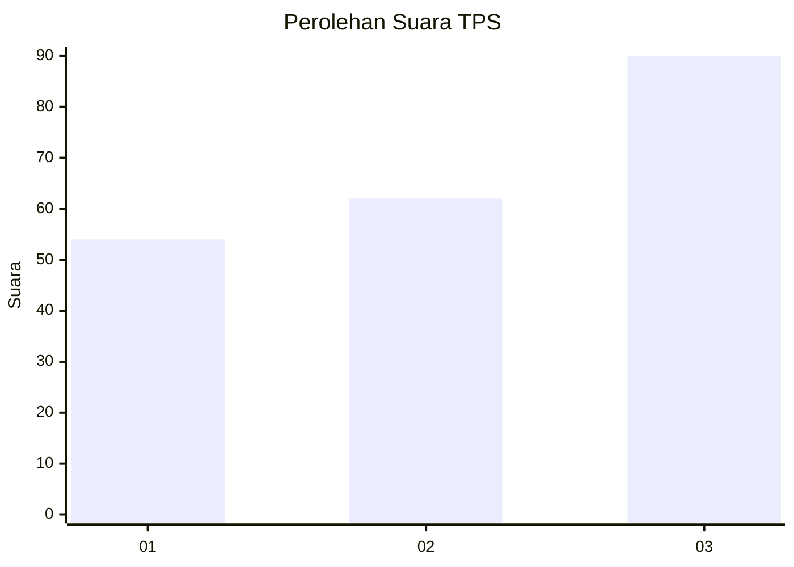
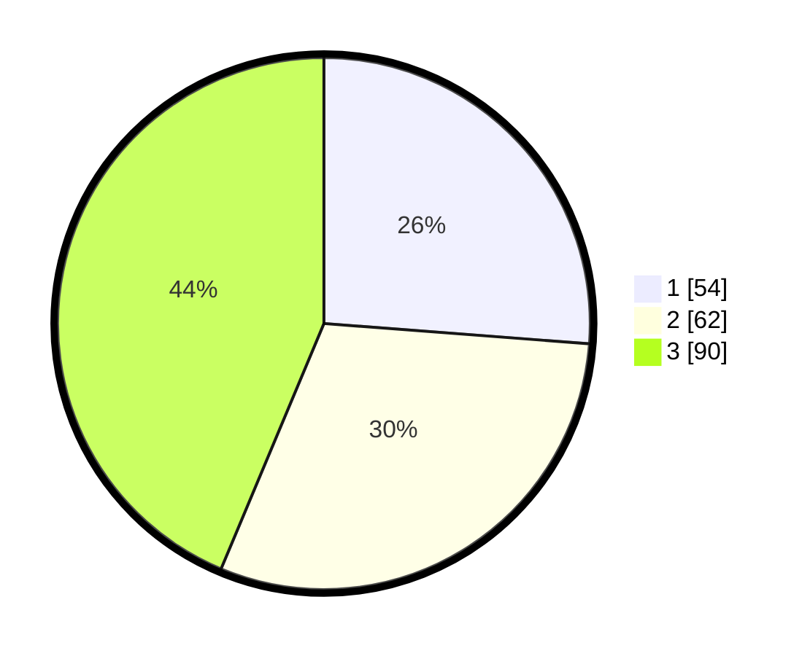

# Hasil

## Grafik

## Tabel

| No. | Nama Paslon    | Suara | Suara (raw) | Persentase |
|:--- |:-------------- | -----:| -----------:| ----------:|
| 1   | ANIES MUHAIMIN | 54    | [54][p-1]   | 26,21      |
| 2   | PRABOWO GIBRAN | 62    | [62][p-2]   | 30,10      |
| 3   | GANJAR MAHFUD  | 90    | [90][p-3]   | 43,69      |

[p-1]: https://github.com/gigit-pemilu/pemilu-2024/blob/main/pilpres/hitung-suara/sub/35-jawa-timur/sub/15-sidoarjo/sub/18-waru/sub/2004-ngingas/sub/031-tps/sub/paslon-1.txt
[p-2]: https://github.com/gigit-pemilu/pemilu-2024/blob/main/pilpres/hitung-suara/sub/35-jawa-timur/sub/15-sidoarjo/sub/18-waru/sub/2004-ngingas/sub/031-tps/sub/paslon-2.txt
[p-3]: https://github.com/gigit-pemilu/pemilu-2024/blob/main/pilpres/hitung-suara/sub/35-jawa-timur/sub/15-sidoarjo/sub/18-waru/sub/2004-ngingas/sub/031-tps/sub/paslon-3.txt

## Foto C Plano

https://sirekap-obj-formc.kpu.go.id/daa0/pemilu/ppwp/35/15/18/20/04/3515182004031-20240219-125101--189162aa-62d3-409c-8e47-fc10465ccfaa.jpg

https://sirekap-obj-formc.kpu.go.id/daa0/pemilu/ppwp/35/15/18/20/04/3515182004031-20240219-125141--83899b6a-8d2d-4bd4-b772-c66264747945.jpg

https://sirekap-obj-formc.kpu.go.id/daa0/pemilu/ppwp/35/15/18/20/04/3515182004031-20240219-125217--acca6998-47e4-4985-891d-5b7bd72f290a.jpg

## Metadata

| Key        | Value               |
| ---------- | ------------------- |
| Time Stamp | 2024-02-24 22:31:28 |

