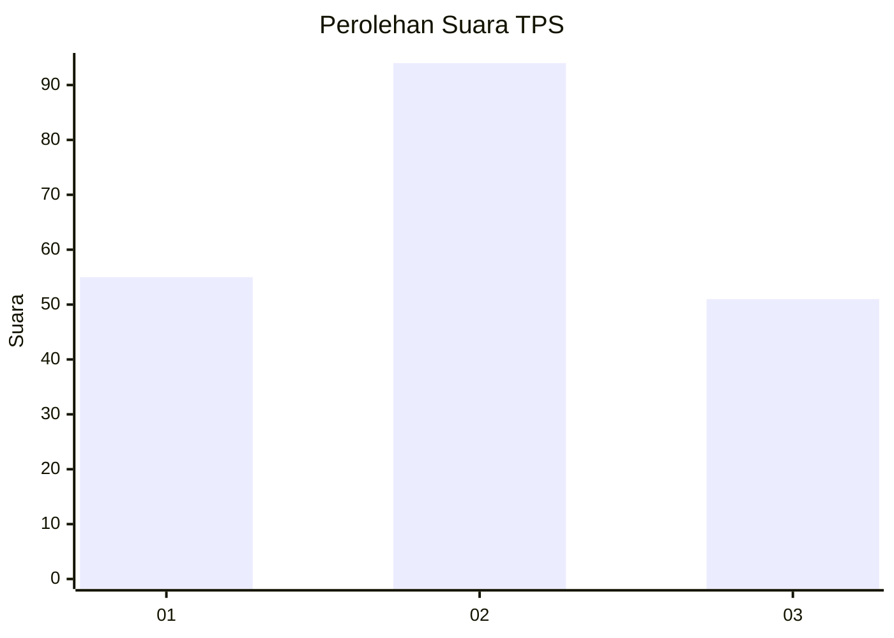
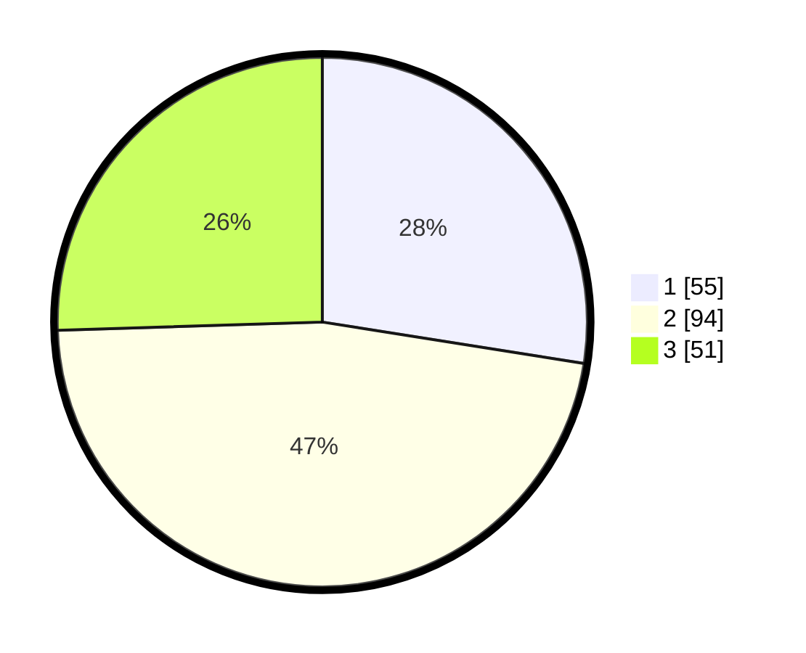

# Hasil

## Grafik

## Tabel

| No. | Nama Paslon    | Suara | Suara (raw) | Persentase |
|:--- |:-------------- | -----:| -----------:| ----------:|
| 1   | ANIES MUHAIMIN | 55    | [55][p-1]   | 27,50      |
| 2   | PRABOWO GIBRAN | 94    | [94][p-2]   | 47,00      |
| 3   | GANJAR MAHFUD  | 51    | [51][p-3]   | 25,50      |

[p-1]: https://github.com/gigit-pemilu/pemilu-2024/blob/main/pilpres/hitung-suara/sub/35-jawa-timur/sub/15-sidoarjo/sub/18-waru/sub/2005-tropodo/sub/021-tps/sub/paslon-1.txt
[p-2]: https://github.com/gigit-pemilu/pemilu-2024/blob/main/pilpres/hitung-suara/sub/35-jawa-timur/sub/15-sidoarjo/sub/18-waru/sub/2005-tropodo/sub/021-tps/sub/paslon-2.txt
[p-3]: https://github.com/gigit-pemilu/pemilu-2024/blob/main/pilpres/hitung-suara/sub/35-jawa-timur/sub/15-sidoarjo/sub/18-waru/sub/2005-tropodo/sub/021-tps/sub/paslon-3.txt

## Foto C Plano

https://sirekap-obj-formc.kpu.go.id/5049/pemilu/ppwp/35/15/18/20/05/3515182005021-20240216-232830--e2d80a23-b67c-43d5-9f72-d053a16041e7.jpg

https://sirekap-obj-formc.kpu.go.id/5049/pemilu/ppwp/35/15/18/20/05/3515182005021-20240216-232412--fb21250c-e9ba-4274-9f93-f7e87b30e365.jpg

https://sirekap-obj-formc.kpu.go.id/5049/pemilu/ppwp/35/15/18/20/05/3515182005021-20240216-232715--c641012a-3a49-4cce-bc25-f965e0c23b8b.jpg

## Metadata

| Key        | Value               |
| ---------- | ------------------- |
| Time Stamp | 2024-02-25 15:00:00 |

