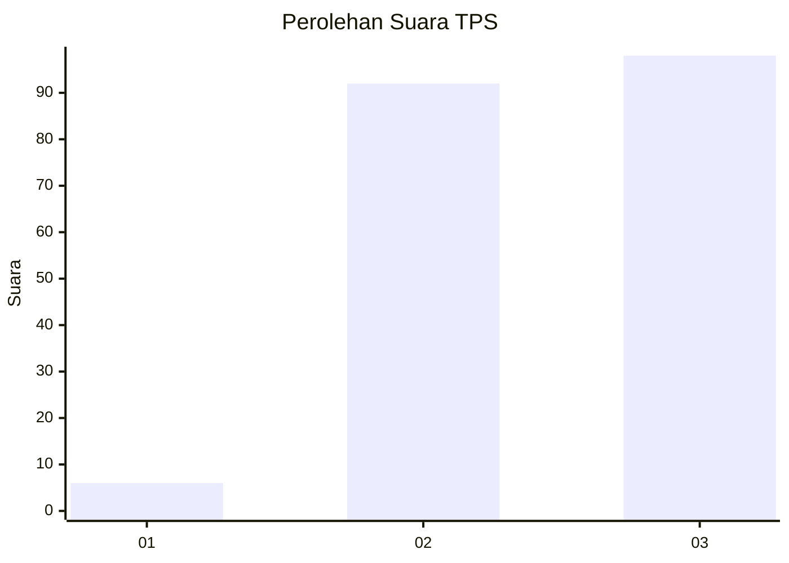
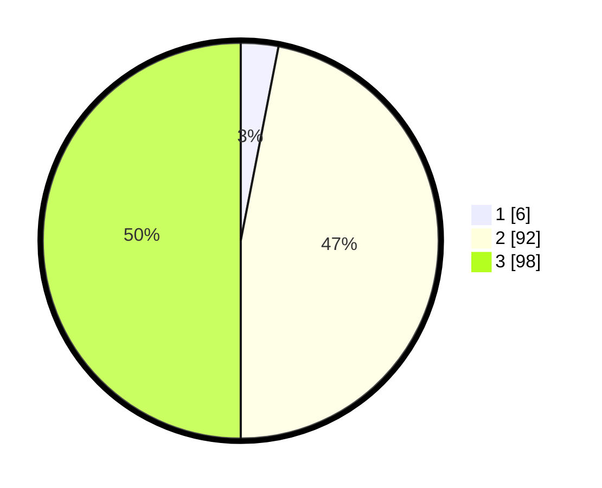

# Hasil

## Grafik

## Tabel

| No. | Nama Paslon    | Suara | Suara (raw) | Persentase |
|:--- |:-------------- | -----:| -----------:| ----------:|
| 1   | ANIES MUHAIMIN | 6     | [6][p-1]    | 3,06       |
| 2   | PRABOWO GIBRAN | 92    | [92][p-2]   | 46,94      |
| 3   | GANJAR MAHFUD  | 98    | [98][p-3]   | 50,00      |

[p-1]: https://github.com/gigit-pemilu/pemilu-2024-35-jawa-timur/blob/main/pilpres/hitung-suara/sub/35-jawa-timur/sub/15-sidoarjo/sub/18-waru/sub/2007-tambakrejo/sub/041-tps/sub/paslon-1.txt
[p-2]: https://github.com/gigit-pemilu/pemilu-2024-35-jawa-timur/blob/main/pilpres/hitung-suara/sub/35-jawa-timur/sub/15-sidoarjo/sub/18-waru/sub/2007-tambakrejo/sub/041-tps/sub/paslon-2.txt
[p-3]: https://github.com/gigit-pemilu/pemilu-2024-35-jawa-timur/blob/main/pilpres/hitung-suara/sub/35-jawa-timur/sub/15-sidoarjo/sub/18-waru/sub/2007-tambakrejo/sub/041-tps/sub/paslon-3.txt

## Foto C Plano

https://sirekap-obj-formc.kpu.go.id/dc6d/pemilu/ppwp/35/15/18/20/07/3515182007041-20240214-160129--a03fda96-f084-41da-bc97-f8daa25e6f42.jpg

https://sirekap-obj-formc.kpu.go.id/dc6d/pemilu/ppwp/35/15/18/20/07/3515182007041-20240214-155230--f4f1df74-b50f-4dbb-94a5-99aae2113194.jpg

https://sirekap-obj-formc.kpu.go.id/dc6d/pemilu/ppwp/35/15/18/20/07/3515182007041-20240214-160056--a7693132-3e0f-4008-968e-4add07b188da.jpg

## Metadata

| Key        | Value               |
| ---------- | ------------------- |
| Time Stamp | 2024-02-25 21:00:00 |

