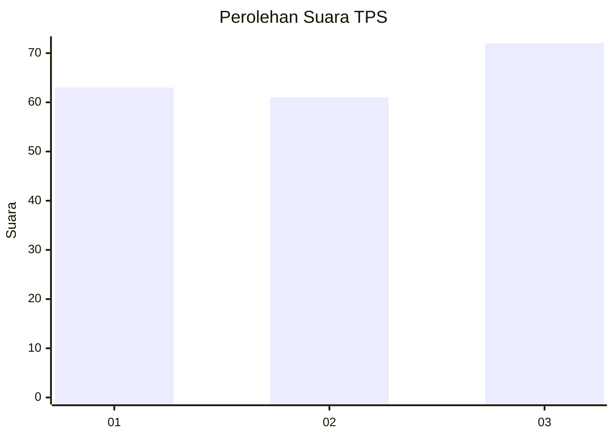
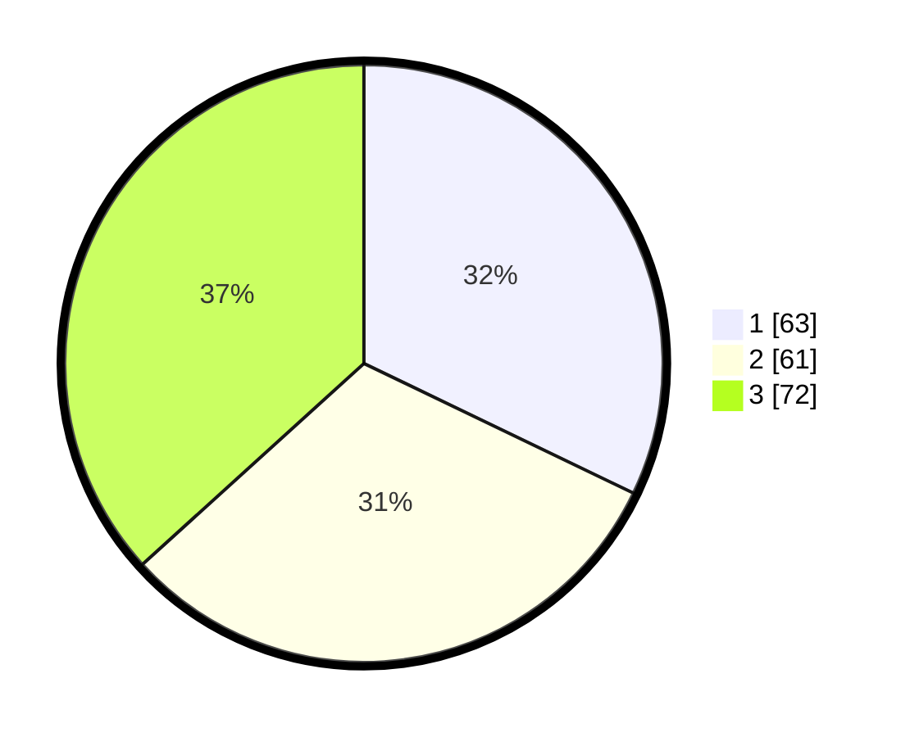

# Hasil

## Grafik

## Tabel

| No. | Nama Paslon    | Suara | Suara (raw) | Persentase |
|:--- |:-------------- | -----:| -----------:| ----------:|
| 1   | ANIES MUHAIMIN | 63    | [63][p-1]   | 32,14      |
| 2   | PRABOWO GIBRAN | 61    | [61][p-2]   | 31,12      |
| 3   | GANJAR MAHFUD  | 72    | [72][p-3]   | 36,73      |

[p-1]: https://github.com/gigit-pemilu/pemilu-2024-35-jawa-timur/blob/main/pilpres/hitung-suara/sub/35-jawa-timur/sub/15-sidoarjo/sub/18-waru/sub/2009-tambaksumur/sub/017-tps/sub/paslon-1.txt
[p-2]: https://github.com/gigit-pemilu/pemilu-2024-35-jawa-timur/blob/main/pilpres/hitung-suara/sub/35-jawa-timur/sub/15-sidoarjo/sub/18-waru/sub/2009-tambaksumur/sub/017-tps/sub/paslon-2.txt
[p-3]: https://github.com/gigit-pemilu/pemilu-2024-35-jawa-timur/blob/main/pilpres/hitung-suara/sub/35-jawa-timur/sub/15-sidoarjo/sub/18-waru/sub/2009-tambaksumur/sub/017-tps/sub/paslon-3.txt

## Foto C Plano

https://sirekap-obj-formc.kpu.go.id/6c7c/pemilu/ppwp/35/15/18/20/09/3515182009017-20240216-111613--43ad0c4a-039a-4506-8f68-06b2787d7ca4.jpg

https://sirekap-obj-formc.kpu.go.id/6c7c/pemilu/ppwp/35/15/18/20/09/3515182009017-20240215-015725--87aa75dc-cdf2-41a4-bbd7-6d98d625c772.jpg

https://sirekap-obj-formc.kpu.go.id/6c7c/pemilu/ppwp/35/15/18/20/09/3515182009017-20240215-015843--0b9ccde2-5a52-4807-956b-a474f31b5a23.jpg

## Metadata

| Key        | Value               |
| ---------- | ------------------- |
| Time Stamp | 2024-02-16 12:51:22 |

