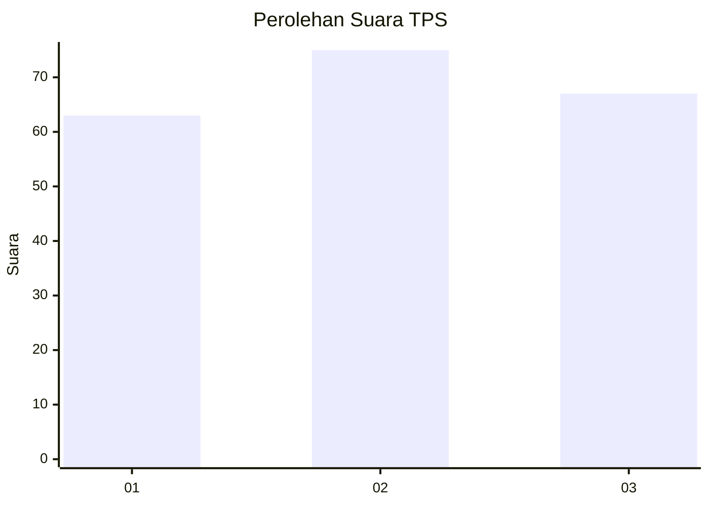
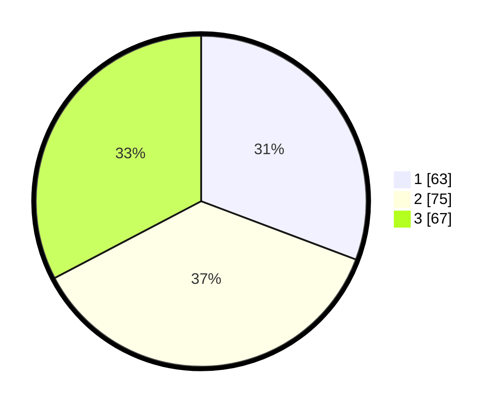

# Hasil

## Grafik

## Tabel

| No. | Nama Paslon    | Suara | Suara (raw) | Persentase |
|:--- |:-------------- | -----:| -----------:| ----------:|
| 1   | ANIES MUHAIMIN | 63    | [63][p-1]   | 30,73      |
| 2   | PRABOWO GIBRAN | 75    | [75][p-2]   | 36,59      |
| 3   | GANJAR MAHFUD  | 67    | [67][p-3]   | 32,68      |

[p-1]: https://github.com/gigit-pemilu/pemilu-2024-35-jawa-timur/blob/main/pilpres/hitung-suara/sub/35-jawa-timur/sub/15-sidoarjo/sub/18-waru/sub/2011-kepuhkiriman/sub/026-tps/sub/paslon-1.txt
[p-2]: https://github.com/gigit-pemilu/pemilu-2024-35-jawa-timur/blob/main/pilpres/hitung-suara/sub/35-jawa-timur/sub/15-sidoarjo/sub/18-waru/sub/2011-kepuhkiriman/sub/026-tps/sub/paslon-2.txt
[p-3]: https://github.com/gigit-pemilu/pemilu-2024-35-jawa-timur/blob/main/pilpres/hitung-suara/sub/35-jawa-timur/sub/15-sidoarjo/sub/18-waru/sub/2011-kepuhkiriman/sub/026-tps/sub/paslon-3.txt

## Foto C Plano

https://sirekap-obj-formc.kpu.go.id/3cf2/pemilu/ppwp/35/15/18/20/11/3515182011026-20240214-204844--7d392b3c-f51a-45c0-adc5-0bd53d5ef41d.jpg

https://sirekap-obj-formc.kpu.go.id/3cf2/pemilu/ppwp/35/15/18/20/11/3515182011026-20240215-004245--5d50c68c-9d4f-4390-95c1-cca45d97cfdf.jpg

https://sirekap-obj-formc.kpu.go.id/3cf2/pemilu/ppwp/35/15/18/20/11/3515182011026-20240215-004441--9fa5525f-50d3-4521-89c2-f71315be89fe.jpg

## Metadata

| Key        | Value               |
| ---------- | ------------------- |
| Time Stamp | 2024-02-16 10:00:28 |

