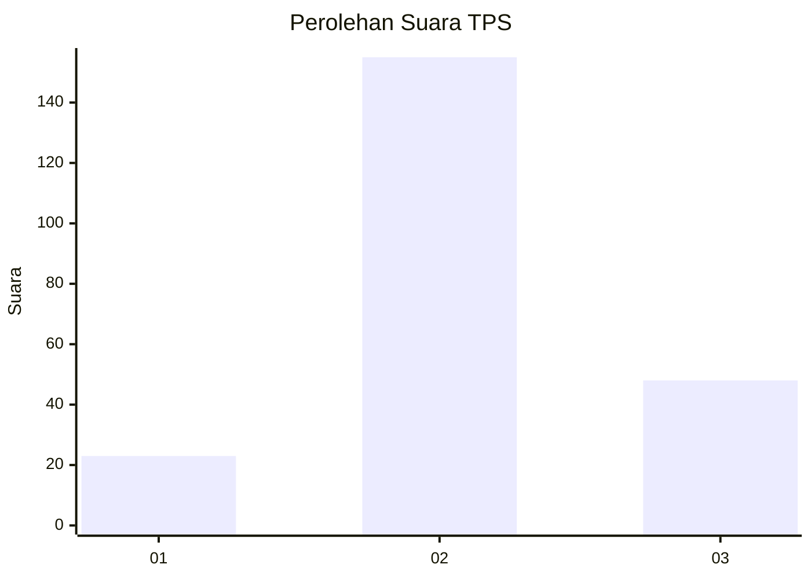
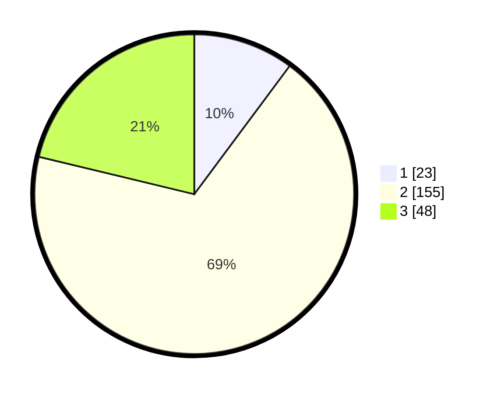

# Hasil

## Grafik

## Tabel

| No. | Nama Paslon    | Suara | Suara (raw) | Persentase |
|:--- |:-------------- | -----:| -----------:| ----------:|
| 1   | ANIES MUHAIMIN | 23    | [23][p-1]   | 10,18      |
| 2   | PRABOWO GIBRAN | 155   | [155][p-2]  | 68,58      |
| 3   | GANJAR MAHFUD  | 48    | [48][p-3]   | 21,24      |

[p-1]: https://github.com/gigit-pemilu/pemilu-2024/blob/main/pilpres/hitung-suara/sub/35-jawa-timur/sub/15-sidoarjo/sub/18-waru/sub/2017-bungurasih/sub/004-tps/sub/paslon-1.txt
[p-2]: https://github.com/gigit-pemilu/pemilu-2024/blob/main/pilpres/hitung-suara/sub/35-jawa-timur/sub/15-sidoarjo/sub/18-waru/sub/2017-bungurasih/sub/004-tps/sub/paslon-2.txt
[p-3]: https://github.com/gigit-pemilu/pemilu-2024/blob/main/pilpres/hitung-suara/sub/35-jawa-timur/sub/15-sidoarjo/sub/18-waru/sub/2017-bungurasih/sub/004-tps/sub/paslon-3.txt

## Foto C Plano

https://sirekap-obj-formc.kpu.go.id/eb37/pemilu/ppwp/35/15/18/20/17/3515182017004-20240216-090246--ccdd23cf-b324-42a5-b1fb-2d1ec108f4c3.jpg

https://sirekap-obj-formc.kpu.go.id/eb37/pemilu/ppwp/35/15/18/20/17/3515182017004-20240216-090344--9f9a868d-1bd1-4ca7-99a6-6e5338fd6bde.jpg

https://sirekap-obj-formc.kpu.go.id/eb37/pemilu/ppwp/35/15/18/20/17/3515182017004-20240216-090442--f5ebc8e5-c169-46f0-80a2-b45a2e3c4044.jpg

## Metadata

| Key        | Value               |
| ---------- | ------------------- |
| Time Stamp | 2024-02-24 22:31:28 |

